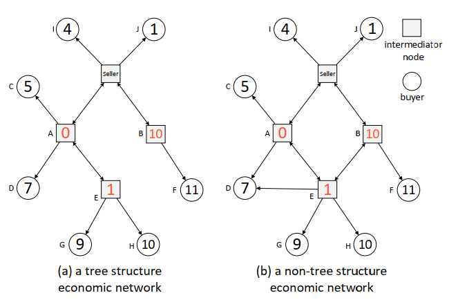

### Customer Sharing in Economic Network with Costs

---

#### 摘要

经济市场下，sellers，infomediaries，customers构成了经济网络。对于sellers来说他有一个自己的独立的消费者群体，这个群体对于别的sellers而言是不可观测的。sellers希望自己的售卖场景下的人是越多越好的，而对于别的sellers却又是没有incentive去传播这些customers的信息的。因此本文在考虑传播代价的前提下，构建一个新的diffusion auction的场景并引入CSM机制同时证明这个机制是IC,IR,efficient同时还是最大化seller的收益。

#### Model

在一个经济网络下，一个seller出售一个commodity. 除去seller之外在整个经济网络共有$n$个agents，$N=\{1,2,\cdots,n\}$. 所有的agents可以分为两类人：buyers和其他的sellers和infomediaries. 存在一些基本的设定，每个中介只能够连接到他自己的buyers群体以及其他的一些中介。中介的buyers群体可以是有交叉的；同时我们还需要假设buyers之间没有连接。每一个buyer $i \in N$对于商品有一个私人的估值$b_i\geq 0$. 每一个中介有一个私人的邻居集合$r_i\subseteq N$，对于这个集合中的人，中介可以直接进行信息交互。更进一步地，当有一个trade通过中介时存在一个cost $c_i$, 初始状态下只有seller的邻居$r_s$知道sale information.

下面的图给出了两个示例：

定义$t_i$为agent $i$的私人type，在这个经济网络的设定下：
$$
t_i=
\begin{cases}
b_i & \text{if }i \text{ is a buyer}\\
r_i & \text{if }i \text{ is an intermediate node}\\
\end{cases}
$$
$t=(t_1,\cdots,t_n)$表示所有agents的一个type的集合。

**Definition 1.** 给定一个type report profile $t'$，从seller到i的一条路径（trading chain）是一个agents的序列：$(a_1,\cdots,a_k,a_{k+1},\cdots,a_p,i)$. 其中$a_1\in r_s$对于$1<l\leq p, a_l\in r'_{a_{l-1}},i\in r'_{a_p}$. （simple path）

**Definition 2.** 如果对于所有的$i\in N,t_i'\neq nil$当且仅当在$t'_{-i}$下存在一个trading chain从seller到$i$, 那么就称这个type profile$t'$是feasible的。

**Definition 3.** 给定一个feasible的type profile $t'$，对于agent $i,t_i'\neq nil$，定义$LCC_i$表示从seller到$i$的最低传播代价的trading chain. 即$LCC_i=\arg\min_{l_i\in \mathcal{L}_i}\sum_{j\in l_i\backslash \{i\}}c_i$. $\mathcal{L}_i$表示所有从seller到$i$的trading chains的集合。

**Definition 4.** 一个机制$\mathcal{M}=(\pi,x)$. 其中$\pi=\{\pi_i \}_{i\in N}$, $\pi_i:T\rightarrow \{-1,0,1\}$; $x=\{x_i\}_{i\in N}$, $x_i:T\rightarrow \mathbb{R}$. $\pi_i(t')=1$表示$i$获得了这个commodity，$\pi_i(t')=-1$表示是在从seller到winner的trading chain上的一个node，$\pi_i(t')=0$表示的是既不是winner也不是在trading chain上的一个agent. 

定义$v_i(t_i,\pi(t'))$表示agent $i$在可行分配$\pi(t')$下的关于分配结果的一个估值：
$$
v_i(t_i,\pi(t'))=
\begin{cases}
b_i & \pi_i(t')=1 \\
-c_i & \pi_i(t')=-1 \\
0 & \pi_i(t')=0
\end{cases}
$$
社会福利的定义：
$$
W(\pi(t'))=\sum_{i\in N}v_i(t_i',\pi(t'))=\sum_{i \in TC_w}v_i(t_i',\pi(t'))
$$
**Definition 5.** 如果对于任意的可行的type report profile $t'$，分配规则$\pi$都能使得$\pi\in \arg\max_{\pi'\in \Pi}W(\pi'(t'))$，那么我们就称这个分配规则$\pi$是efficient的。

**Definition 6.** 机制$(\pi ,x)$是IR的：对于所有的buyers来说都有$u_i(t_i,(b_i,t_{-i}'),(\pi,x))\geq 0$；对于所有的中介来说都有$u_i(t_i,(r_i',t_{-i}''),(\pi,x))\geq 0$

**Definition 7.** 机制$(\pi,x)$是IC的：对于所有的$i\in N$, 都有$u_i(t_i,(t_i,t_{-i}'),(\pi,x))\geq u_i(t_i,(t_i',t_{-i}''),(\pi,x))$. 

卖家收益定义为：$Rev^{\mathcal{M}}(t')=\sum_{i\in N}x_i(t')$.

**Definition 8.** 机制$(\pi,x)$是WBB的：对于任意可行的type profile都有$Rev^{\mathcal{M}}(t')\geq 0$.

#### IDM with Transaction Costs

IDM-TC机制：

1. 给定可行type profile $t'$，将物品分配给$m=\arg\max_{i\in N}SW_{i}$同时选择$LCC_m$作为trading chain. $C_m=\{1,2,\cdots ,m-1,m\}$表示关键传播序列。

2. 对于每一个agent他的支付规则给出如下：
   $$
   \begin{cases}
   W^\ast_{-d_i}- W^\ast_{-d_{i+1}}-c_i & \text{if }i\in C_m\backslash \{m\} \\
   -c_i &\text{if }i\in LCC_m\backslash\{C_m\} \\
   W^\ast_{-m}+\sum_{j\in LCC_m\backslash\{m\}}c_j & \text{if }i=m \\
   0 & \text{otherwise}
   \end{cases}
   $$

只有在winner的关键传播序列上的人才能够得到奖励，其他的非传播关键节点只能获得一个简单的payoff来cover他们的cost. 为了保证卖家的收益，传递代价都由winner支付。

给出一个示例：以Figure1(a)为例，计算所有agents的$SW_i=\sum_{j\in LCC_i}v_j(t_j',\pi(t'))$, 不难发现H点的$SW_H$最高，因此根据分配规则将物品分配给H，进一步计算得到关键传播序列$\{A,E,H\}$，同时这个序列也是$LCC_H$. 计算payment，对于winner H来说，他的支付等于$8+0+1=9$, 对于E的支付为：$7-8-1=-2$. 对于A来说支付为：$4-7-0=-3$. 其余的所有点的支付为0，最终卖家的收益等于$9-2-3=4$. 下面给出IDM-TC机制的性质以及证明。

**性质一：**如果经济网络的结构是树结构的，那么IDM-TC机制是efficient, IR, IC,WBB的，且IDM-TC给出的卖家的收益至少为Vickrey Auction情境下的收益。

*Proof.* 根据分配规则来看，显然IDM-TC机制是efficient的。下面主要证明IR和IC的性质。

首先对于winner来说，他没有理由高报，因为高报不能使得他的收益增加，其次如果低报可能导致自己失去item，导致收益从正收益变为0. 其次对于不是winner的buyers，在实报的情况他们的收益等于0，如果他想高报成为winner，他的收益会从0变为负值，因为$SW_i\leq SW_m \subseteq -d_i$. 因此对于这类的buyers实报是最好的结果；下面分析中介节点，对于那些不在$C_m$中的中介节点来说，不管他向谁分享sale information他也无法改变$LCC_m$，因为在树结构的经济网络下$LCC_m=C_m\subseteq -d_i$. 因此他无法通过不传或者少传来增加自己的收益；而如果$i$是$C_m$中的一员，首先$W^\ast_{-d_i}$是与他无关的，而它能够做的就是尽可能地多传播使得$W_{-d_{i+1}}$最大从而使得自己的收益最大化。因此在这种情况下实传对于他来说是一个占优策略。卖家的收益可以计算得到：$\sum_{i\in N}x_i(t')=W^\ast_{-d_1}\geq 0$. 由于$r_s\subseteq -d_1\cup \{1\}$，$W^\ast_{-d_1}\geq b_{r_s}^2$. 其中$b_{r_s}^2$表示在$r_s$中的第二高的报价（这个值就是在Vickrey Auction下的revenue）。

上面我们给出了IDM-TC在树形经济网络下的良好性质及其证明，而在更加广泛的cases中这个机制是不truthful的，注意看Figure1(b)，我们发现在中介节点B和E之间添加一条边之后，根据IDM-TC机制计算得到H仍然是获胜者。但是注意此时的中介节点A不在是H的关键传播节点，因此A只能得到一个支付使得自己的cost被cover了。而为了提高自己的收益，A节点选择不再将信息传递给中介节点E，在这种情况下我们会发现，获胜者变为了D，同时A作为传播的关键节点，他的收益获得了提升，从0变为1. 

出现这个情况的原因是在于说一些不是winner的关键传播节点的节点可以通过改变自己的策略使得整个auction的分配结果产生一定的变化。在我们不考虑传输代价的情况下是不存在这样的问题的。由于收益的变化导致了中介节点存在更加复杂的传播策略存在。下一个部分引入新的机制来解决这个问题。

#### Customer Sharing Mechanism

**Definition 10.** 给定一个agents的type profile集合$t'$，对于每一个中介节点$i\in N$, 先定义一个概念叫做阈值邻居集合${r{_i}^{\ast'}}$，这是一个$r_i'$的子集，这个子集满足在中介节点不向$r_{i}^{\ast'}$传播信息的情况下使得winner改变的最小的子集。公式化可以写为：$r_i^{\ast'}=\arg\min_{r_i''\subseteq r_i'}\{|r_i''|\}$. 其中$\pi_{m'}(r_i'\backslash r_i'',t_{-i}'')=1\and \pi_m(r_i',t_{-i}')=1\and m'\neq m$同时$\pi$是一个efficient的分配。

以Figure1(b)中的中介节点A为示例，$r^\ast_A=\{E\}\subset r_A=\{C,D,E\}$. 这个结果表示的是当A不再给$r^\ast_A$中的节点传递信息的情况下，winner发送了变化。如果一个节点$i$无法通过任何的传播策略来改变winner，那么就规定$r_i^{\ast'}=r_i'$.  对于任何一个中介节点$i$，如果他不属于$LCC_m$的话那么显然对于他来说一定有$r_i^{\ast'}=r_i'$. 对于$i\in LCC_m$的情况下我们可以使用如下的方法来计算$r_i^{\ast'}$.

1. 初始化$r_i^{\ast'}=\empty$, $m$是在efficient分配规则下的winner.
2. 将$i$的一个邻居$j\in LCC_m$添加到$r_i^{\ast'}$中同时将$(i,j)$这一条边从网络中除去，跳转第3步.
3. 如果$m'=m$同时$i\in LCC_m$则跳转回第2步，如果$m'=m$同时$i\notin LCC_m$那么直接返回$r_i^{\ast'}=r_i'$同时结束流程；否则的话继续执行最终返回$r_i^{\ast'}$.

显然我们会发现任意的$j\in r_i^{\ast'}$删除边$(i,j)$都不会影响上面步骤的结果因为从$k(\neq j)\in r_i^{\ast'}$到$m$的LCC不会受到影响。我们通过上面的步骤得到的是唯一的结果，且得到的集合一定是一个最小的子集。基于这个最小的阈值邻居集合$r_i^{\ast'}$我们引入CSM机制（customers sharing mechanism）

##### 分配规则：

给定一个可行的type report profile $t'$，将物品分配给$m=\arg\max_{j\in N}SW_j$同时沿着$LCC_m$分配物品。

##### 支付规则：

对于每一类的agents其支付规则定义如下：

（1）对于buyers $i\in N$，她的支付定义为：
$$
W^\ast_{-i}-W^\ast(t')+v_i(t_i',\pi^{csm})
$$
（2）对于中介节点$i$，其支付定义为：
$$
W^\ast_{-d_i} - W^\ast_{-r_i^{\ast'}} + v_i(t_i',\pi^{csm})
$$
其中$W_{-r_i^{\ast'}}^\ast$表示的是在可行的type report profile $(r_i'\backslash r_i^{\ast'},t_{-i}'')$下最大的社会福利的值。

**Theorem 1.** CSM机制是IR, IC, efficient的。

*Proof.* 首先根据分配规则可以知道CSM机制一定是efficient的。下面进一步证明IR和IC：

首先对于任意的一个buyer $i$来说，实报的情况下他的收益可以写为：$W^\ast(t')-W^\ast_{-i}$, 其中$W^\ast(t')$是$i$无法去影响的最优社会福利，假设存在$i$可以通过误报为$b_i'$去改变分配结果从而提高$v_i(t_i,\pi^{csm})+(W^\ast(t')-v_i(t_i',\pi^{csm}))$, 这就违反了VCG机制下也就是刚刚所说得$W^\ast(t')$是最优社会福利且是$i$无法影响的部分。简而言之：$v_i(t_i,\pi^{csm})+(W^\ast(t')-v_i(t_i',\pi^{csm}))$这个式子的第一项表示的$i$的真实估值无法通过误报改变，而后面的一部分表示的是在除去$i$的情况下的所有其他人的社会福利的值的和。而假设$i$本来是一个loser，通过误报他成为一个winner，计算他的收益会发现其收益会变为负值，而在实报的情况下：其收益等于$W^\ast(t')-W^\ast_{-i}\geq 0$, 因此对于任何的一个buyer来说 truthful的报价对于他来说一定是一个收益最大化的策略。

其次对于中介节点来说，我们将证明将auction的信息传递给它的所有的邻居将会是一个收益最大化的策略。首先如果这个中介节点不属于$LCC_m$，那么这个节点无论进行什么样的信息传递都不会改变它的收益，且这个收益一定等于0. 对于$i\in LCC_m$的那些中介节点来说，其收益等于$W^\ast_{-r_i^{\ast'}}-W^\ast_{-d_i}$, 因为我们很容易发现$v_i(t_i,\pi^{csm})=v_i(t_i',\pi^{csm})=-c_i$. 其中$-d_i \subseteq -r_i^{\ast'}$, 所以这个收益一定是大于等于零的。满足IR. 由于$i\notin -d_i$，因此$W_{-d_i}$一定是独立于$r_i'$的，无论$i$的传递信息情况如何都不会改变这个值，因此只需要考虑后面的这个值。假设$i$误报的信息为$r_i'\subseteq r_i$。这样可能会出现两种情况，第一种winner因为这个信息的传递发生了改变，此时一定有$r_i^\ast\subset r_i\backslash r_i'$. 这里的$r_i^\ast$表示的是当$i$在实报的情况下得到的使得当前winner改变的最小集合，同时定义$r_i^{\ast'}$表示在$i$在汇报$r_i'$情况下的使得winner变化的最小阈值集合。显然我们很容易得到：$-r_i^{\ast'}\subset -r_i^\ast$. 显然实报情况下的payment的值低于误报情况下的payment的值。如果winner没有改变，那么可以得到：$r_i^\ast\subseteq (r_i^{\ast'}\cup (r_i\backslash r_i'))$，这种情况下也表示$-r_i^{\ast'}\subset -r_i^{\ast}$. 因此不论在哪一种情况下我们都可以得到如实传播对于中介节点来说一定是最大化其收益的。

综上我们得到CSM机制是IR和IC的。证明的关键点在于一个中介节点传递信息的邻居越多他的阈值子集就会越小。因此在他全部传递的情况下$W_{-r_i^{\ast'}}^\ast$取得最大的值，进而收益也取得最大的值。

**Lemma 1.** 给定一个可行的report profile $t'$，假设winner是$m$，同时有$LCC_m=\{l_1,l_2\cdots,l_q=m\}$. 对于任意一个中介节点$l_i\in LCC_m$，当$l_i$的传播策略从$r_{l_i}'$变化为$r_{l_i}'\backslash r_{l_i}^{\ast'}$, winner变为了$m'\neq m$. 然后我们可以得到：$\{l_{i+1},l_{i+2},\cdots,l_q\}\cap LCC_{m'}=\empty$. 

*Proof.* 这里的证明采用反证法，首先假设存在这样一个$l_j\in \{l_{i+1},l_{i+2},\cdots l_q\}\cap LCC_{m'}$. 我们记录从seller到$l_j$的最小传输cost为$x$，从$l_j$到$m$的最小传输cost为$y$，从$l_j$到$m'$的最小传输cost为$z$. 由于我们知道$m'$是新的winner，所以我们不难得到：$b_{m'}-x-z > b_m-x-y$，也就是$b_{m'}-z>b_m-y$. 这与从seller到$m$的最短路径为$LCC_m$相矛盾，因此得到结论$\{l_{i+1},\cdots,l_q\}\cap LCC_{m'}=\empty$.

对于所有的中介节点来说，如果他无法影响谁能够获胜的话，他的收益始终是为0的。对于那些能够改变的中介节点来说，$\{l_{i+1},l_{i+2},\cdots,l_q\}\cap LCC_{m'}=\empty$意味着$LCC_{m'}$是独立于$l_k\in \{l_{i+1},l_{i+2},\cdots,l_q\}$的，因此我们可以得到：$LCC_{m'}\subseteq -d_{l_k}$, 从而$W^\ast_{-r_i^{\ast'}}=SW_{m'}=\sum_{i\in LCC_{m'}}v_i(t_i'\pi^{csm})\leq \sum_{i\in -d_{l_k}}v_i(t_i',\pi^{csm})=W^\ast_{-d_{l_k}}$. 

**Theorem 2.** CSM是WBB的且其卖家收益不应该低于$W^\ast_{-d_{1^\ast}}$, 其中$1^\ast$表示的是在$LCC_m$中第一有$r_{1^\ast}^\ast\neq r_{1^\ast}$的agent.

*Proof.* 记那些能够改变的winner的中介节点（也就是那些$r_{1^\ast}^\ast\neq r_{1^\ast}$）的集合为$LCC^\ast_m=\{1^\ast,2^\ast,\cdots,k^\ast\}\subseteq LCC_{m}$. 不属于$LCC^\ast_m$的那些中介节点我们显然可以得到他们支付就等于$v_i(t_i,\pi^{csm})$. 因此我们可以写出seller的revenue的值可以表示为：
$$
\begin{split}
\sum_{i\in N}x_i(t)&=\sum_{i\in LCC_m}x_i(t)\\
&=\sum_{i\in LCC^\ast_m}(W^\ast_{-d_i}-W^\ast_{-r_i^\ast})+\sum_{i\in LCC_m}v_i(t_i,\pi^{csm})+W^\ast_{-m}-W^\ast(t)\\
&=\sum_{i\in LCC^\ast_m}(W^\ast_{-d_i}-W^\ast_{-r_i^\ast}) + W^\ast_{-m}\\
&= W^\ast_{-d_1^\ast} + \sum_{i\in LCC_m^\ast \backslash\{1^\ast\}} (-W^\ast_{-r_i^\ast}+W^\ast_{-d_{i+1}})
\end{split}
$$
根据Lemma1我们可以得到对于中介节点$i^\ast\in LCC_m^\ast$, $(i+1)^\ast \notin LCC_{m'}$, 也就意味着$LCC_{m'}\subseteq -d_{(i+1)^\ast}$, 因此对于所有的$j \in LCC^\ast_m\backslash \{1^\ast\}$都有$W^\ast_{-d_{j+1}}\geq W^\ast_{-r^\ast_j}$，从而求和之后有$\sum_{i\in LCC_m^\ast \backslash\{1^\ast\}} (-W^\ast_{-r_i^\ast}+W^\ast_{-d_{i+1}})\geq 0$. 因此$Rev^{csm}=W^\ast_{-d_{1^\ast}}+\delta\geq W^\ast_{-d_{1^\ast}}\geq b_{r_s}^2\geq 0 $. 

我们在Figure1(b)中运行一遍CSM机制，首先得到$H=\arg\max_{j\in N}SW_j$以及$LCC_H=\{A,E,H\}$. 求解$LCC_H$中中介节点的$r^\ast_i$, 其中$r^\ast_A=\{E\}$以及$r^\ast_E=\{H\}$. 计算支付结果：$x_A=W^\ast_{-d_A}-W^\ast_{-r_A^\ast}+v_A(t_A,\pi^{csm})=4-7+0=-3$. 同理我们可以计算中介节点E的支付结果为：$x_E=W^\ast_{-d_E}-W^\ast_{-r_E^\ast}+v_E(t_E,\pi^{csm})=7-8+(-1)=-2$. 最终计算winner H的支付为$8-9+10=9$. 其余agents的支付都为0，最终卖家收益等于$9-3-2=4$远远高于Vickrey Auction的卖家收益。

#### Conclusion

在这个模型中一个重要的假设是每一个中介节点的cost是公共知识。如果这个cost也变成一个私人信息的话，整个模型可以归约为一个双边贸易的模型中，是不存在IR, IC, efficient且WBB的机制的。

在经济网络的设定下寻找最大的卖家收益的工作还没有进行。同时这是一个单物品的问题，还没有扩展到多物品上去。思考如果使用DAMD（Distributed Alogorithmic Mechanism Design）去探讨这一系列的问题。

#### 关于CSM机制的一些深刻理解

首先制定$r_i^{\ast'}$的目的在于：我需要去判断那些中介节点对于最终winner的分配走向会带来影响，找到那些能够影响的中介节点之后，分析其哪些传播是有效的（也就是中介节点传递给谁会给最终的分配结果产生影响）（我们认为这些节点都是有话语权的节点，能够决定auction最终走向的节点）