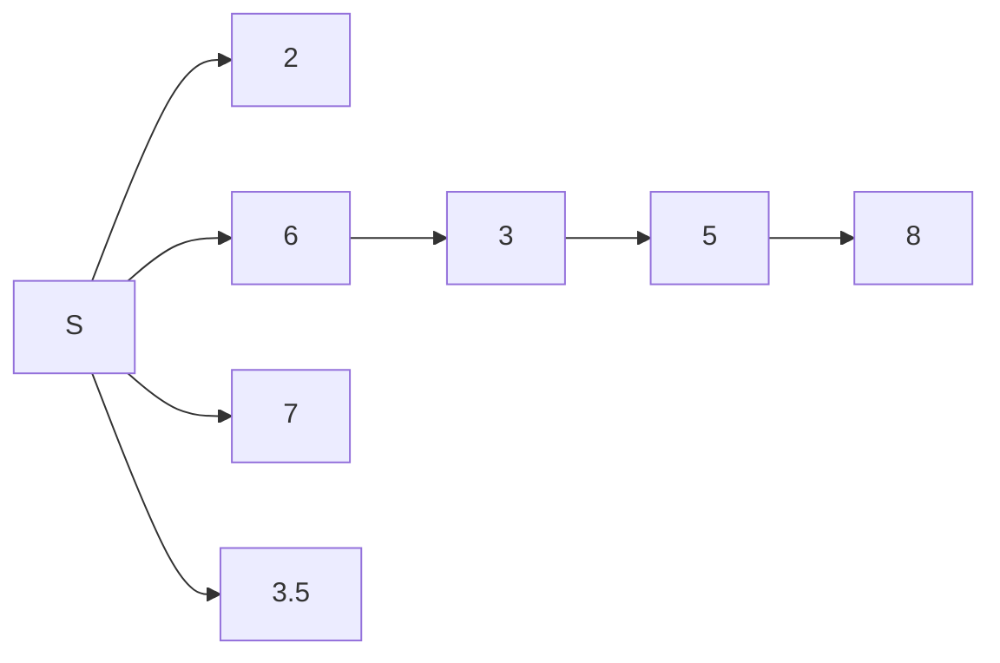
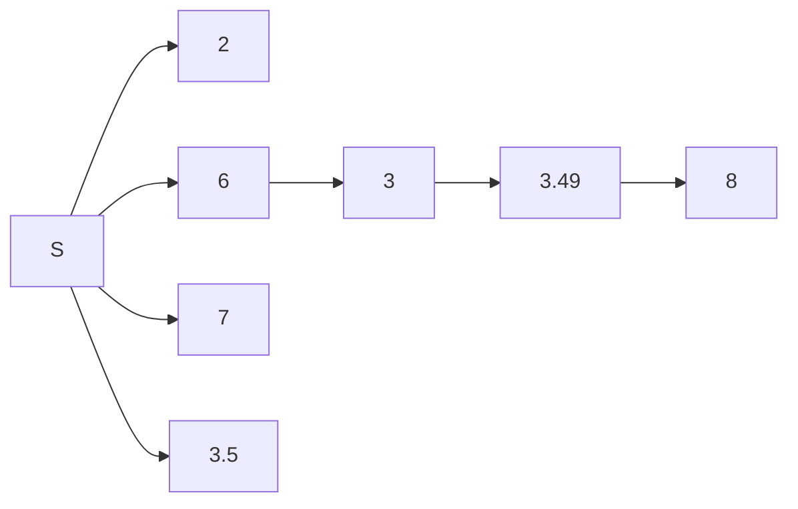
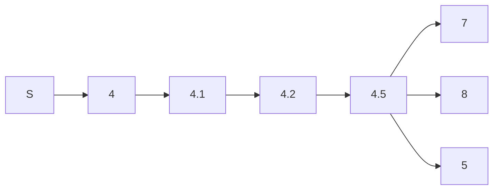

#### CFM的问题所在

##### Case1：allocate 4 items

问题出在存在bidder通过低报使得在对其祖先节点进行判断时不被割掉，从而让前面的一个bidder从winner变为loser（这样的收益更高）进而使得传递到自己的items的数量增加（$\ell_i$增加）导致支付降低收益增加。

（对应的我们是可以找到一个case满足某个bidder通过高报使得前面的bidder从一个loser变为一个winner的，但是这种情况下我们会发现其收益一定是降低的（可以根据我们之前的那个单调性直接推导过来））

##### Case2：allocate 3 items

这个case的具体情况是，某个bidder原本是在top-k中的，但是割点的原因导致其自己变为了一个unlucky player，而通过虚报又可以让自己成为一个winner从而就增加了自己的收益，这个虚报是指低报到top-k之外，从而自己不被割，进而前面的某一个也不是top-k的祖先节点从winner变为了loser.

综合两个cases都是通过低报来获得更高的收益的。都是通过低报来使得自己不被割掉，从而改变了前面节点的win或者lose的情况（准确的说是从winner变为loser使得他们自己的$\ell_i$变大了），本质上两种情况是一种情况。

**Lemma 1.** 对于任意一个bidder来说，其支付值一定是关于$\ell_i=\mathcal{K}-|\mathcal{W}_{\succ i}|$非递减的。

**Lemma 2.** 任何通过虚报或者少传使得自身的前驱节点从loser变为winner的行为永远都无法使得自己的收益增加。

为什么在单物品的情境下没有出现这种通过虚报让一个bidder从一个winner变为一个loser的情况呢？

#### Diffusion Strategies

通过少传播$r_i'\subseteq r_i$来使得前面的bidder从winner变为loser. 

