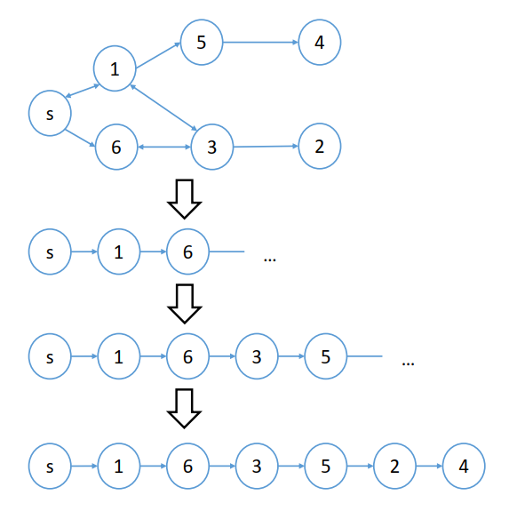

### Efficiency in Truthful Auctions via Social Network

---

#### Abstract

在social network上的auction目前来说是无法同时做到truthful, IR, efficient和budget-balanced的。这篇论文提出了一类叫做$\alpha-$APG的机制，这类机制可以在efficiency与weakly budget-balanced之间寻找一种trade-off. 这篇论文中找出了GIDM的不truthful的地方同时自己提出了一种广义的APG机制，这个机制针对的是那些具有边际效益递减的buyers，同时这个机制是truthful的也是IR的，但是并不efficient. 但是这个efficient可以计算达到在所有truthful机制中的最大efficiency.

#### 一些在处理social network中问题的论文

Edelman et al.在2007年研究了关于在网络广告市场下的GSP拍卖；有高收益但是没有truthful. Bergemann和Valimaki在2002年探索了在每个agent他可以尝试获取外部世界信息的情况下觉得自己是否参加auction的情境下的机制设计问题；Kempe et al.在2003年探索了社交网络中ideas和影响力的传播。这些问题的主要目标都是寻找一些满足要求的个体。

#### Model

N个buyers，$N=\{1,\cdots,n\}$. seller $s$手中有$k$件相同的items要出售。由于假设边际效益降低，因此对于这$k$个items，每一个buyer $i$都会有一个估值向量：$v_i=(v_{i,1},v_{i,2},\cdots,v_{i,k})$. 其中$v_{i,1}\geq v_{i,2} \geq v_{i,k}\geq 0$. 对于每一个buyer定义一个type：$\theta_i=(v_i,R_i)$. 机制的两点要素：分配规则$f_i:\Theta \rightarrow \mathbb{Z}_{\geq 0}$和一个支付规则$p_{i,l}:\Theta\rightarrow \mathbb{R}$. 当一个buyer $i$得到了$k'$件items时，他的收益等于$\sum_{l=1}^{k'}(v_{i,l}-p_{i,l})$. 

关于IC和IR的定义与之前的IDM和GIDM没什么差异。这里再给一个新的定义：

定义当一个机制满足下面的式子时我们认为其是$\alpha-\text{efficient}$的。

$$
\alpha=\min_{\theta'\in \Theta} \frac{\sum_{i\in N}\sum_{l=1}^{f_i(\theta')}v_{i,l}}{\max_{f'\in \mathcal{F}}\sum_{i\in N} \sum_{l=1}^{f_i'(\theta')} v_{i,l}}
$$

最后介绍关于这个APG（Aligned Path Graph），下面的图给出了一个实例：

定义一个path graph，其中起点是seller $s$, 根据到达seller的距离以及出价的高低，距离越小，出价越低越在这个path graph的前面，根据这个APG，给出一些重要的定义：$P_i^{close}$表示比$i$到seller近的buyers的集合，$P_i^{far}$表示到seller距离比$i$远的那些buyers的集合。定义$l_i^P$表示在$P$集合下从seller到$i$的distance. 

#### 单物品下的APG机制

定义$p_i$为$p_{i,1}$和$p_{i,0}$分别表示获得物品或者失去物品的情况下的payment. 

定义一个关于seller的revenue的概念：$\beta-$weakly budget balancedness($\beta-$WBB).

当且仅当一个机制满足：
$$
\beta=1+\min_{\theta'\in \Theta}\frac{\sum_{i\in N}p_i(\theta')}{(n-1)v^\ast}
$$
我们认为这个机制$\mathcal{M}$是$\beta-$WBB的.

**性质一**：在social network下的auction没有truthful, IR, efficient及weakly budget-balanced机制。

*Proof*.  考虑存在这样一个满足IC,IR,efficient, weakly budget-balanced的机制，固定$i\in N$和$\theta'_{-i}$，首先假设$i$是一个winner同时实报且实传，根据efficiency的定义可以得到$v_i\geq v^\ast_{N_{-i}}$. 如果实报实传，其收益等于：$u_i=v_i-p_i(\theta'_{-i},(v_i,R_i))$，假设其虚报为$v_i'<v^\ast_{N_{-i}}$, 则$i$的收益变为：$u_i'=0-p_i(\theta'_{-i},(v_i',R_i))$. 根据IC可以得到：
$$
-p_i(\theta'_{-i},(v_i',R_i))\leq v_i-p_i(\theta'_{-i},(v_i,R_i))
$$
也就是：
$$
-p_i(\theta'_{-i},(v_i',R_i))+p_i(\theta'_{-i},(v_i,R_i))\leq v_i
$$
由于这个式子对于任意的$v_i\geq v^\ast_{N_{-i}}$，因此就能够得到：
$$
-p_i(\theta'_{-i},(v_i',R_i))+p_i(\theta'_{-i},(v_i,R_i))\leq v^\ast_{N_{-i}}
$$
根据IR可以得到：$v_i\geq p_i(\theta'_{-i},(v_i,R_i))$，类似地可以得到：$v^\ast_{N_{-i}}\geq p_i(\theta'_{-i},(v_i,R_i))$.

第二种情况，假设$i$在实报实传时不是一个winner，也就有$v_i\leq v^\ast_{N_{-i}}$. 类似第一种情况可以得到：
$$
v_i-p_i(\theta_{-i}',(v_i,R_i))\leq -p_i(\theta'_{-i},(v_i',R_i))
$$
也就是：
$$
v_i\leq -p_i(\theta'_{-i},(v_i',R_i))+p_i(\theta'_{-i},(v_i,R_i))
$$
由于我们还有$v_i\leq v^\ast_{N_{-i}}$, 进一步可以得到：
$$
v^\ast_{N_{-i}}\leq -p_i(\theta'_{-i},(v_i',R_i))+p_i(\theta'_{-i},(v_i,R_i))
$$
结合两种情况我们可以得到：
$$
v^\ast_{N_{-i}}= -p_i(\theta'_{-i},(v_i',R_i))+p_i(\theta'_{-i},(v_i'',R_i))
$$
其中$v_i'<v^\ast_{N_{-i}}$同时$v_i''>v^\ast_{N_{-i}}$.

现在在给出一些合理的假设，首先我们假设$v^\ast_{N_{-i}}>0$, $v^\ast_{N_{-i}}>v_i>0$, 同时假设除了这两个buyers外的其他所有人的报价均为0. 另外估值为$v^\ast_{N_{-i}}$的这个人如果$i$不给他传递信息的情况下他是无法参与这个auction的。在这种情况下，假设$i$停止了传播，其收益变为：$v_i-0$, 而根据IC，我们会知道：$v_i-0\leq -p_i(\theta'_{-i},(v_i,R_i))$. 进一步有$v^\ast_{N_{-i}} -0\leq -p_i(\theta'_{-i},(v_i,R_i))$. 

最后我们来分析revenue，在这个特殊的情境下，卖家收益等于$p_i+p_{v^\ast_{N_{-i}}}+\cdots +0$, 注意在所有人都truthful的情况下，$v^\ast_{N_{-i}}$的支付值最多为$v_i$，同时$i$输掉了这个物品同时有一个支付$p_i(\theta'_{-i},(v_i,R_i))$，这个支付满足条件是$p_i(\theta'_{-i},(v_i,R_i))\leq -v^\ast_{N_{-i}}$, 那么我们会发现revenue一定是小于等于$v_i-v^\ast_{N_{-i}}$，而这个值一定是小于0的，因此推出了矛盾，不满足weakly budget-balanced. 从而不存在一个机制使得truthful，IR，efficient，weakly budget-balanced同时成立。

下面给出一类机制，这类机制在收益与社会福利之间达到了一种trade-off. 这类机制是满足$\alpha-$efficient同时是$(1-\alpha)-$WBB的。其中$\alpha\in (0,1)$. 定义这类机制名称为$\alpha-$APG机制。

分配规则：
$$
f_i(\theta'=
\begin{cases}
1 & \text{if }i=\arg\min_{j\in M}l_j^P\\
0 & \text{otherwise}
\end{cases}
$$
支付规则：
$$
p_i(\theta')=
\begin{cases}
v^\ast_{P_i^{close}}&\text{if }i=w\text{ and }v^\ast_{P_i^{close}}< \alpha v^\ast_{P_i^{far}}\\
-\alpha v^\ast_N + v^\ast_{P_i^{close}} &\text{if }i\in P_w^{close}\\
v^\ast_{P_i^{close}}/\alpha &\text{if }i=w \text{ and } v^\ast_{P_i^{close}}\geq \alpha v^\ast_{P_i^{far}}\\
0 & \text{otherwise}
\end{cases}
$$
其中$M=\{i\in N | v_i'\geq \alpha v^\ast_N\}$.

根据分配规则的定义，直观上来看，会将物品分配给一个离seller最近的人，但是这个人的估值得满足条件：其估值不得小于全场最高报价的$\alpha$倍。其中这个$\alpha\in (0,1)$. 

根据支付规则的定义，直观上来看，每一个buyer能够获得物品的那个关键报价是不一样的，因此支付根据不同的人群有不同的定价规则。大概的支付规则可以理解为：如果$i$是一个winner同时在$i$之前的那些buyers中最高的报价小于$\alpha$倍的比$i$远的那些节点中最高的报价，$i$支付的价格为更靠近seller的那些buyers中最高的报价；而如果更加靠近的那些人的最高报价大于等于更远的那些人的最高报价的$\alpha$倍，则$i$需要支付的价格为$v^\ast_{P_i^{close}}/\alpha$.(这个机制的payment的设定不是很直观)。如果$i$在$P_w^{close}$中，则他需要支付的值为：$-\alpha v^\ast_N+v^\ast_{P_i^{close}}$. 其他情况下支付值为0.

**Theorem 1**：$\alpha-$APG机制是一个$\alpha-$efficient，$(1-\alpha)-$WBB，IR且truthful的机制。

*Proof*. 首先假设$i$属于group1，也就是winner，我们可以得到：$v_i\geq \alpha v^\ast_N$同时$v^\ast_{P_i^{close}}<\alpha v^\ast_{N}$. 如果$i$实报，则他的收益等于$v_i-v^\ast_{P_i^{close}}$. 注意这个收益是与$\theta'_i$无关的。假设$i$误报使得自己进入了group2，那么他的收益变为$\alpha v^\ast_N-v^\ast_{p_i^{close}} \leq v_i-v^\ast_{P_i^{close}}$. 如果误报使得自己进入group3，此时他的收益又变为$v_i-\frac{v^\ast_{P_i^{close}}}{\alpha}\leq v_i-v^\ast_{P_i^{close}}$. （因为$0<\alpha <1$）。如果进入group4，收益变为0小于实报的收益。因此我们可以认为当$i$属于group1时实报对于他来说是他的占优策略。

下面假设$i$实报的情况下属于group2中，那么我们自然得到：$v_i<\alpha v^\ast_N$，$v^\ast_{P_i^{close}}<\alpha v^\ast_N$. 实报时其收益等于$\alpha v^\ast_N-v^\ast_{P_i^{close}}$. 这个值不取决于$v_i'$。另外如果$i$少传播不会增加他的收益，因为$\alpha v^\ast_N$不会增加。那么如果$i$误报使得自己进入group2，收益没有变化，误报进入group1，其收益变为$v_i-v^\ast_{P_i^{close}} < \alpha v^\ast_N-v^\ast_{P_i^{close}}$. 如果$i$误报使得自己进入group3，其收益变为$v_i-\frac{v^\ast_{P_i^{close}}}{\alpha}\leq v_i - v^\ast_{P_i^{close}}$. 如果误报是自己变为group4中的一员，那么他的收益变为0，低于他实报的收益（$v^\ast_{P_i^{close}}<\alpha v^\ast_N$）因此对于group2中的buyers，实报他们自己的type对于他们来说是一个占优策略。

第三种情况，假设$i$实报得到的结果属于group3，那么很容易得到：$v_i\geq \alpha v^\ast_N$以及$v^\ast_{P_i^{close}}<\alpha v^\ast_N$. 另外由于属于group3，根据payment的定义还有$v^\ast_{P_i^{close}}\geq \alpha v^\ast_{P_i^{far}}$. 注意到当$i$在这种情况下$i$是无法通过误报或者别的方式来使得自己变为group1或者group2中的，因为如果他少传或者不传不会影响$v^\ast_{P_i^{close}}$同时只有可能让$v^\ast_{P_i^{far}}$降低。如果$i$实报那么收益为$v_i-\frac{v^\ast_{P_i^{close}}}{\alpha}$，这个值不取决于$\theta'_i$，如果他误报使得自己成为group4中的成员，那么他的收益变为$0\leq v_i-\frac{v^\ast_{P_i^{close}}}{\alpha}$. 因此在group3中的buyer，实报对于他们来说就是一个占优策略。

最后一种情况，假设$i$被分到了group4中，$v^\ast_{P_i^{close}}<\alpha v^\ast_N=\alpha v_i$, 由于$i$不是winner，那么一定存在$\alpha v_i\leq v^\ast_{P_i^{close}}$. 实报收益为0，如果误报使得自己成为group3中的成员，$i$的收益就变为$v_i-\frac{v^\ast_{P_i^{close}}}{\alpha}\leq 0$. 因此truthful type是group4中buyers的占优策略。

下面证明IR，首先显然group1，2，4中的buyers的收益一定满足IR，最后需要判断的是group3中的buyers，实报情况下其收益为：
$$
v_i-\frac{v^\ast_{P_i^{close}}}{\alpha}=\frac{1}{\alpha}\left(\alpha v_i-v^\ast_{P_i^{close}} \right)\geq 0
$$
因为前面我们得到在这种情况下，一定有$v^\ast_{P_i^{close}}< \alpha v^\ast_N \leq \alpha v_i$.

至此我们证明完毕$\alpha-$APG机制的IC和IR性质，下面我们考虑其$\alpha-$efficient. 我们下面给出$(1-\alpha)-$WBB的证明：

根据定义，我们会发现$\sum_{i\in N}p_i(\theta')$在$v^\ast=v^\ast_N$时取到最小值同时图$G(\theta)$一定是一个APG，在这种情况下：
$$
1+\min_{\theta'\in \Theta'}\frac{\sum_{i\in N}p_i(\theta')}{(n-1)v^\ast}=1-\frac{(n-1)\alpha v^\ast_N}{(n-1)v^\ast}=1-\alpha
$$
因此$\alpha-$APG机制一定是$(1-\alpha)-$WBB的。

#### 多物品下的APG机制

在multi-items auction的情境下，假设buyers需要多个items同时存在降低的边缘收益，定义$n_k=\lfloor \sqrt{k}\rfloor$, $v^\ast(S,k')$是在集合$S\subseteq N$下的第$k'-$th高的报价。

**Theorem 2**：对于任意的$\epsilon >0$，不存在一个机制既是truthful的同时又是$(\frac{n_k}{k}+\epsilon)-$efficient的。

*Proof*. 使用反证法进行证明，首先我们假设存在这样一个机制同时满足上述的两个条件。首先我们来证明不存在一个buyer可以获得$k'$items，其中$n_k\geq k'>0$. 假设存在这样一个buyer，$v_{i,1}'=v_{i,2}'=\cdots =v_{i,k}'>\frac{k-n_k}{k\epsilon}v^\ast(N\backslash\{i\},1)$, 在$\frac{n_k}{k}+\epsilon-$efficient的情境下，$i$一定能够获取到多于$n_k$件items. 下面我们假设$i$通过实报$\theta_i'$获得了$k'$件物品，同时$i$通过误报$\theta''_i$获得了$k''>n_k$件商品。

首先考虑第一种情况，$i$的type是$\theta_i'$. 当buyer $i$实报时，他的收益可以写为$\sum_{l=1}^{k'}\{v_{i,l}-p_{i,l}\}$. 而当$i$误报为$\theta_i''$时，他的收益变为：
$$
\sum_{l=1}^{k''}\{v_{i,l}-p_{i,l}\}\leq \sum_{l=1}^{k'}\{v_{i,l}-p_{i,l}\}
$$
进而就会有：
$$
\sum_{l=k'}^{k''}v_{i,l}\leq \sum_{l=k'}^{k''}p_{i,l}
$$
 上式表明$\sum_{l=k'}^{k''}v_{i,l}$一定存在一个上界，我们记为$ub$, 则有$ub\leq \sum_{l=k'}^{k''}p_{i,l}$. 

下面假设$i$的type是$\theta''_i$，当他实报时他的收益为：$\sum_{l=1}^{k''}\{v_{i,l}-p_{i,l}\}$，且当$i$误报为$\theta_i'$时他的收益变为：
$$
\sum_{l=1}^{k'}\{v_{i,l}-p_{i,l}\}\leq \sum_{l=1}^{k''}\{v_{i,l}-p_{i,l}\}
$$
从而导出类似的但是相反的结果：
$$
\sum_{l=k'}^{k''}v_{i,l}\geq \sum_{l=k'}^{k''}p_{i,l}
$$
这种情况下我们会知道$\sum_{l=k'}^{k''}v_{i,l}$一定存在一个下界，我们记这个下界为$lb$. 因此我们就能够得到：$ub=lb=\sum_{l=k'}^{k''}p_{i,l}$. 上式表明$ub$的取值不取决于$i$自己的估值。而我们又知道由于机制满足$(\frac{n_k}{k}+\epsilon)-$efficiency. 从而$\frac{k-n_k}{k\epsilon} v^\ast(N\backslash \{i\},1)\geq ub=lb$. 当$v^\ast(N\backslash\{i\},1)=0$时，$ub=lb=0$. 另外由于那些估值为$v^\ast(N\backslash\{i\},1)$的buyers有可能是从$i$手中获取到的信息，从而$ub$是关于$v^\ast(N\backslash\{i\},1)$的一个单调非增的函数。进一步我们导出了对于任意的$\theta'_{-i}$我们都有$ub=lb=0$，从而这与存在一个buyer得到了$k'$个items是矛盾的，进而所有拿到商品的buyers都一定是拿到了大于等于$n_k+1$件商品的，从而也就说明winner的数量是少于$n_k$的。假设$v_{1,1}=v_{n,1}>0$, 对于所有的$l=2,\cdots,k,$ $v_{1,l}=v_{n,l}=0$. 那么这个机制下的efficiency一定是小于等于$(\frac{n_k}{k})-$efficiency. 这与假设矛盾，证毕。

在可行的范围内，我们导出一个$\frac{n_k}{k}-$efficiency的机制。定义$v_{i,sum}=\sum_{l=1}^{n_k}v_{i,l}, v_{i,sum}'=\sum_{l=1}^{n_k}v'_{i,l}$都被称为$n_k-$sum估值。那些拥有$n_k$-sum估值且不小于$n_k$-th的$n_k$-sum估值的buyers成为最终的获胜者。也就是说每一个winner都获得了$n_k$个item。如果一个人是获胜者，那么他的支付情况为$v^\ast_{sum}(P_i^{close},k’)$，这里指的是在集合$P_i^{close}$中的那些buyers的第$k'$高的$n_k$-sum的估值。如果$i$是一个loser，那么他的支付等于$v^\ast_{sum}(N,n_k)-v^\ast_{sum}(P_i^{close},n_k)$.

**Theorem 3**：GAPG机制是truthful的且是$\frac{n_k}{k}-$efficient.

证明略去，暂时不涉及这方面的需求。

