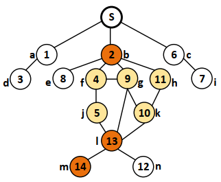
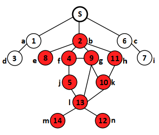
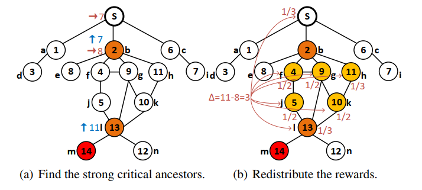
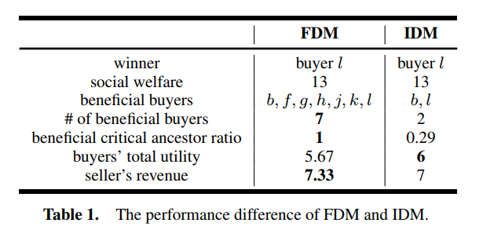

### Incentive Diffusion with Fair Rewards

---

#### Abstract

IDM的solution是给网络中的一些割点一些reward从而达到让seller的所有邻居节点都去如实地向周围节点传递auction的信息，但是在实际的网络中往往这类的割点存在的比较少，也就是说实际中的很多网络比较稠密，从而导致大部分的节点不愿意分享信息。因此本文提出一种新的机制来解决这个问题，这个机制奖励了更多的相关节点同时还保证了seller的收益。

#### Introduction

根据小世界网络的理论，在网络中一个点能够成为割点的几率是非常低的，因此IDM的激励方式可能会导致无法激励所有节点去传播auction的信息。这篇文章提出一个新的机制，这个机制不仅奖励cut-points，而且奖励那些不是割点但能够与其他非割点一起让winner无法到达seller. 这些节点相对于割点的重要性降低了但是对于winner和seller之间也是很重要的。为了处理这个问题，我们借用了一些来自redistribution mechanism design方面的知识，人们提出了很多的redistribution mechanism来将剩余money从seller手中重新分配给buyers. redistribution mechanism的目标是为了满足预算收支平衡的问题。这里仅仅借鉴redistribution mechanism的思想来对更多的buyers进行奖励。第二章陈述基本的问题；第三章介绍新的机制同时对比之前的机制；第四章陈述新机制的关键性质；最后一章给出总结。

#### Preliminaries

图$G=(V,E)$，其中$V=N\cup\{s\}=\{1,2,\cdots,n\}\cup\{s\}$. 每一个$i\in V$有一个$d_i>0$表示$i$到$s$的最小距离。对于每一个$i\in N$, 定义$\theta_i=(v_i,r_i)$表示$i$的type. 定义$i$的report type为$a_i=(v_i',r_i')$.  一个diffusion auction$\mathcal{M}$定义为一个分配规则$\pi=(\pi_1,\pi_2\cdots,\pi_n)$和一个支付规则$p=(p_1,p_2,\cdots,p_n)$. 其中$\pi_i:\Theta\rightarrow\{0,1\}$, $p_i: \Theta\rightarrow \mathbb{R}$. 对于$i$号buyer来说其收益等于$u_i(\theta_i,a)=\pi_i(a)v_i-p_i(a)$. 其他基本的定义与之前的大多数文章中的定义都是一样的，包括feasible，efficient，IR, IC等不多赘述。

#### Fair Diffusion Mechanism

这一章主要介绍FDM机制，在介绍机制之前首先引入多个概念：

**Definition 6.** 给定一个可行的profile $a\in \mathcal{F}(\theta)$，对于每一个buyer $i\in N$来说如果在没有集合$D_i\subseteq N$参与到这个auction的情况下不存在一条从$i$到$s$的路径，则我们称$D_i$是一个关于节点$i$的割集。如果不存在任何一个$D_i'\subset D_i$是的$D_i'$也是$i$的一个割集，那么我们就称$D_i$是关于$i$号buyer的一个**最小割集**。 

**Definition 7.** 给定一个可行的profile $a\in \mathcal{F}(\theta)$，对于任意一个buyer $i,j\in N$，如果$j$是$i$的某一个最小子集中的节点，那么我们定义$j$是$i$的**critical ancestor**.

**Definition 8.** 给定一个可行的profile $a\in \mathcal{F}(\theta)$，对于任意一个buyer $i,j\in N$, 如果$j$单独构成了$i$的一个最小割集，那么就称$j$是$i$的一个**strong critical ancestor**，对于那些是关于$i$的critical ancestor但是不是strong critical ancestor的节点都定义为**weak critical ancestor**. 

如上图所示所有的着色点都是节点$m$的critical ancestors, 浅黄色的节点都是weak critical ancestors同时深橘色的点表示的$m$的strong critical ancestors. 直觉上来说strong critical ancestors都是割点而其他点都是连接割点的节点. 

**Definition 9.** 给定一个可行的profile $a\in \mathcal{F}(\theta)$，对于任意一个buyer $i,j\in N$, 如果$i$是关于$j$的一个strong critical ancestor，那么我们认为$j$是$i$的一个**critical descendant**，定义$V_i=\{j|j\text{ is }i'\text{s }\text{critical descendant},j\in N\}$表示buyer $i$的**critical descendant set**. 类似地对于任意一个集合$K\subseteq N$，如果$K$是$j$的一个割集，那么我们定义$j$是$K$的critical descendant，定义$V_K=\{j|j\text{ is }K'\text{s }\text{critical descendant},j\in N\}$表示集合$K$的critical descendant set.

根据上面的定义我们很容易得到$N_{-i}=N\backslash V_i$以及$N_{-K}=N\backslash \cup_{i\in K}V_i$. 下图给出一个示例：

如上图所示，$V_b=\{e,f,g,h,j,k,i,m,n\}$, $N_{-b}=\{a,d,c,i\}$.

**Definition 10.** 给定一个可行的profile $a\in \mathcal{F}(\theta)$，对于任意一个buyer $i\in N$, 定义$C_i$表示节点$i$的strong critical ancestor sequence. 写为$C_i=\{c_1^i,c_2^i,\cdots,c^i_k\}$，其中$c^i_k=i$. 对于任意一个$c_j^i\in C_i$, 定义顺序规则由depth决定$d_{c_1^i}\leq d_{c_2^i}\leq \cdots,\leq d_{c_k^i}$. 

**Definition 11.** 给定一个可行的profile $a\in \mathcal{F}(\theta)$，对于任意的$c_i,c_{i+1}\in C$, 定义$M_{c_ic_{i+1}}$表示节点$c_i$和$c_{i+1}$之间的weak critical ancestor set.  记作$M_{c_ic_{i+1}}=\{m^1_{c_ic_{i+1}},m^2_{c_ic_{i+1}}\},\cdots,m^k_{c_ic_{i+1}}$, 其中$v_{m^1_{c_ic_{i+1}}}\geq v_{m^2_{c_ic_{i+1}}}\cdots\geq v_{m^k_{c_ic_{i+1}}}$. 其中每一个节点$m^j_{c_ic_{i+1}}\in M_{c_ic_{i+1}}$都是$i$的一个weak critical ancestor，同时这个节点还在节点$c_i$和$c_{i+1}$的一条simple路径上。

以图2(a)为例，其中$m$是最高报价者，关于节点$m$的strong critical ancestor sequence表示为$C=\{b,l,m\}$. $M_{bl}=\{f,g,h,j,k\}$, $M_{lm}=\empty$.

##### Fair Diffusion Mechanism

给定一个可行的action profile $a\in \mathcal{F}(\theta)$, 找到最高报价者$h\in \arg\max_{i\in N}v_i'$. 定义$v_D^{1^{st}}=\max_{i\in D}v_i'$表示在子集$D$中的最高报价者，即我们可以得到$v_h'=v_N^{1^{st}}$. 定义$g_D^{1^{st}}\in \arg\max_{i\in D}v_{V_i}^{1^{st}}$表示在子集$D$中的最高价的那个strong critical ancestor（即$V_D$中的最高报价者）

分配规则：
$$
\pi_i(a)=
\begin{cases}
1 &\text{if }i=c_j\in C,v_i'=v_{N_{-\{c_{j+1}\}\cup M_{c_jc_{j+1}}}}^{1^{st}}\text{and }\sum_{k\in N_{-i}}\pi_k(a)=0 \\
0 &\text{otherwise}
\end{cases}
$$
根据这个分配规则，我们可以得到一个winner $c_w\in C$以及$\pi_{c_w}(a)=1$. 接着我们将rewards分配给strong critical ancestor sequence $\hat{C}=\{c_1,c_2,\cdots,c_w\}$以及weak critical ancestors $\bigcup_{j=1}^{w-1}M_{c_jc_{j+1}}$.

支付规则：
$$
p_i=
\begin{cases}
v^{1^{st}}_{N_{-c_j}}-v^{1^{st}}_{N_{-\{c_{j+1}\}\cup M_{c_jc_{j+1}}}}-R_{c_j}& \text{if }i=c_j\in \hat{C}\backslash\{c_w\}\\
v^{1^{st}}_{N_{-c_w}}-R_{c_w}& \text{if } i=c_w\\
-R_i &\text{if } i \in M_{c_{j-1}c_j}\\
0 &\text{otherwise}
\end{cases}
$$
其中$R_i$定义为：
$$
R_i=
\begin{cases}
\dfrac{v^{1^{st}}_{N_{-\{c_j\}}\cup g^{1^{st}}_{M_{c_{j-1}c_j}}}-v^{1^{st}}_{N_{-\{c_j\}}\cup M_{c_{j-1}c_j}}}{|M_{c_{j-1}c_j}|+1} & \text{if }i=c_j\in \hat{C}\\
\dfrac{v^{1^{st}}_{N_{-\{i\}\cup \{c_j\}}}-v^{1^{st}}_{N_{-\{c_j\}}\cup M_{c_{j-1}c_j}}}{|M_{c_{j-1}c_j}|+1} &\text{if }i\in M_{c_{j-1}c_j}\\
0 &\text{otherwise}
\end{cases}
$$
FDM机制的直觉来看其分类规则是与IDM类似的，在strong critical ancestor sequence上找到第一个当$\{c_{j+1}\}\cup M_{c_jc_{j+1}}$不参与这个auction的情况下情况下，$c_j$是所有bidders中报价最高的那一个。其中$c_{j+1}$是在sequence上的下一个节点，$M_{c_jc_{j+1}}$表示的是在$c_{j}$和$c_{j+1}$之间的那些weak critical ancestors.

对于任意一个strong critical ancestor $c_j\in C$, 其payment可以表示为三部分：

第一部分是他需要支付的部分：$v^{1^{st}}_{N_{-c_j}}$，这个部分将会分配给他自己，前一个strong critical ancestor，$M_{c_{j-1}c_j}$以及seller.

第二部分是他获得的部分，这一部分来自于下一个strong critical ancestor $c_{j+1}$. 

第三部分是在redistribution之后他获得一部分reward.

对于winner来说，他后面没有下一个strong critical ancestor因此他的第二部分为0.

因为在两个strong critical ancestors $c_j$和$c_{j+1}$之间的支付值以及reward值不总是相等的，因此机制就将那一部分不同的值分配给weak critical ancestors $M_{c_jc_{j+1}}$以及$c_{j+1}$. 根据VCG Redistribution Mechanism的思想，对于buyer $i\in M_{c_jc_{j+1}}\cup \{c_{j+1}\}$的重分配的reward的计算方式是：在$i$可以选择的所有的report type之下的两种type之间差异的下界除以要去瓜分这个重分配reward的agents的数量$|M_{c_jc_{j+1}}|+1$. 在单物品的情境下，在$a'_i=nil$的情况下取得这个下界：也就是说它没有参与到这个auction中。更加准确地来说，对于任意一个$c_j\in \hat{C}$来说，假设他退出了这个机制，那么在$M_{c_jc_{j+1}}$中新的strong critical ancestor 变为了$g^{1^{st}}_{M_{c_{j-1}c_j}}$, 其payment变为$v^{1^{st}}_{N_{-\{c_j\} \cup g^{1^{st}}_{M_{c_{j-1}c_j}}}}$, 那么这个新变化的下界变为：$v^{1^{st}}_{N_{-\{c_j\}}\cup g^{1^{st}}_{M_{c_{j-1}c_j}}}-v^{1^{st}}_{N_{-\{c_j\}}\cup M_{c_{j-1}c_j}}$. 对于$i\in M_{c_{j-1}c_j}$, 如果他退出了机制，不会改变strong critical ancestor $c_j$的位置但是其payment会随之改变：$v^{1^{st}}_{N_{-\{i\}\cup \{c_j\}}}$. 因此在这种情况下的新差异的下界可以写为：$v^{1^{st}}_{N_{-\{i\}\cup \{c_j\}}}-v^{1^{st}}_{N_{-\{c_j\}}\cup M_{c_{j-1}c_j}}$.

机制实现的算法复杂度为：$O(|V|(|V|+|E|))$. 

下面给出一个实例：

首先找到最高报价者$m$, strong critical ancestor sequence为$C=\{b,l,m\}$. 根据分配规则，这个item被分配给buyer $l$, 因为$v_l'=v^{1^{st}}_{N_{-\{m\}\cup M_{lm}}}$. 因此对于$l$来说，$\hat{C}=\{b,l\}$. weak critical ancestor set为$M_{bl}=\{h,k,g,j,f\}$. 对于那些strong critical ancestors来说，buyer $b$应当支付的值为：$v^{1^{st}}_{N_{-b}}=v_i'=7$. 她将从buyer $l$手中获得$v^{1^{st}}_{N_{-\{l\}\cup M_{bl}}}=v_e'=8$. 对于buyer $l$可以得到类似的结果，其需要支付为$v_h'=11$同时因为其为winner，所以他获得的值为0. 此时注意buyer $l$的支付值为11，而buyer $b$从$l$手中获得的值为8，之间的差值为3，这个差值的money用来对$M_{bl}$以及$l$进行reward. 注意这个集合中共有6个玩家来share这个reward. 根据$R_i$的定义，当buyer $l$不参与这场auction的情况下winner就变为了buyer $h$同时他的支付值为10. 从而差值从3变为2，因此对于$l$的reward就为：$2/6=1/3$. 而对于其他的weak critical ancestors来说，对于$h$，如果他不参与那么winner还是$l$，但是$l$的payment变为10，从而类似地得到$R_h=2/6=1/3$. 对于f,g,j,k来说他们参与或者不参与对auction的结果没有什么实质性的改变，因为对于这四个buyers来说他们的reward等于$3/6=1/2$. 到这里$l,M_{bl}$中的所有节点都获得了reward，而此时还剩下$3-2/3-2=1/3$将会给予seller. 最后计算所有人的payment，$p_b=7-8=-1,p_f=p_g=p_j=p_k=-1/2,p_h=-1/3,p_l=11-1/3=32/3$. 进而可以计算每个人的收益值，最后计算seller的收益等于$u_s=32/3-1-4*1/2-1/3-1/3=22/3$. 

##### 将FDM与IDM进行对比

1. 

#### Properties of FDM

**Theorem 1.** FDM机制是IR的。

*Proof.* 首先明确在FDM机制实施的情况下，只有critical buyers有非零的收益。同时$R_i\geq 0$是恒成立的。在明确这两个先知条件的情况下开始证明：对于所有非零收益的buyers我们可以分为三类。第一类：$i=c_j\in \hat{C}\backslash c_w$; 其收益为$u_{c_j}(a)=\pi_{c_j}(a)v_{c_j}-p_{c_j}=v^{1^{st}}_{N_{-\{c_{j+1}\}\cup M_{c_jc_{j+1}}}}-v^{1^{st}}_{N_{-c_j}}+R_{c_j}$. 显然集合$N_{-\{c_{j+1}\}\cup M_{c_jc_{j+1}}}\supseteq N_{-c_j}$. 从而很容易得到$u_{c_j}(a)\geq 0$；第二类：winner，对于winner来说，其收益等于：$u_{c_w}(a)=\pi_{c_w}(a)v_{c_w}-p_{c_w}=v_{c_w}-v^{1^{st}}_{N_{-c_w}}+R_{c_w}\geq v_{c_w}-v^{1^{st}}_{N_{-c_w}}\geq v^{1^{st}}_{N_{-\{c_{w+1}\}\cup M_{c_wc_{w+1}}}}-v^{1^{st}}_{N_{c_w}}\geq 0$；第三类：$i\in M_{c_{j-1}c_{j}}$，这一部分人的收益等于$R_i\geq 0$. 综上所述，FDM机制是IR的。

---

**Theorem 2.**  FDM机制是IC的。

在graph上的所有buyers我们可以对他们进行分类，一共可以分为4类：

（1）非winner的strong critical ancestors $c_j\in \hat{C}\backslash c_w$.

（2）在strong critical ancestors之间的weak critical ancestors.

（3）winner $c_w$，最终获得item的buyer.

（4）不属于上面3类的其他buyers.

下面对这些group中的人分别证明他们的IC性质。

- **Group 1: strong critical ancestors**

  （1）固定diffusion strategy $r_{c_j}'$, 改变$v'_{c_j}$

  在这种情况下$c_j$的收益等于：
  $$
  u_{c_j}=\dfrac{v^{1^{st}}_{N_{-\{c_j\}}\cup g^{1^{st}}_{M_{c_{j-1}c_j}}}-v^{1^{st}}_{N_{-\{c_j\}}\cup M_{c_{j-1}c_j}}}{|M_{c_{j-1}c_j}|+1} + v^{1^{st}}_{N_{-\{c_{j+1}\}\cup M_{c_jc_{j+1}}}} - v^{1^{st}}_{N_{-c_j}}
  $$
  首先明确其收益是bid independent的，与其自己的报价无关，下面主要考虑allocation可能存在的变化，首先根据分配规则他是没有办法通过改变报价让自己从group1变为group2的成员的，因此其allocation结果不会改变，导致其收益也不会变化；而如果他高报让自己成为winner了，那么他的收益变为：$v_{c_j}-v^{1^{st}}_{N_{-c_j}}+R_{c_j}<v^{1^{st}}_{N_{-\{c_{j+1}\}\cup M_{c_jc_{j+1}}}} - v^{1^{st}}_{N_{-c_j}}+R_{c_j}=u_{c_j}$. 

  （2）固定buyer的报价$v_{c_j}'$同时改变$r'_{c_j}\neq r_{c_j}$

  此时假设在$r_{c_j}'$的情况下，$c_j$仍然是strong critical ancestor， 那么在这种情况下我们会得到：$N_{-\left\{c_{j+1}\right\} \cup M_{c_{j} c_{j+1}}^{\prime}}^{\prime} \subseteq N_{-\left\{c_{j+1}\right\} \cup M_{c_{j} c_{j+1}}}$，进而得到：$v_{N'_{-\left\{c_{j+1}\right\} \cup M_{c_{j} c_{j+1}}^{\prime}}}^{1^{s t}} \leq v_{N_{-\left\{c_{j+1}\right\}\cup M_{c_jc_{j+1}}}^{\prime}}^{1^{s t}}$. 由于$v^{1^{st}}_{N_{-c_j}}$和重分配的reward $R_{c_j}$没有变化，因此少传的情况下会减少buyer $c_j$的收益。如果少传播使得他成为了一个weak critical ancestor同时拥有正收益。那么他的收益变为：$u_{c_j}'\leq \frac{v^{1^{st}}_{N_{-\{c_j\}}\cup g^{1^{st}}_{M_{c_{j-1}c_j}}}-v^{1^{st}}_{N_{-\{c_j\}}\cup M_{c_{j-1}c_j}}}{|M_{c_{j-1}c_j}|+1}\leq u_{c_j}$. （因为：$v^{1^{st}}_{N_{-\{c_{j+1}\}\cup M_{c_jc_{j+1}}}} - v^{1^{st}}_{N_{-c_j}}\geq 0$）。而如果他通过少传播变为了新的winner，此时他的收益变为：$u_{c_j}'=v_{c_j}-v^{1^{st}}_{N_{-c_j}}+R_{c_j}<v^{1^{st}}_{N_{-\{c_{j+1}\}\cup M_{c_jc_{j+1}}}} - v^{1^{st}}_{N_{-c_j}}+R_{c_j}=u_{c_j}$. 如果他少传播后既没有成为strong critical ancestor也没成为一个weak critical ancestor，他的收益就从正收益变为0. 

- **Group 2: weak critical ancestors**

  （1）固定diffusion strategy $r_{i}'$, 改变$v'_{i}$

  在这种情况下，buyer $i$的收益为$u_i=R_i=\frac{v^{1^{st}}_{N_{-\{c_j\}}\cup g^{1^{st}}_{M_{c_{j-1}c_j}}}-v^{1^{st}}_{N_{-\{c_j\}}\cup M_{c_{j-1}c_j}}}{|M_{c_{j-1}c_j}|+1}$, 这个收益与$i$自己的报价是无关的。根据分配规则，它是没有机会通过虚报来变成一个strong critical ancestor的。如果分配结果不变那么其收益不会变化。如果她高报使得自己成为一个winner，那么重分配的那一部分收益是不会变化的，但是前面的一部分$v_i-v^{1^{st}}_{N_{-i}}<0$，从而会降低$i$的收益。

  （2）固定buyer的报价为$v_i'$，改变$r_i'\neq r_i$

  少传播不能够提升buyer $i$的收益。

- **Group 3: winner  $c_w$**

  （1）固定diffusion strategy $r_{c_w}'$, 改变$v'_{c_w}$

  对于winner来说其收益等于：$u_{c_w}=\frac{v^{1^{st}}_{N_{-\{c_w\}}\cup g^{1^{st}}_{M_{c_{w-1}c_w}}}-v^{1^{st}}_{N_{-\{c_w\}}\cup M_{c_{w-1}c_w}}}{|M_{c_{w-1}c_w}|+1} + v_{c_w} - v^{1^{st}}_{N_{-c_w}}$. 同样满足bid independent. 如果分配结果不变的话，不管$c_w$的报价为什么都会改变其收益，现在存在的可能是$c_w$低报使得自己成为了一个loser，如果她变为了一个weak critical ancestor，那么其收益变为$\frac{v^{1^{st}}_{N_{-\{c_w\}}\cup g^{1^{st}}_{M_{c_{w-1}c_w}}}-v^{1^{st}}_{N_{-\{c_w\}}\cup M_{c_{w-1}c_w}}}{|M_{c_{w-1}c_w}|+1} $，这个收益显然低于她作为winner时的收益。如果她变为了strong critical ancestor，那么她的收益就变为：$u_{c_w}=\frac{v^{1^{st}}_{N_{-\{c_w\}}\cup g^{1^{st}}_{M_{c_{w-1}c_w}}}-v^{1^{st}}_{N_{-\{c_w\}}\cup M_{c_{w-1}c_w}}}{|M_{c_{w-1}c_w}|+1} + v^{1^{st}}_{N_{-\{c_{w+1}\}\cup M_{c_wc_{w+1}}}} - v^{1^{st}}_{N_{-c_w}}$. 这个值也是低于winner时的收益的，因为显然我们可以发现$v_{c_w}\geq v^{1^{st}}_{N_{-\{c_{w+1}\}\cup M_{c_wc_{w+1}}}}$. 

  （2）固定buyer的报价$v_{c_w}'$同时改变$r'_{c_w}\neq r_{c_w}$

  winner $c_w$的收益等于：$u_{c_w}=\frac{v^{1^{st}}_{N_{-\{c_w\}}\cup g^{1^{st}}_{M_{c_{w-1}c_w}}}-v^{1^{st}}_{N_{-\{c_w\}}\cup M_{c_{w-1}c_w}}}{|M_{c_{w-1}c_w}|+1} + v_{c_w} - v^{1^{st}}_{N_{-c_w}}$. 这个结果与其传播的情况是无关的。同时我们知道allocation rule分配的情况是：$v'_{c_w}=v^{1^{st}}_{N_{-\{c_{w+1}\}\cup M_{c_wc_{w+1}}}}$，关于这个分配结果也是与$c_w$的传播无关的，因此也就是说无论她如何传播都不会影响她的收益。

- **Group 4: 非group1,2,3的buyers**

  （1）固定diffusion strategy $r_{i}'$, 改变$v'_{i}$

  在这个group中的buyers的收益均为0. 考虑其能够通过改变报价来提高自己的收益，首先一种情况考虑$c_w$是$i$的一个strong critical ancestor，那么显然无论buyer $i$如何报价都无法改变她自己的group属性；另一种情况是$c_w$不是$i$的一个strong critical ancestor, 这种情况下buyer $i$可以通过高报来使得自己成为一个winner，但是这种情况下她所需要支付的值远远大于她的估值，因此她的收益将从0变为负数。

  （2）固定buyer的报价为$v_i'$，改变$r_i'\neq r_i$

  group 4中的buyers她们的传播不会对机制的实施产生任何的影响，所以少传对于这部分的buyers是无法改变他们的收益的。

---

**Theorem 3:** 在FDM机制下的seller的收益一定是大于等于IDM机制下的卖家收益的，同时IDM的卖家收益也一定是不低于传统VCG在diffusion auction下的卖家收益的。

*Proof.* 给定一个可行的action profile $a\in \mathcal{F}(\theta)$, 卖家的收益可以写为所有buyers的payment的和的形式，在FDM机制下我们可以写为：
$$
\begin{split}
u_s^{FDM}(a,(\pi,p))&=
\sum_{i\in N}p_i(a,(\pi,p))\\
&=v^{1^{st}}_{N_{-c_1}} + R_s\\
&\geq v^{1^{st}}_{N_{-c_1}}
\end{split}
$$
然而在IDM机制下，seller的收益定义为：$u_s^{IDM}(a,(\pi,p))=v{1^{st}}_{N_{-c_1}}$.

从而我们进一步可以得到：
$$
\begin{split}
u_s^{FDM}(a,(\pi,p)) &\geq v^{1^{st}}_{N_{-c_1}}=u_s^{IDM}(a,(\pi,p))\\
&\geq v^{2^{nd}}_{r_s}=u_s^{VCG}(a,(\pi,p))
\end{split}
$$
综上我们可以知道FDM机制下的seller的revenue是非负的，且至少和IDM一样好，同时也是大于等于VCG机制的seller revenue的。

---

#### Conclusion

这篇论文提出了一种新的diffusion auction的机制，这种机制在IDM的基础上，对于reward进行了调整，不再是仅仅对于strong critical ancestors进行奖励，而是对于所有连接两个强关键节点之间的节点都进行reward. 进一步提高了buyers incentive to diffuse这个auction的信息。同时这个机制是IR的，IC的，而且没有降低seller's revenue. 

未来的研究方向：FDM扩展到多物品上。更进一步的还有匿名攻击也是在机制设计问题上的一个困难问题，如何设计一种对抗匿名攻击的机制也是一个很有意思的课题。除此之外，在一个social network上给定一个估值分布，我们可以考虑贝叶斯均衡下的seller的最大收益问题。还有课题是如何将FDM机制扩展到带权图上……