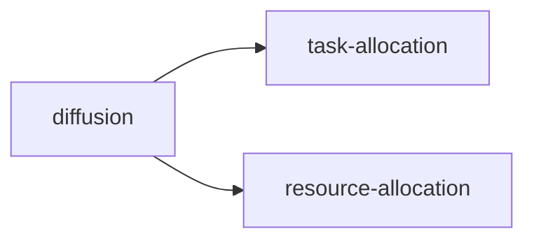

#### Collaborative Data Acquisition

(AAMAS 2020)

众包机制设计：给出了在社交网络上的众包机制（不依赖于第三方平台）实报数据且diffuse task information；评估数据冗余性的新方法以及定reward的新方法，修改了shapley value；使得requester受益。

crowdsourcing diffusion mechanism

#### Redistribution Mechanism on Networks

(AAMAS 2020)

重分配机制设计：单物品分配的情景下，讲传统的非diffusion auction下的重分配机制扩展到graph上，改进了Cavallo Mechanism $\Rightarrow$ Network-based Redistribution Mechanism（带cost的参与以及多物品上的redistribution是研究方向）（注意这里的机制还是针对于auction而言的，也就是说每个agent的profile是$(v_i,r_i)$）

#### Maximal Information Propagation with Budgets

所有的参与者没有报价，只需要进行传播，seller或者说center根据每个agent的传播情况和自己的total budget将自己的budget全部分配出去，因此最好的机制是满足：BB（将所有的budgets都分配出去）同时满足IC性

#### Fixed-price Diffusion Mechanism Design

setting: seller sell one item via social network; 这个机制更像是设计了一个近似算法，从revenue的角度出发找到一个1/2近似最优revenue的算法。fix-price mechanism属于经典的算法，这里是将经典算法扩展到了social network下。优势在于不需要保证所有的agents导出IC性，只需要保证所有人的支付一致，同时易于计算。保证1/2的最优revenue.

