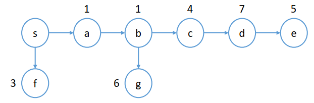

### Selling Multiple Items via Social Networks

---

#### 摘要

一般的diffusion auction的情境，一个seller，出售多个相同的单位物品，每一个参与的buyer只需要一个单位的物品。基于IDM算法给出了一种泛化的算法GIDM，满足DSIC，IR，卖家收益非负但不满足efficient. 

#### 基本的IDM算法

IDM的核心在于一个buyer如果通过传播增加了社会福利那么他就能够通过传播获利同时这个获利确保每个人邀请他的所有邻居参加auction是一个占优策略。

算法的流程如下：

(1) 给定一个可行的buyers types的集合$\theta'$，找到那个出最高价的buyer，记为$i^\ast$.

(2) 找到所有的$i^\ast$的关键传播节点记为$C_{i^\ast}$. 

(3) 对于所有在$C_{i^\ast}\cup\{i^\ast\}$的buyers $i$，如果$i$被分配得到了这个物品那么他的payment就是在当他自身不参加这个auction下的最大的那个报价：$p_i=\max_{j\in N_{-i}\and \theta_j'\neq nil} v_j'$

(4) 起初，seller将这个物品分配给最高价关键传播路径上的第一个人，同时定义一个$l=1$，重复下面的步骤：

	1. 如果$i$是在$C_{i^\ast}\cup\{i^\ast\}$中排名最后的一个人，那么$i$获得商品同时支付$x_i(\theta')=p_i$.
 	2. 如果$v_i'=p_j$，其中$j$是第$(l+1)$号buyer，那么$i$得到这个物品同时支付$x_i(\theta')=p_i$.
 	3. 否则的话，$i$将这个item传递给$j$ buyer同时$i$的payment为$x_i(\theta')=p_i-p_j$, 其中$j$是第$(l+1)$号buyer，之后置$i=j,l = l+1$.

(5) 其余的buyers的支付结果都为0.

给出示例：

初始情况下seller只能将物品在A,B,C三人进行auction，其最高的收益不会超过7. 而在diffusion auction下网络得到扩展，能够看到出价最高者出价为20.

下面进行IDM机制的运行流程：

首先找到最高价者Y，以及其关键的传播路径S-C-K-Y, 不难计算$C_{i^\ast}=\{C,K\}$. 起初卖家将物品分配给C，判断C是否有资格拿到物品，判断其报价与序列上的后一个节点需要支付的值之间的大小关系即$v_C$和$p_K$之间的大小关系，前者等于2，后者等于17. 因此C没有资格取得item，这时计算C的payment等于$p_C-p_K=16-17=-1$，即seller需要向C支付价格为1. C将这个item传递给下一个序列上的节点K，继续判断K是否有资格获得这个item，$v_K=19$, $p_Y=19$, 因此K有资格获得这个物品，从而这个物品被分配给K. K的支付结果就为17. 最终seller的收益为16.

IDM有良好的性质，首先其是IR,IC的，另外其卖家收益至少是仅仅带有seller邻居进行auction下的卖家收益。

#### GIDM

引入概念：critical parents和critical children，定义$P_i(\theta')$表示$i$的所有critical parents构成的集合，$C_i(\theta')$表示$i$的所有的critical children构成的集合。如果一个在$P_i(\theta')$集合中的元素决定不将拍卖信息传播给任意一个他的邻居，那么最终$i$将无法加入这个auction中；同样的如果$i$不将拍卖的信息告诉他的邻居们，那么$C_i(\theta')$都将无法加入这个auction.

有了上面的两个概念我们就可以定义一个最优的分配树：$T^{opt}(\theta')$

1. 以seller为根节点
2. 根据出售物品的数量选择top-k出价的那些人作为$N^{opt}$节点，同时找到在$N^{opt}$中的buyers的critical parents：$P^{opt}(\theta')=\cup_{i\in N^{opt}}P_i(\theta')$. 整个Tree的nodes由这些节点构成：$N^{opt}(\theta')\cup P^{opt}(\theta')$。
3. 所有的路径根据$P_i(\theta')$得到。

对于在这个Tree上的所有的节点，我们都给他定义一个权重$w_i(T^{opt}(\theta'))=|\{j\in N^{opt}|j=i \or i\in P_j(\theta')\}|$. 这个权重表示的是在efficient allocation下分配给每个节点$i$以及他的孩子$C_i(\theta')$的items的数量。定义$Children(i)$表示在Tree中$i$的所有direct children构成的集合. 

仍然使用分析IDM时的网络，假设一共存在5个items需要分配出去，现在我们可以构建如下的这个Tree.

GIDM机制的整体流程如下：

首先根据所有buyers的type profiles计算出最优分配Tree：$T^{opt}(\theta')$. 定义$W$是在GIDM下的获胜者的集合，初始情况下$W=\empty$, 定义$GetFrom(i)$表示i从谁的手中拿到了一个item. 下面介绍分配规则：

##### Allocation of GIDM

定义$Q$为一个stack，起初seller将根据$w_i(T^{opt}(\theta'))$的值将物品分配给他的邻居$Children(s)$同时将他们放入这个stack中。

(1) 将Q中的一个$i$节点pop出来，分析这个$i$是否有资格获得商品：
$$
\text{Maximize: } SW_{-C_i^K}=\sum_{j\in N_{-C_i^K}}\pi_j(\theta')v_j'
$$

$$
\begin{split}
\text{Subject to:} & C_i^K=C_i(\theta')^K\cup P(C_i(\theta')^K)\cup C(P(C_i(\theta')^K))\\
& P(C_i(\theta')^K)=\cup_{j\in C_i(\theta')^K}\{l|l\in P_j(\theta')\and i\succ_{\theta'}l\}\\
 & C(P(C_i(\theta')^K))=\cup_{j\in P(C_i(\theta')^K)}C_j(\theta')\\
&\forall j\in N_i^{received},\pi_j(\theta')=1 \\
& N_i^{received}=W\cup P_i(\theta')\\
& \forall j \neq i \in (N^{opt}\backslash C_i^K)\backslash N_i^{out},\pi_j(\theta')=1 \\
& N_i^{out}=\{j\notin N_i^{received}|j=GetFrom(l),\forall l\in N_i^{received}\}
\end{split}
$$

其中$C_i(\theta')^K$表示的是$i$的critical children中报价排名前k高的那些buyers.

这里的$N_i^{received}$表示的是那些从孩子节点处获得item的那些parent节点。

而这里的$N_i^{out}$则表示的是那些把自己的item拿出来给parent的节点。

如果$i$满足上面的优化问题则将$i$添加到$W$中。

(2) 下一步需要考虑的是既然$i$具有获得物品的权力，那么从哪里获得这个item. 

1. 如果$\sum_{j\in Children(i)} w_j(T^{opt}(\theta'))=w_i(T^{opt}(\theta'))-1$. 则定义从自己手中拿到一个item，即$GetFrom(i)=i$.

 	2. 否则的话定义$k_i=w_i(T^{opt}(\theta'))$同时定义$out$表示在以$i$为root的子树中$w_{out}(T^{opt}(\theta'))\neq 0$中报价为第k高的那个buyer，他需要将他的item贡献出来，这时候设置$GetFrom(i)=out$.
 	3. 对于$i$的每一个child $j$，如果$w_j(T^{opt}(\theta'))>0$, 将$w_j(T^{opt}(\theta'))$个items给$j$同时将$j$放入Q中。

##### Payment of GIDM

对于所有的$i\in N$，其payment可以写为：
$$
\begin{cases}
SW_{-D_i}-(SW_{-C_i^K}-v_i') &\text{ if }i \in W \\
SW_{-D_i} - SW_{-C_i^K} &\text{ if }i\in \cup_{j\in W}P_j(\theta')\backslash W \\
0 &\text{ otherwise }
\end{cases} 
$$
其中$SW_{-C_i^K}$定义在allocation rule中，而$SW_{-D_i}$定义如下：
$$
\text{Maximize: }SW_{-D_i}=\sum_{j\in N_{-D_i}}\pi_j(\theta')v_j'
$$

$$
\begin{aligned}
\text{Subject to: } & D_i=\{i\}\cup C_i(\theta')\\
& \forall j \in N_i^{received},\pi_j(\theta')=1 \\
& N_i^{received} = W\cap P_i(\theta')\\
& \forall j \in (N^{opt}\backslash D_i)\backslash N_i^{out},\pi_j(\theta')=1 \\
& N_i^{out}=\{j\notin N_i^{received}|j=GetFrom(l),\forall l\in N_i^{received}\}
\end{aligned}
$$

在GIDM机制中的分配规则内部的直觉是如果一个buyer在efficient分配规则下不能够获得一个item，但是他的critical children获得了一个商品，那么他是有可能从他的这个获得物品的critical child手中将这个item抢过来，但是前提是他自己对于这个item的估值是足够大的，否则的话不去获得这个item反而会让他的收益更高。

下面给出一个GIDM的直观的例子比较容易理解这个机制的运行过程：

 仍然以IDM分析时使用的例子来看：

（1）seller将这5个items分别分配给D和C，其中D两个，C三个，同时将C,D压入stack中。

（2）将D从Q中pop出来，分析D有没有成为winner的资格，首先$C_D(\theta')=\{H,I,J,M,O\}$. $C_D^K=\{H,I,J,M,O\}$. 当我们将$C_D^K$从graph中移除之后不难发现D是有资格获得一个item的，因此将D添加到$W$中去。

（3）由于我们知道D本来是无法获得一个item的，因此需要一个D的critical child将自己原本获得的item拿出来。我们找到M，因此有$GetFrom(D)=M$.

（4）D将剩余的一个item拿给H同时将H添加入stack中。

（5）分析H，H有资格得到一个item，因此将H从stack中pop出来同时将其添加到$W$中。其中$C_H^K=\empty$，$N_H^{received}=\{D\}$，$N_H^{out}=\{M\}$.

（6）C从stack中pop出来，C没有资格成为一个winner，因此他将三个items给了两个K，给了一个G，同时将G,K分别压入stack中。

（7）通过类似的分析方法可以发现最终的获胜者是：$\{D,H,K,Y,G\}$.

最终的结果以及各自的支付计算为如下图：

#### Properties of GIDM

**Theorem 5.1**：GIDM机制是IR的。

*proof*. 证明目标：对于所有的$\theta'_i(v_i,r_i')$, 都有$u_i(\theta_i,\theta',(\pi^{GIDM},x^{GIDM}))\geq 0$. 

根据GIDM机制的基本定义，我们不难发现对于任意的一个buyer来说，他的收益要么等于$u_i(\theta_i,\theta')=0$，要么等于$u_i(\theta_i,\theta')=SW_{-C_i^K}-SW_{-D_i}$. 根据$SW_{-C_i^K}$和$SW_{-D_i}$的定义我们可以得到$N_{-D_i}\subset N_{-C_i^K}$，从而我们可以知道$SW_{-C_i^K}\geq SW_{-D_i}$，从而有$u_i(\theta_i,\theta')\geq 0$.

**Theorem 5.2**：GIDM机制是IC的。

*proof*. 证明目标：对于任意的buyer，在固定其他所有人的报价以及传播信息时他的占优策略一定是实报且将auction信息传递给所有邻居。

证明的思路，首先要将所有的buyers分为三个不同的类别：

1. Winner群体，这群人最终得到了一个item.
2. 所有的不是winner但是他们是winner的critical parents，也就是$\bigcup_{i\in W}P_i(\theta')\backslash W$.
3. 第三类人是不在前两类中的那些人.

Group1：他们中的任意一个人的收益等于：$u_i(\theta_i,\theta')=v_i +(SW_{-C_i^K}-v_i')-SW_{-D_i}$. 假设固定$i$的invitations为$r_i'$，那么我们知道$C_i^K$就固定了。如果$i$实报$v_i$，其收益变为：$u_i(\theta_i,\theta')=SW_{-C_i^K}-SW_{-D_i}$, 在这种情况下我们知道$SW_{-C_i^K}$表示的是在$i$不影响结果下的最优社会福利。而如果$i$误报$v_i'$从而改变了分配结果来提高$v_i+(SW_{-C_i^K}-v_i')$，而我们知道这是无法提升的，因为这与之前提到的$SW_{-C_i^K}$是最优社会福利的结论相互矛盾，因此不能通过误报来提高收益。$i$在作为winner情况下的收益是大于他通过误报而改变分配结果下的收益的。考虑另一种情况，当$i$通过误报使得自己从winner变成了一个winner集合中某个buyer的critical parent，下面考虑这种情况下的收益：$SW_{-C_i^K}-SW_{-D_i}$，而我们知道实际上当$v_i$被包含在$SW_{-C_i^K}$的情况下才是其最大的时候，因此这种情况下$v_i$是不在其中的也就意味着这种情况下的收益是低于$i$实报作为一个winner时的收益的。还有一种情况就是$i$变成了一个非winner且非critial parent的情况，其收益变为0，显然低于实报的情况。因此对于group1中的winners，在固定传播情况下其最大的收益一定是如实报价。

假设固定$i$的估值和报价为$v_i$, 改变$i$的传播情况$r_i'\subseteq r_i$，对于任意两个$\theta_i'=(v_i,r_i')$和$\theta_i''=(v_i,r_i'')$：假设$r_i''\subset r_i'\subseteq r_i$，我们很容易得到：$C_i(\theta_i'',\theta_{-i}')\subset C_i(\theta_i',\theta_{-i}')$. 从而我们会发现$N_{-C_i^{K,r_i''}}\subset N_{-C_i^{K,r_i'}}$，从而我们会有$SW_{-C_i^{K,r_i'}}\geq SW_{-C_i^{K,r_i''}}$. 而我们知道当$r_i'=r_i$时$SW_{-C_i^{K,r_i}}$得到最大值，从而当$\theta_i'=\theta_i$时我们会发现$i$的收益最大。

Group2：任意一个在$i\in \bigcup_{j\in W}P_j(\theta')\backslash W$，他的收益为：$u_i(\theta_i,\theta')=SW_{-C_i^K}-SW_{-D_i}$. 假设$i$误报$v_i'$他仍然在group2中，那么其收益不会改变，因为收益表达式中的两项与$v_i'$是无关的；而如果他高报使得自己成为winner，很容易发现他的收益会降低；对于$i$来说他是不可能通过误报使得自己变为group3中的成员。固定$i$的估值和报价为$v_i$, 改变其传播信息的证明与group1的证明是类似的，因此来说对于group2中的buyers他们的占优策略也一定是实报且全部传播。

Group3：在这个group中人的收益原本都为0.（这个地方的证明是有问题的！）

固定$i$的传播type为$r_i'$，假设$i$通过误报$v_i'$使得自己成为一个winner，此时其收益为$u_i(\theta_i\theta')=v_i + (SW_{-c_i^K}-v_i')-SW_{-D_i}$，而我们假设他实报的情况下会发现由于其收益等于零，也就是说在这种情况下$SW_{-C_i^K}=SW_{-D_i}$, 而显然我们发现误报的情况下收益是会降低的，因为$v_i'>v_i$. 

固定$i$的估值和报价$v_i$, 如果向自己的所有邻居传播拍卖信息不能让自己成为group1或者group2中的人，那么传播更少的情况下$i$仍然会在group3中，因此全部传播是使得$i$最优化他的收益。（这个地方的证明是错误的，单纯的认为少传播不会改变i的group类型以及不会增加i的收益是错误的。下面给出反例。）

以下面的图为例：

seller手中共计有4件相同的items，buyers的网络结构图如下。初始状态下seller将4件items全部分配给a，因为报价前4名的buyers全部在a的子树下面。整个图中的权重为：$w_a=4,w_f=0,w_b=4,w_g=1,w_c=1,w_d=1,w_e=1$. 将a压入栈中，此时判断a是否有资格获得这个item，$C_a^K=\{b,c,d,e,g\}$，将这些节点去掉后，a有资格获得这个item，找到原本分配到商品的人中最低价格的那个，也就是c，将c的item拿给a，同时a放入winner集合中，权重进行修改：$w_a=4,w_b=3,w_g=1,w_c=2,w_d=1,w_e=1,w_f=0$. 此时a将3个items拿给b同时将b压入栈中，下面判断b有没有资格获得这个item，考虑$C_b^K=\{c,d,e,g\}$，去除之后b有资格拿到一个item，因此将e的item拿给b，b加入winner集合，修改权重：$w_a=4,w_b=3,w_c=1,w_d=1,w_e=0,w_g=1,w_f=0$, $W=\{a,b\}$. 下面对c进行判断是否有资格获得一个item，计算$C_c^K=\{d,e\}$，去掉之后c也是有资格获得一个item的，这时候c从d手中拿走了一个item，同时c的支付为$2+6+3-(2+6+4-4)=3$. 进一步更新，$w_a=4,w_b=3,w_c=1,w_d=0,w_e=0,w_f=0,w_g=1$. $W=\{a,b,c\}$. 分别对之后的节点进行分析，最终会发现$W=\{a,b,c,g\}$. 这时候就发现一个奇怪的情况，d虽然报价是最高的，同时也传了，但是他的总收益却为0. 而我们考虑如果d不将信息传播出去，仿照前面的推理会发现最终d能够获得一个item同时收益从0变为了1（$7-6=1$）. 因此不传播反而是增加了d的收益的，因此来说这GIDM机制不是truthful的。

##### Seller's Revenue with GIDM

**Theorem 5.3** GIDM机制下的卖家的收益大于等于$K\times v_{K+1}$. 其中$v_{K+1}$表示的是在$r_s$中的第$(K+1)$高的价格。（假设$|r_s|> K$）

*Proof*. 首先考虑GIDM的支付规则如下：
$$
\begin{cases}
(SW_{-D_i}-V_{N_i^{still}})-(SW_{-C_i^K}-V_{N_i^{still}}-v_i') & \text{if }i\in W \\
(SW_{-D_i}-V_{N_i^{still}})-(SW_{-C_i^K}-V_{N_i^{still}}& \text{if } i\in \bigcup_{j\in W} P_j(\theta')\backslash W \\
0 & \text{otherwise}
\end{cases}
$$
其中：
$$
\begin{aligned}
N_i^{still}&=(N^{opt}\backslash (D_i\cup N_i^{out}))\cup N_i^{received} \\
V_{N_i^{still}}&=\sum_{j\in N_i^{still}}v_j'\\
\end{aligned}
$$
注意在最原始的GIDM的支付规则的定义中是不存在$V_{N_i^{still}}$这一项的。考虑在$SW_{-D_i}$和$SW_{-C_i^K}$中均包含了在$N_i^{still}$这个集合中的所有buyers的估值，因此我们可以对于这两项同时减去这个$V_{N_i^{still}}$.

下面进一步引出lemma5.4:

**Lemma 5.4**：在给定所有buyers的types profile $\theta'$后，在GIDM机制下，对于所有的$i\in \bigcup_{j\in W}P_j(\theta')\backslash W$, 定义$k_i$为表示传递给$i$的items的数量。同时存在$m\geq 1$个$i$的children从$i$手中获得了一件item. 定义这$m$个children为一个序列：$\{i_1,\cdots,i_m\}$. 同时定义$i$给了$i_l$一共$k_{i_l}$件商品。
$$
SW_{-C_i^K}-V_{N_i^{still}}\leq \sum_{i_l}(SW_{-D_i}-V_{N_{i_l}^{still}})
$$
*Proof*. $SW_{-C_i^K}-V_{N_i^{still}}$表示的是在集合$N\backslash(C_i^K\cup N_i^{still})$中那些报价排名前$k_i$的buyers. 而$SW_{-D_{i_l}}-V_{N_{i_l}^{still}}$则表示的是在集合$N\backslash (D_{i_l}\cup N_{i_l}^{still})$中排名前$k_{i_l}$的那些buyers的估值的和。而由于$i$是没有获得一个item的，因此$k_i=\sum_{i_l}k_{i_l}$, $N_{i}^{still}\subseteq N_{i_l}^{still}$以及$|N_{i_{l}}^{still}-N_i^{still}|=k_i-k_{i_l}$. 而由于$K\geq k_i\geq k_{i_l}$, 我们不难得到$\bigcup_{i_l}D_{i_l}\subseteq C_i^K$以及$N_{i_l}^{still}\backslash N_i^{still}\subset C_i^K$. 进一步可以得到：$D_{i_l}\cup N_{i_l}^{still} \subseteq C_i^K\cup N_i^{still}$以及$N\backslash (C_i^K\cup N_i^{still})\subseteq N\backslash (D_{i_l}\cup N_{i_l}^{still})$. 有了这样一个关系后我们就可以导出Lemma5.4中的结论：
$$
SW_{-C_i^K}-V_{N_i^{still}}\leq \sum_{i_l}(SW_{-D_i}-V_{N_{i_l}^{still}})
$$
类似的方法我们还可以导出另外一个结论，对于所有的$i\in W$都会有：
$$
(SW_{-C_i^K}-V_{N_i^{still}}-v_i')\leq \sum_{i_l}(SW_{-D_{i_l}}-V_{N_{i_l}^{still}})
$$
其中$k_i-1=\sum_{i_l}k_{i_l}$，因为$i$作为一个winner获得了一个item. 

下面就可以证明Theorem5.3了，因为lemma5.4中我们放缩了两个式子，分别是group1和狗group2中buyers的支付，从而我们得到结论，对于GIDM机制下所有buyers的支付的结果的求和等于：
$$
\sum_{i\in Children(s)}(SW_{-D_i}-V_{N_i^{still}})+\Delta
$$
其中这个$\Delta\geq 0$表示为由于放缩而带来的偏移量。

假设$s$在$T^{opt}(\theta')$中共有$m$个children，传递给他们的items的数量分别为：$k_{s_1},k_{s_2},\cdots,k_{s_m}$. 其中$\sum_{s_i}k_{s_i}=K$. 根据前面的lemma5.4我们知道$SW_{-D_{s_i}}-V_{N_{s_i}^{still}}$表示的是在集合$N\backslash (D_{s_i}\cup N_{s_i}^{still})$中报价前$k_{s_i}$高的那些buyers的报价的和。而我们又不难发现：$r_s\nsubseteq D_{s_i}\cup N_{s_i^{still}}$. （因为至多有K个items，而$|r_s|>K$）对于每一个$s_i$，$D_{s_i}$中至多包含一个来自$r_s$的buyer，同时$N_{s_i}^{still}$则包含至多$K-k_{s_i}$个来自$r_s$的buyers。因此在集合$N\backslash (D_{s_i}\cup N_{s_i}^{still})$的buyers中第$k_{s_i}$高的报价者的值一定不低于$v_{K+1}$，从而我们就能够得到结果：
$$
\sum_{i\in Children(s)}(SW_{-D_i}-V_{N_i^{still}})+\Delta \geq K\times v_{K+1}
$$

#### Conclusions

总结下来几个核心点：

1. 在GIDM机制下定义的$C_i^K$是保证在此机制下所有人都truthful的关键。（虽然实际上这个机制并不是truthful的）
2. 未来的工作方向一定是找关于组合拍卖在diffusion auction下的truthful机制的设计。
3. 考虑diffusion下的cost的问题。

