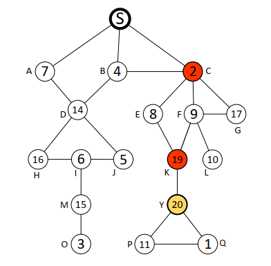

### Selling Multiple Items via Social Networks

---

#### 摘要

一般的diffusion auction的情境，一个seller，出售多个相同的单位物品，每一个参与的buyer只需要一个单位的物品。基于IDM算法给出了一种泛化的算法GIDM，满足DSIC，IR，卖家收益非负但不满足efficient. 

#### 基本的IDM算法

IDM的核心在于一个buyer如果通过传播增加了社会福利那么他就能够通过传播获利同时这个获利确保每个人邀请他的所有邻居参加auction是一个占优策略。

算法的流程如下：

(1) 给定一个可行的buyers types的集合$\theta'$，找到那个出最高价的buyer，记为$i^\ast$.

(2) 找到所有的$i^\ast$的关键传播节点记为$C_{i^\ast}$. 

(3) 对于所有在$C_{i^\ast}\cup\{i^\ast\}$的buyers $i$，如果$i$被分配得到了这个物品那么他的payment就是在当他自身不参加这个auction下的最大的那个报价：$p_i=\max_{j\in N_{-i}\and \theta_j'\neq nil} v_j'$

(4) 起初，seller将这个物品分配给最高价关键传播路径上的第一个人，同时定义一个$l=1$，重复下面的步骤：

	1. 如果$i$是在$C_{i^\ast}\cup\{i^\ast\}$中排名最后的一个人，那么$i$获得商品同时支付$x_i(\theta')=p_i$.
 	2. 如果$v_i'=p_j$，其中$j$是第$(l+1)$号buyer，那么$i$得到这个物品同时支付$x_i(\theta')=p_i$.
 	3. 否则的话，$i$将这个item传递给$j$ buyer同时$i$的payment为$x_i(\theta')=p_i-p_j$, 其中$j$是第$(l+1)$号buyer，之后置$i=j,l = l+1$.

(5) 其余的buyers的支付结果都为0.

给出示例：

初始情况下seller只能将物品在A,B,C三人进行auction，其最高的收益不会超过7. 而在diffusion auction下网络得到扩展，能够看到出价最高者出价为20.

下面进行IDM机制的运行流程：

首先找到最高价者Y，以及其关键的传播路径S-C-K-Y, 不难计算$C_{i^\ast}=\{C,K\}$. 起初卖家将物品分配给C，判断C是否有资格拿到物品，判断其报价与序列上的后一个节点需要支付的值之间的大小关系即$v_C$和$p_K$之间的大小关系，前者等于2，后者等于17. 因此C没有资格取得item，这时计算C的payment等于$p_C-p_K=16-17=-1$，即seller需要向C支付价格为1. C将这个item传递给下一个序列上的节点K，继续判断K是否有资格获得这个item，$v_K=19$, $p_Y=19$, 因此K有资格获得这个物品，从而这个物品被分配给K. K的支付结果就为17. 最终seller的收益为16.

IDM有良好的性质，首先其是IR,IC的，另外其卖家收益至少是仅仅带有seller邻居进行auction下的卖家收益。

#### GIDM

引入概念：critical parents和critical children，定义$P_i(\theta')$表示$i$的所有critical parents构成的集合，$C_i(\theta')$表示$i$的所有的critical children构成的集合。如果一个在$P_i(\theta')$集合中的元素决定不将拍卖信息传播给任意一个他的邻居，那么最终$i$将无法加入这个auction中；同样的如果$i$不将拍卖的信息告诉他的邻居们，那么$C_i(\theta')$都将无法加入这个auction.

有了上面的两个概念我们就可以定义一个最优的分配树：$T^{opt}(\theta')$

1. 以seller为根节点
2. 根据出售物品的数量选择top-k出价的那些人作为$N^{opt}$节点，同时找到在$N^{opt}$中的buyers的critical parents：$P^{opt}(\theta')=\cup_{i\in N^{opt}}P_i(\theta')$. 整个Tree的nodes由这些节点构成：$N^{opt}(\theta')\cup P^{opt}(\theta')$。
3. 所有的路径根据$P_i(\theta')$得到。

对于在这个Tree上的所有的节点，我们都给他定义一个权重$w_i(T^{opt}(\theta'))=|\{j\in N^{opt}|j=i \or i\in P_j(\theta')\}|$. 这个权重表示的是在efficient allocation下分配给每个节点$i$以及他的孩子$C_i(\theta')$的items的数量。定义$Children(i)$表示在Tree中$i$的所有direct children构成的集合. 

仍然使用分析IDM时的网络，假设一共存在5个items需要分配出去，现在我们可以构建如下的这个Tree.

GIDM机制的整体流程如下：

首先根据所有buyers的type profiles计算出最优分配Tree：$T^{opt}(\theta')$. 定义$W$是在GIDM下的获胜者的集合，初始情况下$W=\empty$, 定义$GetFrom(i)$表示i从谁的手中拿到了一个item. 下面介绍分配规则：

##### Allocation of GIDM

定义$Q$为一个stack，起初seller将根据$w_i(T^{opt}(\theta'))$的值将物品分配给他的邻居$Children(s)$同时将他们放入这个stack中。

(1) 将Q中的一个$i$节点pop出来，分析这个$i$是否有资格获得商品：
$$
\text{Maximize: } SW_{-C_i^K}=\sum_{j\in N_{-C_i^K}}\pi_j(\theta')v_j'
$$

$$
\begin{split}
\text{Subject to:} & C_i^K=C_i(\theta')^K\cup P(C_i(\theta')^K)\cup C(P(C_i(\theta')^K))\\
& P(C_i(\theta')^K)=\cup_{j\in C_i(\theta')^K}\{l|l\in P_j(\theta')\and i\succ_{\theta'}l\}\\
 & C(P(C_i(\theta')^K))=\cup_{j\in P(C_i(\theta')^K)}C_j(\theta')\\
&\forall j\in N_i^{received},\pi_j(\theta')=1 \\
& N_i^{received}=W\cup P_i(\theta')\\
& \forall j \neq i \in (N^{opt}\backslash C_i^K)\backslash N_i^{out},\pi_j(\theta')=1 \\
& N_i^{out}=\{j\notin N_i^{received}|j=GetFrom(l),\forall l\in N_i^{received}\}
\end{split}
$$

其中$C_i(\theta')^K$表示的是$i$的critical children中报价排名前k高的那些buyers.

如果$i$满足上面的优化问题则将$i$添加到$W$中。

(2) 下一步需要考虑的是既然$i$具有获得物品的权力，那么从哪里获得这个item. 

	1. 如果$\sum_{j\in Children(i)} w_j(T^{opt}(\theta'))=w_i(T^{opt}(\theta'))-1$. 则定义从自己手中拿到一个item，即$GetFrom(i)=i$.
 	2. 否则的话定义$k_i=w_i(T^{opt}(\theta'))$同时定义$out$表示在以$i$为root的子树中$w_{out}(T^{opt}(\theta'))\neq 0$中报价为第k高的那个buyer，他需要将他的item贡献出来，这时候设置$GetFrom(i)=out$.
 	3. 对于$i$的每一个child $j$，如果$w_j(T^{opt}(\theta'))>0$, 将$w_j(T^{opt}(\theta'))$个items给$j$同时将$j$放入Q中。

##### Payment of GIDM

对于所有的$i\in N$，其payment可以写为：
$$
\begin{cases}
SW_{-D_i}-(SW_{-C_i^K}-v_i') &\text{ if }i \in W \\
SW_{-D_i} - SW_{-C_i^K} &\text{ if }i\in \cup_{j\in W}P_j(\theta')\backslash W \\
0 &\text{ otherwise }
\end{cases} 
$$
其中$SW_{-C_i^K}$定义在allocation rule中，而$SW_{-D_i}$定义如下：
$$
\text{Maximize: }SW_{-D_i}=\sum_{j\in N_{-D_i}}\pi_j(\theta')v_j'
$$

$$
\begin{aligned}
\text{Subject to: } & D_i=\{i\}\cup C_i(\theta')\\
& \forall j \in N_i^{received},\pi_j(\theta')=1 \\
& N_i^{received} = W\cap P_i(\theta')\\
& \forall j \in (N^{opt}\backslash D_i)\backslash N_i^{out},\pi_j(\theta')=1 \\
& N_i^{out}=\{j\notin N_i^{received}|j=GetFrom(l),\forall l\in N_i^{received}\}
\end{aligned}
$$

在GIDM机制中的分配规则内部的直觉是如果一个buyer在efficient分配规则下不能够获得一个item，但是他的critical children获得了一个商品，那么他是有可能从他的这个获得物品的critical child手中将这个item抢过来，但是前提是他自己对于这个item的估值是足够大的，否则的话不去获得这个item反而会让他的收益更高。

下面给出一个GIDM的直观的例子比较容易理解这个机制的运行过程：

 仍然以IDM分析时使用的例子来看：

（1）seller将这5个items分别分配给D和C，其中D两个，C三个，同时将C,D压入stack中。

（2）将D从Q中pop出来，分析D有没有成为winner的资格，首先$C_D(\theta')=\{H,I,J,M,O\}$. $C_D^K=\{H,I,J,M,O\}$. 当我们将$C_D^K$从graph中移除之后不难发现D是有资格获得一个item的，因此将D添加到$W$中去。

（3）由于我们知道D本来是无法获得一个item的，因此需要一个D的critical child将自己原本获得的item拿出来。我们找到M，因此有$GetFrom(D)=M$.

（4）D将剩余的一个item拿给H同时将H添加入stack中。

（5）分析H，H有资格得到一个item，因此将H从stack中pop出来同时将其添加到$W$中。其中$C_H^K=\empty$，$N_H^{received}=\{D\}$，$N_H^{out}=\{M\}$.

（6）C从stack中pop出来，C没有资格成为一个winner，因此他将三个items给了两个K，给了一个G，同时将G,K分别压入stack中。

（7）通过类似的分析方法可以发现最终的获胜者是：$\{D,H,K,Y,G\}$.

最终的结果以及各自的支付计算为如下图：

#### Properties of GIDM

