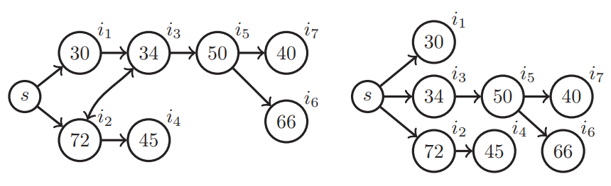
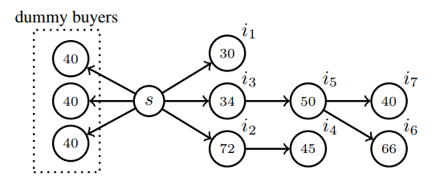
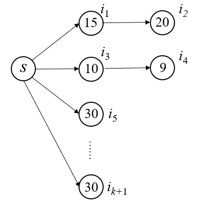

### Strategy Proof and Non-Wasteful Multi-Unit Auction via Social Network

---

#### 摘要

本文主要提出了一种满足strategy-proofness，non-deficit，non-wastefulness，IR的同质多物品单位需求量的auction的机制。同时对比了两种简单的机制，发现新机制的性质更加优异。包括社会福利，卖家收益，激励buyers说实话等等。

#### Preliminaries

$k$个相同物品的集合$K$，$n$个buyers的集合$N$. 其中每个agent都是要求一个单位的物品。定义$\bold{x}= (x_i)_{i\in N} \subset \{0,1\}^n$表示一种分配结果，$x_i=1$表示$i$得到一件item，$x_i=0$表示$i$没有获得商品。真实单位商品估值等于$v_i\in \mathcal{R}_{\geq 0}$，拟线性收益：$u_i=v_i\cdot x_i - p_i$. 

$r_i\subseteq N\backslash \{i\}$表示$i$的followers，定义拍卖网络$G=(N\cup \{s\},E)$，$i$的true type定义为：$\theta_i=(v_i,r_i)$，report type为$\theta_i'=(v_i',r_i')$. 如果基于$\bold{\theta}'$得到拍卖网络下的路径$s\rightarrow \cdots,\rightarrow i$，那么就认为$i$是connected. 定义$\hat{N}$为所有connected的buyers的集合。定义$d(i)$表示从$s$到$i$的最短路径的距离。定义$j$是$i$的关键parent，假设$j$不参与则$i$一定参加不了。定义$P_i(\bold{\theta}')\subseteq \hat{N}$表示的是在$\theta'$下的$i$的所有critical parents的集合。

定义一个机制$(f,t)$，其中$f$表示分配规则，$t$表示付款规则。

**定义一**：如果对于所有的$\theta'$都有$f(\theta')$是可行的，则认为机制$(f,t)$是可行的。

**定义二**：给定一个机制$(f,t)$和一个agent $i$，其真实type为$\theta_i=(v_i,r_i)$，假设一个report type $\theta^\ast=(v^\ast,r^\ast)\in R(\theta_i)$都有$v_i \cdot f(\theta^\ast,\theta'_{-i})-t_i(\theta^\ast,\theta'_{-i}) \geq v_i \cdot f(\theta',\theta'_{-i})-t_i(\theta',\theta'_{-i})$ 则这个$\theta^\ast$是一个占优策略. 如果实报对于$i$来说是一个占优策略，那么定义机制是IC的。

**定义三**：如果对于任意的$i,\theta_i$以及$\theta'_{-i}$，都有：$v_i\cdot f(\theta_i,\theta'_{-i})-t_i(\theta_i,\theta'_{-i})\geq v_i\cdot f(\theta_i',\theta'_{-i})-t_i(\theta_i',\theta'_{-i})$.

**定义四**：如果对于任意的$\theta'$都有$\sum_{i\in N}t_i(\theta')\geq 0$，则表示机制non-deficit.

**定义五**：如果对于任意的$\theta'$都有$\sum_{i\in N}f_i(\theta')\geq \min \{k,|\hat{N}|\}$.

两种简单的用于后续对比的机制，VCG和FCFS-F机制。

#### Distance-based Network Auction mechanism for Multi-Unit, Unit-demand buyers

我们定义一个重要的概念叫做*Diffusion Critical Tree*, 写作$T(\theta')$, $T(\theta')$中的节点由$\hat{N}$中节点以及他们的最小关键parent构成，边由传播的情况构成。给定一个$\theta'$, 一个子集$S\subseteq \hat{N}$，一个整数$k'\leq k$，定义$v^\ast(S,k')$表示在集合$S$中的第$k'$高的报价。如果$k'\leq 0$则$v^\ast(S,k')=\infty$; 如果$|S|\leq k'$则$v^\ast(S,k')=0$.

**定义六**：给定$\theta'$，将$\hat{N}$中的节点按照$d(i)$从小到大的顺序进行排序并在图中标号。给出$T(\theta')$，定义$i\notin \hat{N}$，$f_i(\theta')=0,t_i(\theta)=0$. 定义$\hat{N}_{-i}$表示所有connected节点的集合，给出算法流程：

> $k'=k,W\leftarrow \emptyset$
>
> for each $i\in \hat{N}$（按照距离的降序排列的顺序）do:
>
> ​	$p_i\leftarrow v^\ast(\hat{N}_{-i}\backslash W,k')$
>
> ​	if $v_i'\geq p_i$ then 
>
> ​		$f_i(\theta')\leftarrow 1,t_i(\theta')\leftarrow p_i$, $k'\leftarrow k,W\leftarrow W\cup\{i\}$
>
> ​	else:
>
> ​		$f_i(\theta')\leftarrow 0, t_i(\theta')=0$
>
> ​	end if
>
> end for

上面的算法流程就是DNA-MU机制的运行过程。

左图为初始auction network，根据距离进行了编号。右图为$T(\theta)$.

假设共计有三个物品待拍卖。

下面以上图为例分析算法的实现流程：

从$i_1$开始分析，$p_1=v^\ast(i_2,i_3,i_4,i_5,i_6,i_7,3)=50$，而$v_1'=30<p_1$，因此$i_1$无法得到一件item，继续算法，$i_2$, $p_2=v^\ast(i_1,i_3,i_5,i_6,i_7,3)=40$，而$v_2'=72>p_2$，因此$i_2$得到一件item，将$i_2$加入到$W$集合中，$k'-1=2$，继续算法，重复上述的算法，最终会发现$\{i_2,i_3,i_5\}$最终获得了三件items，三个人的付款值分别为：40,30,45. 

存在的几点希望能够有改进的地方：

1. 如何将CDM的思想放入这个算法中进行改进？是否这个改进点是可行的还有待考虑。

2. 思考这个根据距离远近来进行分配的方式是否存在不DSIC的情况，能不能给出反例，或者说这个排序的地方是否可以改进

3. 在i的报价低于p时是否存在i是一个获胜者的关键传播parent，此时应该不应该给i一些奖励？

4. 能不能将这个算法扩展到Sponsor Search Auctions？

5. 思考一个十分重要的问题，如果说IDM中给予那些critical nodes的补偿是为了让他们实报，那么在DNA-MU这个机制中并没有考虑这个补偿的问题，因此是否存在一些非DSIC的问题？尤其注意Lemma 2的证明过程是否存在一些问题？

##### DNA-MU的一些性质

定义$\hat{W}=\{w_1,w_2,\cdots\}$, 同时定义$\hat{W}_{\succ j}=\{w\in \hat{W}|w\succ j\}$.

**理论一**：DNA-MU满足可行性，IR以及non-deficit.

**理论二**：DNA-MU是non-wasteful的.

**理论三**：DNA-MU是IC的.

证明的步骤大概分为两个点，首先证明一个buyer没有动机向他的周围的人不传播，其次证明他误报不会增加他的收益。

**Lemma 1**：对于任意一个$i$，$\theta_i=(v_i,r_i)$, $\theta_{-i}'$, $\theta_i'=(v_i,r_i')$, 使得对于$r_i'\subset r_i$，都有$v_i\cdot f_i(\theta_i,\theta'_{-i})-t_i(\theta_i,\theta'_{-i})\geq v_i\cdot f_i(\theta'_i,\theta'_{-i})-t_i(\theta'_i,\theta'_{-i})$.

**Proof**：考虑如果$i$不传信息，他可能会通过下面的几种方式影响其他$j$的buyer，（1）在$T(\theta)$中$i$的子孙后裔会失去参与auction的资格；（2）原本满足$i\succ j$的那些buyer $j$因为$i$的不传播使得$d(j)$增大了。在第一种情况下，首先本身$j$就不会包含在$\hat{N}_{-i}$中，另外$j$不参与可能会导致一些其他buyer $j'$的价格降低，反而存在一定的可能性$i$的price升高。第二种情况下$d(j)$增加，而$i\succ j$的关系没有变化，因而$i$的price没有什么变化。所以综上来看不传是没有用的甚至是使得自己想获得商品的难度增加的。

**Lemma 2**：对于任意一个$i$，$\theta_i=(v_i,r_i)$, $\theta_{-i}'$,以及 $\theta_i'=(v_i',r_i)$, 都会满足$v_i\cdot f_i(\theta_i,\theta'_{-i})-t_i(\theta_i,\theta'_{-i})\geq v_i\cdot f_i(\theta'_i,\theta'_{-i})-t_i(\theta'_i,\theta'_{-i})$.

**Proof**：对于一个buyer $i$来说，他的payment价格来自于$v^\ast(\hat{N}_{-i} \backslash \hat{W}_{\succ i},k-|\hat{W}_{\succ i}|)$. 显然我们会发现$p_i\geq v^\ast(\hat{N}_{-i},k)$（这个可以从定义获得也可以推导出来）. 定义$\pi_i=v^\ast(\hat{N}_{-i},k)$。不难发现$\pi_i$是独立于$i$的报价的，如果$v_i\leq \pi_i$，那么无论$i$的report type是什么他的收益定义小于等于0，假设$v_i> \pi_i$，那么他的payment价格等于$p_i=v^\ast(\hat{N}_{-i}\backslash \hat{W}_{-i},k-|\hat{W}_{-i}|)$。考虑任意一个优先级高于$i$的buyer，假设为$j$，如果存在这个$j$，他的$v'_j\leq \pi_i$且其成为了一个winner，那么我们认为此时的$p_i$是严格大于$\pi_i$的；如果这个$j$，他的$v'_j>\pi_i$那么他一定是一个前$k-1$个的获胜者，事实上任意的优先级比$i$高的$j$ buyer，如果$j$成为了一个winner，他是不会影响$p_i$的。

那么我们考虑$i$唯一的能够降低自己$p_i$的方式就是通过高报来使得一个buyer从winner变为loser，假设$j$就是这样一个winner，注意到$j$的优先级仍然高于$i$，如果$j$是$i$的ancestor的话，$i$的报价是改变不了$j$的price的，因此在$T(\theta)$上一定要有$i$和$j$在不同的分支上才能够产生影响，由于$j$是一个winner，$j$的$p_j$等于：$p_j=v^\ast(\hat{N}_{-j}\backslash \hat{W}_{\succ j},k-|\hat{W}_{\succ j}|)$, 且$v_j'\geq p_j$. 同时，我们不难发现如果想要提高$p_j$，对于$i$来说，$v_i$一定是小于等于$v^\ast(\hat{N}_{-j}\backslash \hat{W}_{\succ j},k-|\hat{W}_{\succ j}|)$, 因为如果$v_i$太高了的话，无法影响到$p_j$, 只有$v_i$处于某一个$k-|\hat{W}_{\succ j}|$的位置才能够通过自己的report改变$j$的payment. 如果$i$成为了$\hat{N}_{-j}\backslash \hat{W}_{\succ j}$中的第$k-|\hat{W}_{\succ j}|-1$高的一个winner，那么即使$i$去高报也无法改变$j$的payment，因此一定有$v'_j\geq v_i$, 而前面又假设了$v'_j\leq \pi < v_i$. 因此出现矛盾，从而说明$i$无法通过误报自己的value来使得自己的payment降低。

#### Efficiency Analysis

##### Bounded Efficiency

在k个单位物品的拍卖中，帕累托效率要求每一个获胜者一定都是top-k的buyers，也就是说他的value不能低于第k高的价格。但是帕累托效率在这个传播auction的模型下并不适用，原因在于每一个参与者是没有什么动机去将拍卖信息传播给周围的人的，因为他们实际上处于一个竞争的环境下。这里就引入了一个更加弱的概念**bounded efficiency**. 这个会与参与者将信息传播出去的动机保持一致。如果每一个winner都是一个在除了他的后裔中的前top-k的buyers，那么就称这个分配规则是满足bounded efficiency。

**命题一**：DNA-MU机制满足bounded efficiency, $\forall \theta',\forall i \in \hat{N},s.t.f_i(\theta')=1,\text{#}\{j\in \hat{N}_{-i}|v_j'>v'_i\}<k$.

 **Proof**：假设$i\in \hat{N}$是一个任意的winner，而$W\subseteq \hat{N}\backslash\{i\}$表示那些先于$i$被选为winner的一群agents，根据定义，$p_i=v^\ast(\hat{N}_{-i}\backslash\{W\},k-|W|)$, 而$v_i'>p_i$的，从而我们不难知道在$\hat{N}_{-i}\backslash\{W\}$中少于$k-|W|$个agent的报价是高于$v_i'$的，从而有$\text{#}\{j\in \hat{N}_{-i}\backslash\{W\}|v_j'>v_i'\}<k-|W|$, 也就是说无论在已经获胜的人中有多少人的报价超过了$v_i'$都会有结论：$\text{#}\{j\in \hat{N}_{-i}|v_j'>v_i'\}<k$. 证毕。

**命题二**：机制DNA-MU在社会福利上优于ND-VCG和FCFS-F机制，反之不成立。

##### Worst-Case Efficiency Loss

我们给这个DNA-MU机制添加一个保留价格，这种做法往往是seller为了最大化收益而进行的操作。定义一个保留价格为$v_h$. 那么之前的$T(\theta)$可以修改为如下所示的图：

上图就是之前的范例中的添加了三个dummy buyers的情况。保留价格定为40. 同样的执行一遍机制流程，最终发现获得商品的agents是$\{i_2,i_5,i_6\}$. 

添加保留价可能会破坏non-wasteful的性质。

**定义七**：定义$\bar{v}$表示所有value的上界，如果一个$(f,t)$机制满足：
$$
\alpha = \frac{1}{k\bar{v}}\sup_{\theta'\in \Theta}\left[\max_{x\in X}\sum_{i\in N}v_i'x_i - \sum_{i\in N} v'_i\cdot f_i(\theta') \right]
$$
$\alpha$的范围在$[0,1]$之间，同时$\alpha$的值越小越好。给定一个$\theta'$，定义$\ell$表示一个集合，这个集合是那些自己的value不低于保留价$v_h$的buyers的集合。$\ell:=\text{#}\{i\in \hat{N} | v_i \geq v_h\}$.

**Lemma 3**：假设所有人都是实报，那么$\min(\ell,k)$单位的物品都以保留价被分配出去了。

**理论四**：通过设置保留价为$v_h=\bar{v}/2$，带有$v_h$这个保留价的DNA-MU机制满足$1/2-$inefficiency.

**Proof**：首先假设$\ell < k$，那么机制将$\ell$件商品分配给了前$\ell$价高的agents，同时还有$k-\ell$件商品没有被分配，则最大效用损失上界是$(k-\ell)v_h$. 而最糟糕的情况是所有人的value都低于保留价，则最坏情况的效用损失为$k\cdot v_h$；如果$\ell\geq k$，那么机制将$k$件商品全部分配出去，此时最大效用损失的上界为$k(\bar{v}-v_h)$，综合来看，最大的效用损失表示为：$\max(k\cdot v_h,k(\bar{v}-v_h))$. 其下界是设置$v_h=\bar{v}/2$的情况，因此当保留价为$\bar{v}/2$的情况下，DNA-MU机制是一个$1/2-$inefficiency的机制。

#### Revenue Analysis

**命题三**：DNA-MU机制在卖家的收益上来说，优于ND-VCG和FCFS-F，反之不成立。

在$|r_s|\leq k$时，在ND-VCG机制下的收益为0，显然DNA-MU机制的收益更高；当$|r_s|>k$时，ND-VCG机制每一个赢家所支付的值为$v^\ast(r_s\backslash\{i\},k)$. 而DNA-MU机制下的每一个赢家的payment定义为：$v^\ast(\hat{N}_{-i},k)$，而显然$\hat{N}_{-i}$是一个$r_s\backslash\{i\}$的一个超集，所以我们会发现DNA-MU机制的卖家收益一定是高于ND-VCG机制的。而至于FCFS-F机制，其卖家收益一直为0，而DNA-MU机制的收益一定非负且往往都是正收益。因此DNA-MU机制的卖家收益是优于ND-VCG和FCFS-F的。

**follower revenue monotonic**：如果卖家的收益是关于拍卖参与者人数成单调递增的趋势的，那么就称这个机制是*follower revenue monotonic*的。

**定义八**：如果对于任意的$r_s,\theta'$以及$r_s'\subseteq r_s$, 都满足$\sum_{i\in N}t_i(\theta'|r_s) \geq \sum_{i\in N} t_i(\theta'|r_s')$, 那么我们就称这个机制是一个follower revenue monotonic的。

DNA-MU机制下是不满足follower revenue monotonic的。（原文中给了一个例子，这里就不赘述）

**定义九**：OPTIMAL DIFFUSION：给定$k$个单位的物品，一个profile $\theta'$，一个直接buyers的集合$r_s$，一个阈值$K$，是否存在一个子集$r_s'\subseteq r_s$使得$\sum_{i\in N}t_i(\theta'|r_s')\geq K$在DNA-MU机制下始终成立。

关于这个定义九的证明，作者的思路大致是构建了一个特殊的auction网络，在这个网络中找到了一个传播子集满足定义九中的条件。具体的证明过程可以看full version版本的论文，这个比较详细。这个部分也不是想探讨的论文的重点内容，所以这里就不过多赘述。

#### Incentive Analysis

**命题四**：假定$k\geq 2$，对于每一个agent $i$来说汇报type为$(v_i,\emptyset)$在DNA-MU机制下不是一个占优策略。

**Proof**：考虑一个情境，一共有$k$个单位的物品同时有$k+2$个agents最终参与到这个auction中。

在上述这个实例中，$r_s=\{i_1,i_3,i_5,i_6,\cdots,i_{k+2}\}$，$i_1$将信息传递给了$i_2$同时$i_3$将信息传递给了$i_4$. 同时定义优先级顺序为：$i_5\succ i_6\succ \cdots \succ i_{k+2}\succ i_3\succ i_1 \succ i_4 \succ i_2$， 在这种情况下机制的运行状况是: 首先将$k-2$个物品分配给$\{i_j\}_{5\leq j\leq k+2}$，然后再考虑$i_3$，无法获得一件商品，$i_1$获得一件商品且支付$9$；假设$i_1$没有向$i_2$传递这个auction的消息，那么最终的情况是$i_1$获得一件商品且支付$10$.（这个支付价格为10还有待商榷。）从而说明$(v_i,\empty)$再DNA-MU中不是一个占优策略。

**命题五**：再ND-VCG和FCFS-F中，$(v_i,\empty)$是一个占优策略。

证明略去。

#### Conclusions

DNA-MU机制具有一些良好的性质：strategy-proofness, non-wastefulness, non-deficit, individual rationality. 

未来需要的工作展开在卖家收益的分析上，将DNA-MU机制扩展到带有decreasing marginal values的多单位物品的拍卖。