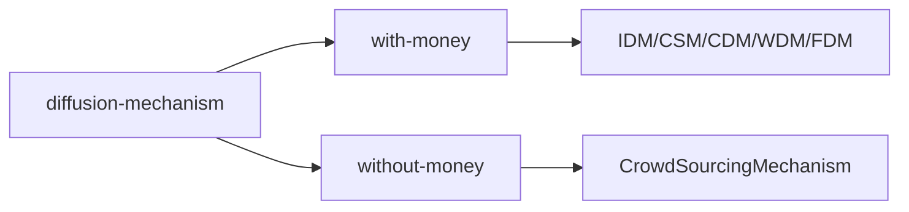

#### Survey-Track

diffusion auction:

IDM 2017 (extend auction into a social network firstly)

CSM 2018 (extend auction into a economic network with diffusion cost)

CDM & WDM (summary of IDM and CSM: considering a more abstract framework for diffusion auction for single-item, with diffusion cost and without diffusion cost)

Incentive Compatible Diffusion Auction 2020

multiple items diffusion auction

2018 AAMAS Selling multiple items via social network

#### Other-Works

extensions with IDM

Double auction

Answer Querying Mechanism

FDM extension on reward for diffusion 

Redistribution Mechanism for diffusion auction

Fixed price diffusion auction

considering maximize revenue in economic network (2020 IEEE Access)

maximal information propagation with budgets

considering efficient but not IC diffusion auction

The Referrer's Dilemma

groupwise pivotal referral mechanism

