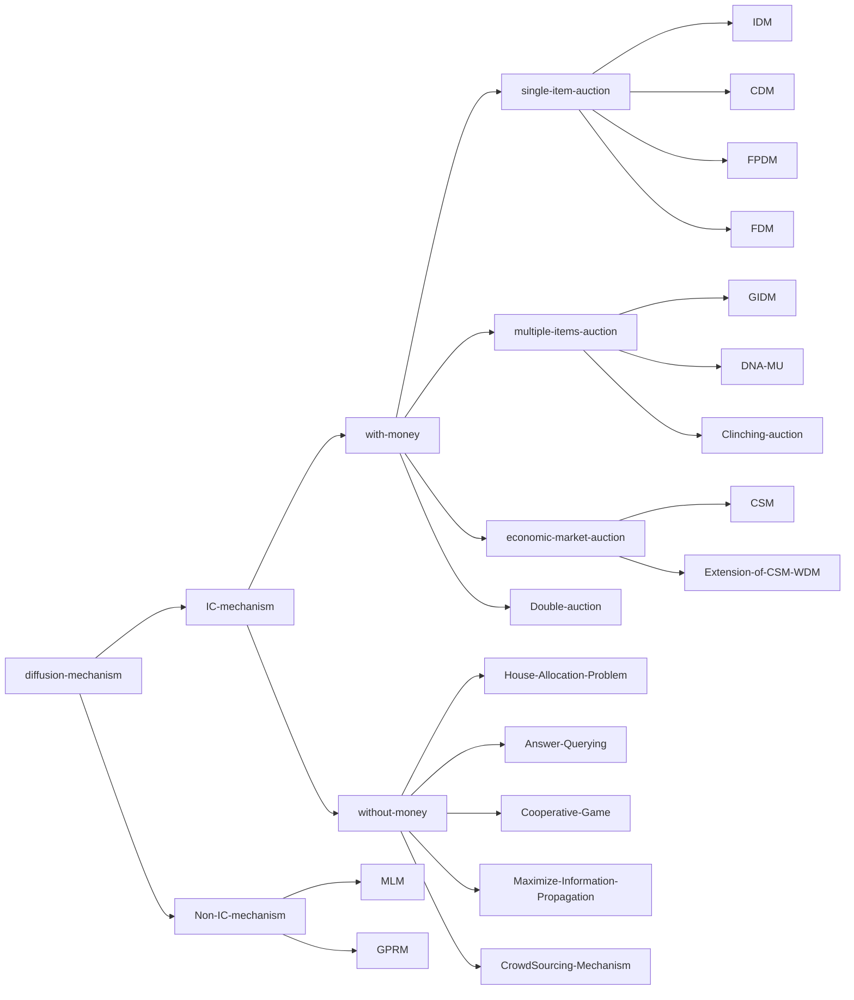

#### Survey-Track

##### With-money (resource allocation)

**single-item diffusion auction**

Incentive Compatible Diffusion Auction 2020

2017 IDM (extend auction into a social network firstly)

2018 CSM (extend auction into a economic network with diffusion cost)

2019 CDM & WDM (summary of IDM and CSM: considering a more abstract framework for diffusion auction for single-item, with diffusion cost and without diffusion cost)

2019 Fixed-Price Diffusion Mechanism (this paper is unpublished)

2020 ECAI FDM extension on reward for diffusion 

**multiple items diffusion auction**

2018 AAMAS Selling multiple items via social network

2020 AAAI DNA-MU (Distance based network auction for multi-unit unit-demand buyers)

**multi-buyers-multi-items diffusion auction**

2019 DAI double auction

##### Without-money (task allocation)

2020 IJCAI Answer Querying Mechanism

2020 AAMAS Redistribution Mechanism for diffusion auction		

2020 ECAI maximal information propagation with budgets

2020 AAMAS Crowd-sourcing Collaborative Data Acquisition 

(unpublished)

House-allocation problem (Barter Exchange via friends' friends)

Coalitions game (Incentives to Form Larger Coalitions when players have the power to choose)

**Sybil-proof answer querying mechanism**

##### Non-IC mechanism

2016 EC Multi-Level Mechanism

2019 GPRM group-wise-pivotal-referral mechanism

#### Analysis Perspectives:

efficiency 

budget balance

revenue maximization

#### Framework

1 Introduction

2 Diffusion Auction 

​	2.1 Definition

​	2.2 Single-item auction

​		2.2.1 Diffusion without transfer cost

​		2.2.2 Diffusion with transfer cost

​	2.2 Multiple-item auction

​	2.3 DSIC diffusion auction

​	2.4 Non-IC diffusion auction

3 Beyond Auction (Diffusion Mechanism Design without Money)

​	3.1 Crowd-Sourcing Problem (data acquisition & Answer-Querying)

​	3.2 Maximize Information Propagation (consider some work about contents with diffusion strategies)

4 Discussion

Reference 

**Redistribution Mechanism**

government builds library $\Rightarrow$ who are more eagle for the facility.

charity want to distribute the donation for those who need most.

allocate doctors to areas where doctors are highly demanded.

Other reference

Blume trading networks intermediaries decide mechanisms

Manea intermediation in markets with a network structure

Bulow and Klemperer 1996

摘要：

传统的机制设计下，所有参与其中的agents在一个确定性的环境下进行