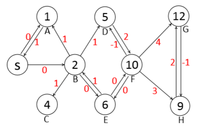

## Diffusion and Auction on Graphs

### 摘要

卖家收益（seller's revenue）和分配有效性（allocation efficiency）的冲突。

拍卖情景扩展到网络上同时提出IDM机制满足激励相容（IC），进一步提出在社交社会网络中的拍卖机制设计。

### Introduction

在拍卖机制设计中的两个重要的目标：最大化社会福利（最大化所有参与者的收益）；拍卖者的收益。

拍卖情景的扩展：除了花费金钱做宣传外如何让更多的人参与到这个拍卖中？

一个自然的解决方式：如何让原本参与在这个拍卖中的买家自愿将这个信息分享给更多的人？

这篇文章的主要内容包括：第一部分：在无权图上提出了一种新的类别的拍卖机制：**critical diffusion mechanism** （CDM）（其中IDM机制是这类机制的一种特例，且其是收益最低的一种情况）；第二部分：在带权图上提出了**weighted diffusion mechanism**（WDM）

在这两种情境下，每一个参与买家的最优策略均为实报+将拍卖信息传递给他的所有邻居。

### Preliminaries

拍卖情景：digraph：$G=(V,E)$, $|V|=n$, seller: $s$, 图中的其他节点：$i$: $t_i(v_i,r_i)$，其中$v_i$表示节点$i$对于item的估值，$r_i$表示为节点$i$的邻居集合。节点$i$只能通过存在的链接$(i,j)\in E$进行交流。初识情况下，只有$s$的邻居节点拥有拍卖的信息。

$w(i,j)$表示节点$i,j$之间连边的权重

问题情境：$t_i=(v_i,r_i)$表示节点$i$的私人type，$t=(t_1,\cdots,t_n)$表示所有节点的types集合，假定$t_{-i}=\{ t_1,t_2,\cdots,t_{i-1},t_{i+_1},\cdots,t_n \}$表示除去节点$i$的所有节点的types，即$t=(t_{-i},t_i)$，假定$T_i=\mathbb{R}_{\geq0}\times \mathbb{P}(V)$表示节点$i$的type空间。其中$\mathbb{P}(V)$是节点集$V$的幂集，$T$表示所有节点的profile的types的空间。$t'_i=(v'_i,r'_i)\in T_i$为节点$i$自己报告出去的type.

**定义一**：给定一个汇报给seller的type profile为$t'$，定义从seller到节点$i$的trading path为$(a_1,a_2,\cdots,a_{l},a_{l+1}=i)$,其中$a_1\in r_s$同时对于$1< j<l+1$,均有$a_j\in r'_{a_{j-1}}$. 

在所有的从seller到i的trading path中定义最短的那一条为$L^*_i(t')$，即$L^*_i(t')=\arg \min_{L\in\mathbb{L}_i(t')}\sum_{(i,j)}\in L w(i,j)$，其中$\mathbb{L}_i(t')$是关于节点$i$所有的可能的trading path.

**定义二**：传播拍卖可以定义为$\mathcal{M}=(\pi,x)$，其中$\pi$表示为分配规则：$T\rightarrow \mathbb{L}$,其决定了一个唯一的trading path，其尾节点为分配得到物品的买家；$x$表示为付款规则，$x=\{x_i\}_{i\in V\backslash \{s\}}$，每一个节点都会有一个付款规则。

在传播拍卖中的社会福利定义为$v(\pi(t))-\sum_{(i,j)\in \pi(t)}w(i,j)$

关于社会福利的问题，一般情况下单物品的社会福利表示为$\sum_{i\in B}v_i x_i$，这里的传播拍卖中需要考虑物品传播过程的外部效应的影响。不变的一点在于对于所有的分配规则，$\pi*$必须满足对每一个$t\in T$都是社会福利最大化的，即$\pi^*\in \arg \max_{\pi'\in \Pi}v(\pi'(t))-\sum_{(i,j)\in \pi'(t)}w(i,j)$

其中$\Pi$表示可实行的分配规则，使用$W^*(t)$表示有效分配规则下的社会福利。

关于所有的节点来说，我们认为其收益函数满足一个近似线性的函数，在给定一个节点$i$的真实type为$t_i$，同时给予整体的$t'$的分配方式，那么对于$i$来说其收益被定义为：$u_i(t_i,t',(\pi,x))=v_iz_i(t')-x_i(t')$

diffusion auction中关于IR的定义：实报价格，任意传播方式下，对于每一个节点都能保证其收益非负。($u_i(t_i,((v_i,r_i'),t_{-i}')(\pi,x))\geq	0$)

diffusion auction中关于IC的定义：实报type对于每一个节点来说都是他们的dominant strategy即：$u_i(t_i,(t_i,t_{-i}'),(\pi,x))\geq u_i(t_i,(t_i',t_{-i}'')，(\pi,x))$ for all $i \in V\backslash \{s\}$

给定一个diffusion auction情境下的上报的type profiles为$t'$和机制$\mathcal{M}=(\pi,x)$,卖家的收入定义为$Rev^{\mathcal{M}}(t')=\sum_{i\in V\backslash \{s\}}x_i(t')-\sum_{(i,j)\in \pi(t')}w(i,j)$

###  Auction Mechanism on Unweighted Graph

关键传播节点(critical diffusion nodes)：对于节点$i$来说，其关键传播节点表示如果缺少该节点则$i$无法参与这场auction中。

定义：$C_i(t')=\{ \cap L \}_{L\in\mathbb{L}_i(t')}$为节点$i$的关键传播节点集合。（其中$\mathbb{L}_i(t')$是所有从卖家$s$到$i$的可行的trading path的集合）考虑一个问题，对于在集合$C_i(t')$中的任意两个节点：$j$,$k$，我们不难发现会存在$j\in C_k(t')$或者$k\in C_j(t')$，因此进一步可以得到unique fully ordered set $C^*_i(t')=\{ s_1,s_2,\cdots,s_k,s_{k+1},\cdots,i \}$. 大概就是将关键传播节点集合进行了排序，按照传播的顺序排列的。

简单实例，以agent $G$为例，共计存在四条路径可以从$s$到达$G$，则$C_G(t)=\{B,F,G\}$, 同时$C_G^\ast(t)=\{B,F,G\}$. 同时定义$d_i$表示那些以$i$作为CDN的agents。例如$d_F=\{F,G,H\}$. 

令$t'_{-x}=t'-t'_x$表示将$x$集合中那部分人除去后的其他人的type集合，我们可以认为这个$x$集合中可以包含包括边或者节点，举例子：$t_{-F}=\{t_i\}_{i\in V\backslash\{d_F\}}$, $t_{-\{(B,D),(B,F)\}}=\{t_i\}_{i\in \{A,B,C\}}$.

现在给出一个十分重要的定义，给定一个$t'$的情况下，假设最高的报价者为$m$，同时他的关键传播序列为$C_m^\ast(t')=\{1,2,\cdots,k,k+1,\cdots m\}$. 定义$\alpha_m=\emptyset$, 对于$i\in C_m^\ast(t')\backslash\{m\}$, 另外定义一个$\alpha_i=\{(j,l)\in E\}_{j\in d_i}$表示一个边集，这个边集中包含的是那些以在以$i$为CDN的节点为起点的一些（还是所有呢？）边的集合。这个边集存在一些性质。

> 1. 信息阻塞性：节点$i+1 \notin t'_{-\alpha_i}$, 也就是说如果$\alpha_i$中的那些节点都被删除之后，$d_{i+1}$当中的那些agents是无法参与到这个auction中的。
> 2. 节点的独立性：假设存在两个type集合$t'^{1}$和$t'^{2}$，这两个集合只在$t'_{d_{i+1}}$中存在一些差别，那么我们有$\alpha_i^1=\alpha^2_i$, 也就是说$\alpha_i$的性质是与$d_{i+1}$中agents的策略是无关的。
> 3. 传播的单调性：如果有$r_i'\subseteq r_i''$，那么就会有$t'_{-\alpha_i'}\subseteq t'_{-\alpha''_{i}}$, 也就是说这个集合$t'_{-\alpha'_i}$是随着$r'_i$的增加而增加的。（这个点其实没怎么想通的，首先如果传播的多了，那么成为别人关键传播节点的机会也就增加了，也就是说应该有$d_i'\subseteq d_i''$，而我们知道$\alpha_i=\{(j,l)\in E\}_{j\in d_i}$，所以讲道理$\alpha_i'\subseteq \alpha_i''$, 而最终要求$t'_{-\alpha_i'}\subseteq t'_{-\alpha''_i}$, 因此实际上在$\alpha_i$中边的选择上是一个很难处理的问题个人感觉？怎么感觉有些违反直觉？, 先理解为为了实现这样的传播单调的特性，或许还没有理解内在的含义？传播的越多，将这个agent后面的节点创建的边删除后，留下的节点的数量会随之增加？）

探讨一个问题：$t'_{-i}$和$t'_{-\alpha_i}$之间的区别和关联性？$t'_{-i}$表示的是将以$i$为关键传播节点的那些agents都去掉的情况，而$t'_{-\alpha_i}$实际上去掉的点和边应该比$t'_{-i}$少！他应该是有选择性的去掉一些点以及边？

整体对于$\alpha_i$的理解就是，这是一个有选择性的将一些从$d_{i}$集合中点出发的一些边按照一定的规则选择出来构成这样一个集合$\alpha_i$，而构成这个集合的规则是不固定的，但是这一族集合都应该满足上面所说的信息阻塞性，节点独立性以及传播单调性的要求，然后构建将这些边删除后的网络给出机制的分配规则以及支付规则。

>**Algorithm 1**: CDM
>
>1. 初始化$\pi(t')=\emptyset$同时所有人的支付集合：$\{x_i(t')=0\}_{i\in V\backslash\{s\}}$
>
>2. 找到最高的报价者$m$，如果同价则随机打破僵局
>
>3. 计算$C^\ast_m(t')$，其中的节点分别表示为$\{1,2,\cdots,m\}$
>
>4. **for** $i\leftarrow 1$ **to** $m$ **do**:
>
>   1. 计算$\alpha_i$
>   2. **if** $v_i=W^\ast(t'_{-\alpha_i})$ **then**
>      1. 将分配路径定义为随机一个从$s$到$i$的传播路径，同时支付：$x_i(t')=W^\ast(t'_{-i})$
>      2. **break**
>
>   3. **else**:
>      1. 对于$i$来说支付结果为：$x_i(t')=W^\ast(t'_{-i})-W^\ast(t'_{-\alpha_i})$

**Theorem 1**：CDM机制是IR且IC的。

*Proof*. 假设$g$是CDM机制下的一个winner. 第一类人：不在关键传播序列上的那些人$i \notin C^\ast_m(t')$，他们的收益为0，对于$i$来说唯一改变自己的收益的方式，高报变成赢家。此时他的payment等于$v'_m$，这个值高于他的估值$v_i$，因此收益会降低；对于第二类$i\in C^\ast_g(t')\backslash \{g\}$，他的收益为$W^\ast(t'_{-\alpha_i}) - W^\ast(t'_{-i})$. 我们发现后一项的值与$i$是无关的，而前一项根据传播的单调性当$r_i'=r_i$时会取到最大值。如果对于$i$来说他变为了获胜者，那么他的收益变为：$v_i-W^\ast(t'_{-i})$，这个值小于$W^\ast(t'_{-\alpha_i})-W^\ast(t'_{-i})$.  