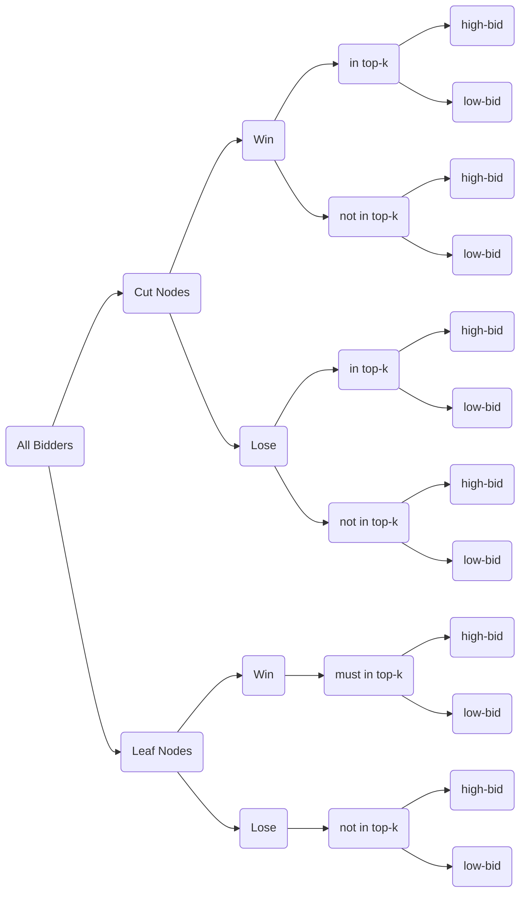
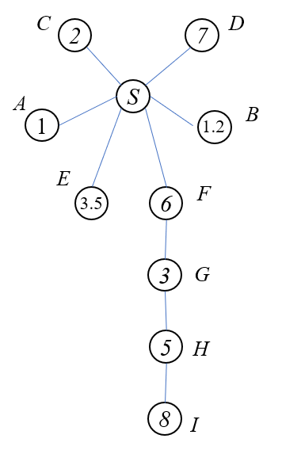
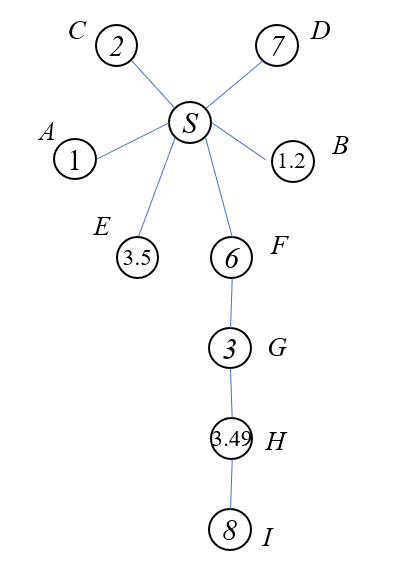

 一些基本的规则问题

1. IC diffusion auction中的单调分配规则是满足分配规则关于报价是非递减的，关于传播情况是非递增的，构成一个偏序关系下的单调规则。
2. 关于payment，payment规则与自身报价无关，关于传播情况是非递增的。
3. 计算收益：$u_i(v_i,r_i)=v_i\cdot f(v_i,r_i) - p(r_i)$. $f$是一个diffusion auction下的单调分配函数。
4. critical bid算是一个关于传播情况的函数，critical bid是关于传播情况非递减的。（这是解决分配问题的一个关键）
5. 对于一个IC diffusion auction的机制来说，efficient和(weakly)budget-balanced之间是不能同时满足的。
6. $\tilde{x}(r_i)_i-\bar{x}_i(r_i)=v^\ast_i(r_i)$如何使用起来？
7. IC diffusion auction的efficiency与weakly budget-balanced之间的trade-off有没有一种系统研究？

一些解决方案：

1. 分析每个人的传播能够对机制的走向以及自身的收益的影响
2. 构建critical diffusion tree是一个关键点，对于一个节点来说他的传播效益的体现一定是在critical diffusion tree上，其他的传播都是无价值传播
3. 定义一个有效的分析序列，这个序列决定着哪些人有优先进行判断是否能够获得一个slot的权利？
4. 分析一个bidder能否获得item的关键因素是$v^k(\tilde{T}_{-i})$.
5. 面对$v_i^1 \geq v_i^2$但是$r_i^2\subseteq r_i^1$的情况下的分配规则，在不满足这种偏序情况下的分配结果。
6.  深刻理解$\tilde{x}_i(r_i)-\bar{x}_i(r_i)=v^\ast_i(r_i)$. 思考在没有diffusion的情况下，这时候单物品情境下获胜者的支付结果是关键报价，但是考虑了传播之后的情况就需要考虑当出现buyer因为传播而导致的从winner变成loser时候的一个补偿。这个补偿就是$\bar{x}_i(r_i)$. 
7. 将IC diffusion auction扩展到sponsor search的情境下的时候会存在一个很大的问题是payment的分解不再是分解为$\tilde{x}_i$和$\bar{x}_i$而是变成一个多阶段的分解payment. 
8. 从价高者得的单调分配规则改变为非传递条件下的价高者得。
9. 放宽要求，先考虑使用VCG下的单调的分配规则。价格前k高的人获得前k个slot.
10. 在构造出一颗关键传播Tree的情况下可以考虑分析所有路径上的情况。（存在需要传播补偿的情况）
11. 抽象的写出一个关于关键字赞助传播拍卖的情景就是考虑将最大化社会福利（或者其他指标）作为优化目标写成优化问题的一个分配规则。
12. 从最高价开始分析，判断他是否有资格获得第一名的位次。依次类推这个过程。
13. 能否先放宽WBB的限制，寻找满足efficiency的分配规则是容易的。
14. 分配存在efficiency同时传播也是存在efficiency的

15. 一个问题，如果我不传我只去考虑我自己的变化情况但是实际上在我不传的情况下也对整个系统带来了一定的影响。（这个问题也很重要）
16. 整理目前的思路，思考存在的问题以及找一个case

---

梳理问题的关键点

在多物品的diffusion auction中一共会存在这样几类人群：

1. 无法获得一件物品同时进行的都是无效传播，收益为0.
2. 无法获得一件物品但是进行了一部分有效传播，存在有效传播的收益。
3. 获得一件商品但是没有进行有效的传播，存在获得商品的收益但是不存在传播收益。
4. 获得一件商品同时进行了有效的传播，存在获得商品的收益以及传播的收益。

另一种思路的解决方案：

假设存在一种分配规则$f(v_i,r_i)$是在IC-DA下单调的，我们下面寻找对于$f(v_i,r_i)=1$的bidders的payment的想法。假设$f(v_i,r_i)=\alpha_j$. 也就是$i$玩家被分配到了$j$位置上。

固定其他所有人的types， 只分析$i$的type的变化对于他slot的变化的影响。

$t_i=(v_i,r_i)$. 假设固定传播，分析$v_i$的变化对于他slot变化的影响？$v_i$从0到$v^\ast_j$过程下他需要支付多少钱？

固定$v_i$，他的$r_i$关于payment的变化。（这个是解决问题的关键点）

#### 目前的一些进展工作（2020.9.5）

VCG在多物品的diffusion auction上是否IC？（证明完成VCG在多物品上的diffusion auction是IC的下面考虑思考IDM的演化）

GIDM的不IC的问题在于回溯的过程存在不传播比传播的收益更高。

割点优先分配和price高优先分配之间的trade-off与Revenue最大化以及efficient之间的trade-off是相关的甚至是对应的！！！

 这种先判断割点的方式完全可以看成是IDM在多物品上的一种扩展。（因为CFM中当item的数量设置为1时其分配结果等价于IDM（一定是等价的））
现在的目标变为寻找一个关键的支付规则！

#### 最新的探究（2020.9.21）

1. 在single-item的diffusion auction下的revenue最大化问题是否已经解决？
2. multi-items的diffusion auction在哪里能够找到最大的revenue？
3. 考虑得到的多物品的新机制能够完整的退化到IDM上形成一个对照的问题。
4. reward is hard to give? （给出的reward的值需要避免让一个cut node有从winner变成loser来获得更好收益的情况出现）

#### 考虑多轮的IDM机制对于payment设置为市场清空价格（2020.11.2）

多轮的IDM：第一轮找到价格最高的bidder，根据其传播的critical diffusion sequence依次判断是否存在赢得一个物品的可能性（分配方式与IDM一致）如果是非最高价者获得物品，则其支付为IDM的支付方法，如果是最高价者获得物品则其支付方式为市场清空的支付价格。

IDM机制中关于reward的一个点理解是：reward：$v_{-i}^\ast-v^\ast_{-{(i+1)}}$，实际上是希望在除了最高价的那个sequence之外有了别的高价（$i$传播或者不传播之间存在一定的差异性）

在非最高价获得物品的情况下需要考虑一下中间点得到物品的支付规则的改变。（是否应该还是市场清空价格还是？）

对于每个参与的bidder，在给定了最终的密封auction的估值以及diffusion strategies之后，每个人的关键报价都是确定了的，这个关键报价就是他能够获胜的最低价格。这个价格应该等于我不参与的情况下我所能够获胜的最低价格。

证明IC的过程应该包括：首先在每一个阶段都是IC的，其次是没有任何的bidder可以通过高报或者低报改变判断的顺序来使得自己的收益提高。

在对于最高价节点来说，当我们固定其支付为市场清空价格的时候我们就可以知道其不存在动机去虚报自己的价格，因为他的收益一定等于$v_i-v^\ast$，$v^\ast$表示的是市场清空价格。那么这样整个graph中判断顺序就固定了。（还不确定，前驱节点的IC性目前来说还没有保证 ）

单物品下IDM分析时删除的是最高价路径上对于他产生竞争的传播策略。

多物品下的情况我们需要删掉的是在他的子树下的那些与他产生竞争的传播策略。

#### 关于目前机制设计情况的IC证明的思路（2020.11.13）

首先简述一下已有的机制：

假设$n$个bidder，$k$个items （$n>k$）

根据网络的结构：将从seller开始的所有的cut nodes按照depth进行层次的划分。

> while  $(k\geq 0)$:
>
> ​	for i in set C(cut nodes set which have been sorted by depth 同一层随机排序)
>
> ​		if $v_i>v_{-\alpha_i}^k$，那么给$i$分配一个item同时其支付为: $v_{-i}^k$,
>
> ​								将$k-=1$，将$i$添加到winner集合中（将其估值置零）
>
> ​		else $v_i \leq v_{-\alpha_i}^k$ 无法获得一个物品：$p_i=v_{-i}^k-v_{-\alpha_i}^k$. 
>
> ​	if 将set C中的点都判断完毕，仍然剩余物品的数量为$(k-m)$对所有的叶子节点从高价到低价进行给予物品且给予的方式是以市场清空的价格分给剩下的叶子节点。

证明IC性：

整体可以将所有的bidders分为以下四类：

- cut nodes win an item 
- cut nodes not win an item 
- leaf nodes win an item 
- leaf nodes not win an item 

##### Cut nodes win an item

1. fix $r_i$ change $b_i$

   对于一个割点来说，它无法通过改变报价来改变网络的结构因此它就无法通过改变报价来改变自己的次序，对于他来说改变$b_i$能够改变的是他是否获得一个物品，假设实报获得第$j$个物品，收益表示为$u_i=v_i-v_{-i}^j$，假设低报，他可能会输掉物品，其收益变为：$v_{-\alpha_i}^j-v_{-i}^j$，收益降低；相反的角度分析这个人高报，支付与其报价无关，因此高报没有意义。

2. fix $b_i$ change $r_i$

   假设固定报价，对于$i$来说，$r_i$是如实传，$r_i'$是少传，假设少传会出现的情况有：如果少传的是叶子节点，那么网络中少了一些叶子节点，对于他自己来说，可能带来的影响是：本来自己的是一个winner的，但是由于少传，给前面的人减少了对手数量，因此前面的cut nodes原本不能win的现在能够win了，导致的结果是自己从winner因为次序的关系变成了unlucky player了收益降低了；还有一种情况，少传了一个点，使得自己同一层原本不是割点的点变为了割点，别人有了优先判断的资格，同样存在可能性降低自己的收益，另外的话还有可能出现少传使得一个节点（可能是割点）的优先级降低了，这种情况下不会降低自己的收益也不会提升自己的收益（$u_i=v_i-v_{-i}^j$没办法通过这样的途径改变收益，尤其是提升自己的收益）。

   （有点问题，存在通过改变自己的传播使得自己的次序有变化的情况。数量没变化但是bidders改变了, 这些变化不会给bidder $i$的收益带来增加，因为它的竞争对手始终还是那群人。）

##### Cut nodes can not win

1. fix $r_i$ change $b_i$

   对于无法win的割点来说，可能存在两种情况考虑，第一种情况是因为次序的关系，成了一个unlucky player，从而无法win，这种情况下，他无法通过改变自己的报价来使得自己的次序发生改变，但是他可以通过提高报价使得前面的某个人无法win从而使得自己能够有机会获得物品，但是在这种情况下他的收益一定是降低的，假设最后一个winner表示为$k$，他win的条件是大于$v^\ast_{-\alpha_k}$，显然如果后面的一个人想要通过高报让$k$号bidder win不了，考虑这个玩家是$m$，显然我们肯定有$v_m\leq v^\ast_{-\alpha_k}$同时$v_k\geq v^\ast_{-\alpha_k}$的，如果他想要高报使得$k$赢不了那么一定得大于$v_k$，这样就算他最后win了他的收益也从0变为了负数，收益降低了；第二种情况 无法win是因为价格不够，此时他的收益为：$v_{-\alpha_i}^j-v^j_{-i}$，他高报想要win一个物品就算赢了收益也低于这个值，低报同样没有意义。

2. fix $b_i$ change $r_i$

   一种情况少了一些叶子节点，可能导致收益降低：$v_{-\alpha_i'}^j-v_{-i}^j\leq v_{-\alpha_i}^j-v_{-i}^j$；下一种情况：可能使得原本不是割点的点变成了割点，无法对$v_{-\alpha_i}^j-v_{-i}^j$产生什么影响。收益不会发生变化。同样的如果割点的情况是改变了与自己同一级竞争的人是谁但是没有改变在同一层中进行判断的人的数量同样也是无法改变这个收益的，因为本质上无论如何他少传一定会关于它的收益呈现非递增的关系。

##### no cut nodes win an item 

这种情境下，这群人要么没有传播，在$r_i=\emptyset$的情况下， 他的支付也与他自己的报价无关同时他的报价也无法改变自己被判定的顺序，因此在这种情况下他没有任何理由进行虚报；在有传播的情况下，少传$r_i'$是无法使自己变为一个割点同时也无法让自己的收益增加。

##### no cut nodes can not win an item 

这群人无法通过虚报价格或者少传播来使得自己的收益增加。

##### 证明IC性的重点研究问题

考虑一个cut node通过虚报自己的价格来使得前面cut nodes的支付发生改变。

这个cut node能够影响两条分支，一个分支是自己的分支；另一个分支是这个虚报改变的前$k$高的bidders的那个所在的分支；对这两个分支的影响在于：使得自己所在的分支上的前面的cut nodes的获得一个item的概率增加了；对于另外一个分支的前面的cut nodes的获得一个item的概率降低了。

（如何证明这种情景是不存在的，也就是这个cut node是不会去高报的）

---

 2020.12.1

可以证明：在这个机制下，假设有一个winner $i$他获得的是第$m$件商品，在这种情况下，他的子树下面的节点没有人可以通过高报来使得自己获得更高的收益。 假设存在一个bidder $j$他高报自己的估值从$v_j$到$v_j'$. 此时高报之后会出现两种情况，第一种情况是$v_j'$变为了top-k的报价，此时不会影响

#### 目前证明IC的一些新的理解：

一个优先级sequence（确保任何的agent都没有动机去虚报估值以及传播来改变这个顺序）+ IC diffusion auction的四条性质

关于IC diffusion auction的四条性质上的证明：

P1：$\pi$是值单调的。

*Proof.* 主要考虑bid从$v_i$变为$v_i'$的情况下对于$v_{-\alpha_i}^j$中的割点规则$\alpha_i$以及轮到自己判定第$j$个物品这个$j$的改变情况。对于节点$i$进行分析：

1. 如果$i$是一个winner且是一个cut node且其估值原本在前$k$高的bidders中，那么无论她怎么去改变自己的$v_i$也无法改变自己的$\alpha_i$同时无法改变自己的$j$，因此高报仍然会win，满足性质。
2. 如果$i$是一个winner且是一个cut node且其估值原本不在前$k$高的bidders中，只要她高报仍然没到前$k$则没变化，如果高报到前$k$高显然她是一定能够win一个item的（这种情况下会改变其割边和判定数）。
3. 如果$i$是一个winner且是一个leaf node，那么意味着他原本的估值一定是在前$k$高的价格中，高报对于他来说一定是可以win的。

综合上面的三种情况可以说P1是满足的。

P2：$\tilde{x}_i$和$\bar{x}_i$是bid-independent的。

Counter Example证明这个是不满足的。有bidder可以通过低报改变自己的支付值

P3：$\tilde{x}_i(r_i)-\bar{x}_i(r_i)=v^\ast(r_i)$.

对于任意的bidder，我们都可以写出其win和lose的支付值：

对于一个winner：其支付值为：$\tilde{x}_i(r_i)=v_{-i}^{k-|w_{\succ i}|}$，而对应的其lose的支付值为：$v_{-i}^{k-|w_{\succ i}|}-v_{-\alpha_i}^{k-|w_\succ i|}$，而根据我们的分配规则我们可以知道对于每个bidder，其关键报价为$v_{-\alpha_i}^{k-|w_{\succ i}|}$. 自然这个机制是满足$P3$的.

P4：$\tilde{x}_i$和$\bar{x}_i$是diffusion-monotonic的

对于P4来说，考虑在tree上的情况，一个winner，他少传的结果少了一些top-k的bidders，这往往给bidders$ (\succ i)$增加了获得一个物品的概率，因此对自己是不利的，同时也就意味着$\tilde{x}_i(v_i,r_i'')\geq \tilde{x}_i(v_i,r_i')$；同样的对于一个loser来说，他少传了首先不可能增加他获得物品的概率，因为在对他进行判断时我们不考虑那些他的子树上的top-k的bidders，因此他少传top-k bidders是没有意义的，与此同时，我们会发现如果他少传了一些非top-k的节点，对于他来说：$v_{-i}^{k-|w_{\succ i}|}-v_{-\alpha_i}^{k-|w_\succ i|}$中前一项不会有变化（少传还得考虑与$k-|w_{\succ i}|$的关系，这里应该要引入一个单调性作为关键信息），同时考虑由于少传：$-\alpha_i'\subseteq -\alpha_i$也就意味着$v_{-\alpha_i'}^{k-|w_\succ i|} \leq v_{-\alpha_i}^{k-|w_\succ i|}$. 不难发现收益会降低，从而说明了传的越少支付越高，即满足diffusion-monotonic.

#### 一边做CFM机制的证明一边思考一些框架性的想法

首先我们考虑一个问题：

一个非常重要的推论

决定优先顺序上：随着优先级排序，排名越靠后，支付的值是非递减的。（不可能有一个winner后win的支付低于前面的任何一个winner的支付）（这个结论不对）

那么我们只要找到一个任意的优先序列让其没有动机让自己往前挤（在这个优先级序列上）

$\Rightarrow$那么我们可以认为这个问题就能够进行简化了

 对于分配规则的拆解（prior sequence & satisfying condition）

从关键报价的角度考虑：

经典多物品单需求的auction下，每个人的关键报价只与将自己去掉的情况下的第top-k的价格相关，高于这个值则win，低于这个值则lose.

对于diffusion auction来说，如何考虑每个人的critical bid？

**Lemma 1.** 任意一个在top-k中的节点高报永远都无法改变所有人的割点结果。

**Lemma 2.** 对于任意一个节点来说，高报一定不会让他受益（高报不会降低该玩家的支付值）。

*Proof.* 

1. 在top-k中的cut nodes且是winner进行高报：不会改变他的关键节点的割边，以及其他所有nodes的割点策略，从而也不会改变自己获得物品的次序，进而无法改变自己的支付，因此高报无法让其获得更高的收益。

2. 不在top-k中的cut nodes且是winner进行高报：（1）没有高报到前top-k那么前top-k的集合没有变化，则大家的割边情况也不会发生变化，从而这个cut node的判别数不会发生改变。（2）如果高报到top-k则前top-k的集合发生变化，这个cut node进入集合，同时挤走另一个原先的top-k节点，则会在两个子树上发生割点的变化，一个是这个cut node所在的子树，另一个是被挤走的原先的top-k的节点所在的子树。（假设不是同一个子树）前者：对于这个cut node前面的所有的cut nodes来说，割点策略$\alpha_k\subseteq \alpha_k'$，也就意味着$v_{-\alpha_k}^m\geq v_{-\alpha_k'}^m$，而对于另外一颗子树上的节点来说（有点复杂）

   （在做这里的验证时发现一个反直觉的事情，在diffusion下并不是说越后面分配出去的物品买家支付的值就一定越高，并不存在这样的一个非递减的性质。有可能会出现后win的人反而支付的比前面的人少。但是注意对于每个单一的agent 一定是成立的因为对于一个agent来说，一定可能有一些非top-k的节点抢占了一些位置从而导致其自己win的时候要求的支付更高）

3. 在top-k中的cut nodes且是loser进行高报：有可能是unlucky player也有可能是单纯轮到他的时候他在原top-k的排名不支持他win一个item了，因为有一些非top-k的cut nodes已经抢占了一些物品。

   （1）假设是一个unlucky player，也就是还没判断到他是物品已经分配完了，这个时候他所能够改变分配的情况为提高报价使得前面某个人win不了。假设他能够让某个人win不了，则他和那个被输的人一定不是被那个被输的人支配，同时我们会他这么做一定会带来亏损，由于前面那个人win了则一定有$v_{lose}>v_i$，因为如果$i$的估值大于被输掉的人的估值则被输的人原本不会win，从而如果$i$高报让这个人输了，他的支付一定是$v_{lose}$，这个值大于$v_i$从而这个unlucky player没有动机高报；

   （2）假设这个人不是一个unlucky player，只是被抢占了位置导致其判别数下的值$v_{-\alpha_i}^j>v_i$（在一般拍卖下$v_i\geq v^{k}$）从而win不了，考虑这种情况下高报会使得

   

**Lemma 3.** 常规单物品需求同质多物品的auction的唯一IC机制满足winners的bid等于第$k+1$高的价格，大家的支付都相等。对于单物品需求同质多物品的diffusion auction，winners的支付值取决于bidder的判别数以及其diffusion情况。对于每个agent来说对于自己的支付值是关于判别数单调非递减的同时对于每一个agent来说关于其自己的diffusion情况是具有单调性的，$p_i$关于$r_i$单调非递增。

**Lemma 4.** for any agent $i$, her payment is no-decrease with her critical left items number.  

**Lemma 5.** 对于所有的节点来说，只要top-k的bidders没有发生变化则对于所有节点的割点策略不会发生变化。 

##### 关于diffusion的改变所能带来的影响

这一方面不需要考虑leaf nodes，对于leaf nodes来说，他在原图中没能成为一个cut nodes所以说在fix了别人的action profile的情况下他是无法通过少传来让自己成为一个cut node的，因此对于他来说少传只有可能让别的leaf node节点成为一个cut node然后使得这个节点变成了winner，这最终导致的可能性是他自己成为一个loser或者说让自己的判别数增加了。

下面考虑cut nodes. 而cut nodes又分为winners和losers，对于winners来说：少传可能带来的影响 

1. 对于一个winner的cut node, 我们考虑其diffusion $r_i$，从$r_i$变为$r_i'$. 可能发生的事情是其关键报价从$v_{-\alpha_i}^{k-|w_{\succ i}|}$变为了$v_{-\alpha_i'}^{k-|w_{\succ i}'|}$，显然，我们可以知道$\alpha_i'\subseteq  \alpha_i$. 从而$-\alpha_i\subseteq -\alpha_i'$. 而对于$k-|w_{\succ i}|$，少传的可能是让其他优先级高于$i$同时没有win的人变成了winner，从而我们会发现$k-|w_{\succ i}|$一定是大于$k-|w_{\succ i}'|$

需要思考关于$\tilde{x}_i(r_i)-\bar{x}_i(r_i)=v^\ast(r_i)$在多物品上的改进版本，这个结论应该如果进行一下改进？

现在决定自己的关键报价还取决于判别数$k-|w_{\succ i}|$. 而我们需要着重探讨的是这个$k-|w_{\succ i}|$关于报价和传播的关系。

核心问题还是在于：任意一个node是否可以通过high-bid使得前面的一个node从winner变为loser从而改变自己的支付值来提高收益？

##### 2020.12.24 改进之前的机制

改进一下之前的CFM机制，考虑在关键传播tree上先去寻找top-k，然后将top-k所在的子树找到，在这个子树上进行分配（按层次进行分配（深度优先或者广度优先都可以）），可以知道一定可以分完。（winner不可能在别的枝上）

**Lemma 1.** all the winner must in the top-k subtree under truthful bids.

*Proof.*  考虑任意一个不在这个subtree上的nodes都必须要和top-k subtree上的所有节点竞争，因此在truthful report的情况下只能排到k+1之后，因此显然不可能win.

**Definition 1.** 优先级单调：对于任意一个节点，当且仅当他的critical nodes被判断过了才能够轮到他被判断。（对于任意一个节点，其优先级一定低于其critical nodes）

**反例的验证：**

假设分配4个items，top-4的bidders：$\{I,D,F,H\}$. 我们对于割点$\{F,G,H\}$先进行判断，

$F$的关键win的报价$v_{-\alpha_F}^4=3<6$. F是一个winner，支付为：$v_{-F}^4=1.2$，收益为$4.8$

$G$的关键报价为$v^3_{-\alpha_G}=3=3$. G是一个winner，支付为：$v^3_{-G}=2$, 收益为：$1$

$H$的关键报价为$v^2_{-\alpha_H}=5$. H是一个winner，支付为：$v_{-H}^2=3.5$, 收益为$1.5$

此时剩余一个item直接分配给$I$，支付为$v_{-I}^\ast=7$, 收益为$1$

这时候我们考虑bidder $G$进行低报：低报为3.49掉出top-4

此时的top-4为$\{I,D,F,E\}$.

$F$的关键报价为$v_{-\alpha_F}^4=3.49$, F是一个winner，支付为: $v_{-F}^3=1.2$

$G$的关键报价为$v_{-\alpha_G}^3=3.49$, F从一个winner变为了loser，支付为: $v_{-G}^3-v_{-\alpha_G}^3=2-3.49=-1.49$

$H$的关键报价为$v_{-\alpha_H}^3=3.49$, H是一个winner，支付为$v_{-H}^3=2$, 收益为$3$

这里我们看到$H$玩家通过低报获得了更高的收益，因此机制不IC. 

出问题了！！！！！！！！

不IC的原因：一个winner通过低报使得前面的人lose，为什么会lose，因为他的虚报使得他自己为这个bidder带来了收益，让从winner变为loser的bidder获得了更高的收益：$v_{-\alpha_i}^j - v_{-i}^j >v_i-v_{-i}^j$.

问题在于bid independent的要求被$k$值破坏了，也就是说这个情况下是不是应该导出一条规则是：

割边的规则一定要与报价无关才能找到IC的机制？

情况是这样的：

（1）对于obvious的IC的diffusion auction的机制在割边上一定会出现不割完的情况，因为割完导致的一定是那些不能win的critical node的支付一定为0.

（2）那么是否可以证明一定要满足与报价无关的割点规则才能满足IC的多物品diffusion auction机制，还是说必须得割完所有的被支配的点才能得到IC的机制？

两个需要遵守的准则：

1. 任何一个节点都不允许在其关键传播节点被判断前被判断。
2. 对于任何一个节点，在被判断是否可以win的情况下，不要将其估值直接置零。

##### 如何研究判别数关于一个bidder的报价与diffusion变化的情况？

理论上很好的结果应该是：

理论上来说我们应该控制一个bidder的判别数与报价无关？同时关于diffusion非递增的？（结论存疑）

对于traditional的auction场景下，所有人的地位是平等的，所以对于任何一个bidder来说其判别数均为$k$，但是这个结论在diffusion的场景下不满足，存在critical diffusion nodes从而会导致所有的nodes之间存在先后关系，也就是优先级的关系。

**关于IC diffusion auction的四条性质上的证明：**

P1：$\pi$是值单调的。

*Proof.* 主要考虑bid从$v_i$变为$v_i'$的情况下对于$v_{-\alpha_i}^j$中的割点规则$\alpha_i$以及轮到自己判定第$j$个物品这个$j$的改变情况。对于节点$i$进行分析：

1. 如果$i$是一个winner且是一个cut node且其估值原本在前$k$高的bidders中，那么无论她怎么去改变自己的$v_i$也无法改变自己的$\alpha_i$同时无法改变自己的$j$，因此高报仍然会win，满足性质。
2. 如果$i$是一个winner且是一个cut node且其估值原本不在前$k$高的bidders中，只要她高报仍然没到前$k$则不会改变割边的情况，那么自然不会改变分配的情况；但是如果他高报到前$k$中，就有可能出现lose的情况，所以在这种情况下，违背了$\pi$是值单调的这个性质。（cases 1）
3. 如果$i$是一个winner且是一个leaf node，那么意味着他原本的估值一定是在前$k$高的价格中，高报对于他来说一定是可以win的。（没有问题）

综合上面的三种情况可以说P1是满足的。

P2：$\tilde{x}_i$和$\bar{x}_i$是bid-independent的。

关于这个性质存在Counter Example证明性质不满足条件。存在有bidder可以通过低报改变自己的支付值同时也存在bidder通过高报改变自己的支付从而提高收益（cases 2 和case 3）

P3：$\tilde{x}_i(r_i)-\bar{x}_i(r_i)=v^\ast(r_i)$.

对于任意的bidder，我们都可以写出其win和lose的支付值：

对于一个winner：其支付值为：$\tilde{x}_i(r_i)=v_{-i}^{k-|w_{\succ i}|}$，而对应的其lose的支付值为：$v_{-i}^{k-|w_{\succ i}|}-v_{-\alpha_i}^{k-|w_\succ i|}$，而根据我们的分配规则我们可以知道对于每个bidder，其关键报价为$v_{-\alpha_i}^{k-|w_{\succ i}|}$. 自然这个机制是满足$P3$的.

P4：$\tilde{x}_i$和$\bar{x}_i$是diffusion-monotonic的

对于P4来说，考虑在tree上的情况，一个winner，本身在top-k中，他少传的结果少了一些top-k的bidders，这往往给bidders$ (\succ i)$增加了获得一个物品的概率，因此对自己是不利的，同时也就意味着$\tilde{x}_i(v_i,r_i'')\geq \tilde{x}_i(v_i,r_i')$，假设他少传了一些非top-k的节点，同样不会影响他前面的节点同时对于其他枝上的节点来说，有可能增加别人获胜的机会从而使得自己的判别数增加，导致自己的支付增加，导出的结果是少传使得自己的支付变大了；假设一个winner，这个winner本身不在top-k中，考虑是否存在可能性他通过少传使得前面的一个节点获胜从而导致他的判别数增加，但是此时假设他少传之前需要支付的值就是刚刚那个loser的值，现在通过他自己的少传使得那个人win了同时他支付值变少了？可能吗？这种情况不可能发生。假设同样的对于一个loser来说，他少传了首先不可能增加他获得物品的概率，因为在对他进行判断时我们不考虑那些他的子树上的top-k的bidders，因此他少传top-k bidders是没有意义的，与此同时，我们会发现如果他少传了一些非top-k的节点，对于他来说：$v_{-i}^{k-|w_{\succ i}|}-v_{-\alpha_i}^{k-|w_\succ i|}$中前一项不会有变化（少传还得考虑与$k-|w_{\succ i}|$的关系，这里应该要引入一个单调性作为关键信息），同时考虑由于少传：$-\alpha_i'\subseteq -\alpha_i$也就意味着$v_{-\alpha_i'}^{k-|w_\succ i|} \leq v_{-\alpha_i}^{k-|w_\succ i|}$. 不难发现收益会降低，从而说明了传的越少支付越高，即满足diffusion-monotonic.