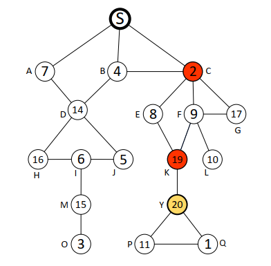
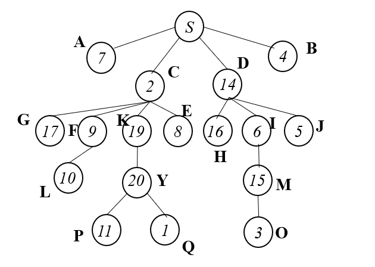

#### 简述机制：

假设$n$个bidder，$k$个items （$n>k$）

根据网络的结构：将从seller开始的所有的cut nodes按照depth进行层次的划分。

> while  $(k\geq 0)$:
>
> ​	for i in set C(cut nodes set which have been sorted by depth 同一层随机排序)
>
> ​		构建$\alpha_i$即：在以$i$为root下的subtree的中排名前$k$高的bidders的集合
>
> ​		if $v_i>v_{-\alpha_i}^k$，那么给$i$分配一个item同时其支付为: $v_{-i}^k$,
>
> ​								将$k-=1$，将$i$添加到winner集合中（将其估值置0）
>
> ​		else $v_i \leq v_{-\alpha_i}^k$ 无法获得一个物品：$p_i=v_{-i}^k-v_{-\alpha_i}^k$. 
>
> ​	if 将set C中的点都判断完毕，仍然剩余物品的数量为$(k-m)$对所有的叶子节点从高价到低价进行分配物品且支付表示为当前图下的市场清空价格$v^{(k-m+1)}$高的价格。

#### Example:

以上图为例首先构造Critical Diffusion Tree

假设分配物品的数量$k=5$ items

机制分析过程：

前$5$高的bidders：Y, K, G, H, M

首先判断level 1的cut nodes：$\{C,D\}$

for C: $v^{5}_{-\alpha_C}=v^5_{-\{K,Y,G\}}=9>2$  not win: $p_C=v^5_{-C}-v^5_{-\alpha_C}=6-9=-3$

for D:  $v^{5}_{-\alpha_D}=v^5_{-\{H,M\}}=11<14$  win:  $p_D=v^5_{-D}=10$ (将$v_D$置0)

此时$k=5-1=4$

下面判断level 2的cut nodes：$\{I,F,K\}$

for I:  $v^{4}_{-\alpha_I}=v^5_{-\{M\}}=16>6$  not win: $p_C=v^5_{-C}-v^5_{-\alpha_C}=0-0=0$

for F:  $v^{4}_{-\alpha_F}=v^4_{-\{\empty\}}=16$  not win: $p_F=0$

for K:  $v^{4}_{-\alpha_K}=v^4_{-\{Y\}}=15<19$  win: $p_K=v^4_{-K}=10$ (将$v_K$置0)

此时$k=4-1=3$

下面判断level 3的cut nodes: $\{M,Y\}$

for M:  $v^{3}_{-\alpha_M}=v^3_{-\{\empty\}}=16>15$  not win: $p_M=0$

for Y:  $v^{3}_{-\alpha_Y}=v^3_{-\{\empty\}}=16<20$  win: $p_Y=v^3_{-Y}=15$ (将$v_Y$置0)

此时$k=3-1=2$

cut nodes set判断完毕下面处理common nodes

此时剩余items数量为2，直接分配给当前图中价格最高的两个bidders：$\{G,H\}$

$p_G=p_H=15$.

因此最终的winner set：$\{D,K,Y,G,H\}$，分别对应的支付为：$\{10,10,15,15,15\}$.