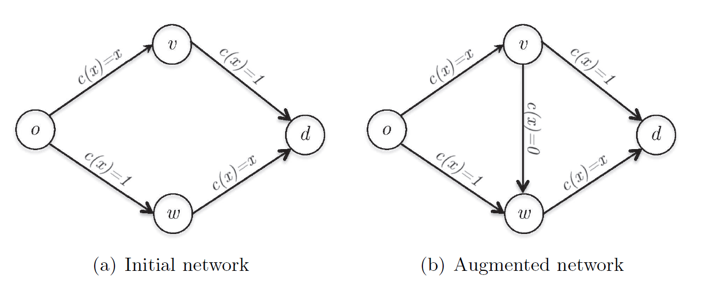
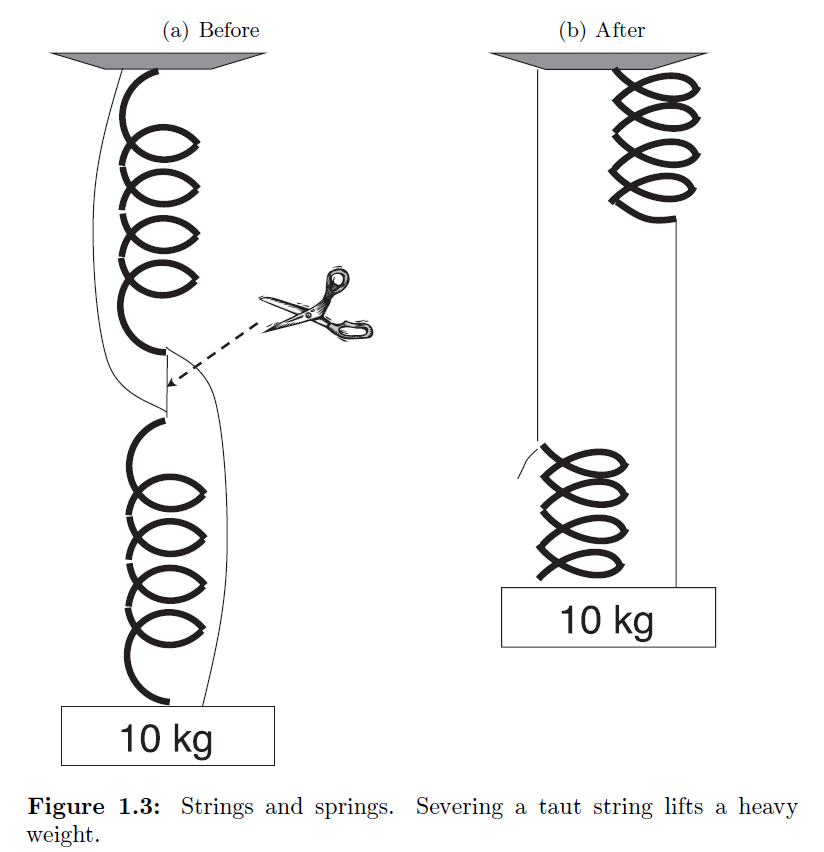

### Lecture 1 

----

### Introduction and Example

这本书一共分为三个部分，每一个部分都有自己的首要的主题。Lecture 2-10

主要给出了一些用于设计一个拥有一些智能体的系统的工具。（这些智能体都是一直处于理性状态的）Lecture 11-15主要帮助我们理解在哪些情境下自私的行为在很大的程度上是一种良性的行为。Lecture 16-20主要探索在博弈中参与的智能体是否能够达到一个平衡以及他们如果在博弈中达到这样一个平衡。在这三个部分中会给出很多的能够激发灵感的例子。

#### 1.1 The Science of Rule-Making

首先给出一个有警示作用的例子。在2012年的伦敦奥运会上在女子羽毛球比赛中出现了一个史上最大的丑闻之一。这个丑闻不是关于药检，而是关于一个非常失败的比赛机制的设计，这种机制没有很好的保证激励所有的运动员都拼尽全力去获取胜利。

这个比赛的机制与世界杯的机制十分类似，共计16支队伍分为四组（A,B,C,D），每一个组四个队。比赛分为两个阶段，循环小组赛：这一阶段中每个队与组内的其他三个队伍之间进行比赛，不与别的组内队伍进行比赛。每一个组的前两名进入第二阶段的淘汰赛，8支队伍有四场四分之一决赛，然后两场半决赛，一场决赛。在这样的一次联赛中，对于参与的运动员，奥运委员会以及观众来说，对他们的激励是不一定一致的。对于队伍来说肯定希望取得奖牌，对于委员会，可能一开始他们并没有仔细思考这个问题，但是从马后炮的角度来说，他们肯定还是希望每一个队伍尽力比赛的。事实上在淘汰赛阶段是不存在什么消极比赛的情况的，因为输了比赛等于直接回家，但是在循环赛的排位阶段，是存在一定的可能性为了避开一些对手而消极比赛的。

（关于这个例子的具体情况就不再赘述了，主要情况就是为了在淘汰赛阶段不碰到太过强力的对手而在循环赛阶段假赛或者消极比赛企图输掉比赛）

**这个例子想要揭示的关键点在于：在一个存在理性agents的系统中，规则的制定是相当的重要的。**

关于规则的制定是存在一个已经发展了很久的科学，这个科学领域叫做“Mechanism Design”，这个领域的目标就是在设计规则的时候保证agents做出的所有的策略行为都是导向一个理想的结果。接下来一阶段我们将要讨论的一些机制设计的应用主要包括了互联网搜索关键词的竞拍，无线频谱的拍卖，医生与医院的匹配以及kidney exchanges（不太清楚这个是什么）。

Lecture 2-10包括了一些基本的传统经济学机制设计的方法，同时还有一些来自计算机领域的补充贡献，这些主要关于计算的可行性，近似计算以及算法鲁棒性的保证。

#### 1.2 When Is Selfish Behavior Near-Optimal

##### 1.2.1 Braess's Paradox

考虑布雷斯悖论，有一个起点$o$，一个目的地$d$和一个固定的从$o$到$d$的通勤的交通流量。现在在整个图中一共两条互不干涉的从$o$到$d$的路径，每一个路径上包含一条比较宽的路和一条窄的路（如图1.2），经过宽路径的时间不管通过的交通流量的大小固定为一个小时，同时在窄路径上的通过时间与在这条路上的交通流量成正比（小时为单位）。在图1.2中分别表示为$c(x) = 1$和$c(x) = x$，因此在这两条路径中的任意一整条路径上通过的时间等于$1+x$。由于这两条路径是完全一样的，所以交通流量会在这两条路径上均分，因此在这种情形下，所有的司机从$o$到$d$的时间为一个半小时。

现在假设我们为了缩短通勤时间在$v$和$w$之间添加了一个瞬时传送的装置，这个设备可以使得所有的司机从$v$到$w$的时间变为零。显然这种情形下我们会发现之前的交通流量的分布无法维持下去了，显然新路径$o\rightarrow v \rightarrow w \rightarrow d$所需要的时间显然是会不高于原先的两条路径的（假设总流量为1则始终有$1+x \geq 2x$）。因此我们假设所有的司机都转向了这条路径，进而我们会发现在边$(o,v)$和$(w,d)$会出现十分严重的阻塞，所有的司机此时花费的时间就全部变为了2个小时。布雷斯悖论揭示了有时候直觉上添加一条超高速的路径会是一个有利的操作然而却往往给交通带来了不利的影响。

布雷斯悖论还揭示了如果在一个网络中存在瞬时传送设备的情况下，所有人都选择自私路由的情况下不会导致整体时间的最短，而一个无私的管理员可以为交通分配路径使得每个人的通勤时间都可以降低$25\%$，我们定义一个混乱程度（price of anarchy）的定义:

$$POA = \dfrac{\text{system performance with strategic players}}{\text{the best-possible system performance}}$$

这个混乱程度的定义基本表示为在所有自私行为下的系统的表现与系统最优的表现之间的比值，例如Figure1.2(b)中的POA等于$2/(3/2) = \frac{4}{3}$。在广泛的一些应用领域中，包括网络路由，调度，资源分配以及竞拍等，在这样的情境下，自私的行为往往是可以导致接近系统最优的结果。在Lecture 12中将会证明适量的过度提供网络的容量是可以保证自私路由的最终的POA趋近于1的。

##### 1.2.2 Strings and Springs

布雷斯悖论不仅仅出现在交通网络中。例如它还有一个类似的例子关于弦和弹簧的机械网络（如图1.3所示）

这个情景是这样的，一开始有一根弹簧，一端是固定在天花板上，另一端连着一个绳子，同时又有一个完全一致的弹簧，这个弹簧的一端悬挂在一个绳子的一端，并且带有一个重物。最终的情况我们会发现，从支座到第二弹簧的上端，从第一弹簧的下端到砝码，两个绳子和弹簧都连接起来了，同时绳子都处于一丁点儿松弛的状态。假设弹簧都是理想化具有弹性的，那么显然这个弹簧延展的长度是关于施加在它上面的力的一个线性函数。我们可以将这个弹簧和绳子的网络假想为一个交通网络，力对应于交通流量，位移对应于通勤的时间。

选择一个合适长度的绳子和弹簧以及固定的弹簧系数，在这个机械网络中平衡位置会像图1.3(a)中的样子。现在考虑一种情景，假设将拉紧的绳子剪断，会导致重量的增加（如图1.3(b)中所示）。我们应该如何解释这个事情呢？注意到一开始我们的两根弹簧初始的情况下是串联在一起的，也就是说每一根弹簧都是承受着全部的重量的并且都是延伸到了一定的长度的。在剪断中间连接的那个拉紧的绳子时两根弹簧承受的重量变为平行的关系，也就是说每个绳子现在只承受一半的重量了因此他们就只伸展之前的一半的长度了。所以说这个例子与之前布雷斯悖论中的例子是十分类似的。

#### 1.3 Can Strategic Players Learn an Equilibrium

我们知道有些游戏是十分容易玩的，比如说布雷斯悖论中的第二图，使用那个捷径不需要动脑筋的，因为那显然对于每一个人来说都是最优的路径，不管别的玩家在其中进行怎样的操作。

然而在大多数的游戏中，玩游戏的最好的策略是根据别的玩家而决定的。剪刀石头布(Rock-Paper-Scissors)的游戏是一个矩阵游戏。下面是一个经典的例子：

|          | Rock | Paper | Scissors |
| -------- | ---- | ----- | -------- |
| Rock     | 0,0  | -1,1  | 1,-1     |
| Paper    | 1,-1 | 0,0   | -1,1     |
| Scissors | -1,1 | 1,-1  | 0,0      |

横向和纵向分别表示两个玩家，矩阵中的数值表示的每个玩家在对应的一次游戏中做出相应的动作（出剪刀，石头或者布）所能带给自己的收益。更加一般化的，我们可以认为对于两个人的博弈来说，每一个玩家都有一个对应的有限策略集合，两个玩家在策略集合中分别选择自己的策略最终对应到每个人都会有一个具体的回报。

一种不太严谨的说法，一个平衡时一个系统的稳定状态，在这个状态下，每个参与者在假设系统中的其他事物都是固定的情况下，他是希望这个系统始终保持这个状态的。显然在石头剪刀布这个游戏中是不存在确定性的平衡的：因为无论现在的状态是什么，至少有一个玩家会有一种通过单边调整策略而获利的情况发生。例如当状态为(Rock,Paper)时，这是不能达到平衡的，因为后一个玩家可以通过变Paper为Scissors来获得更高的利益。

当玩石头剪刀布的时候，似乎你的对手是在三种策略中进行随机选择的，这样的一种在策略下的分布我们称之为混合策略，如果两个玩家都是在游戏中遵循随机均匀分布的选择三种策略的话，事实证明是没有一个玩家可以通过单方面的偏离来获取更高的收益的（因为最终所有偏离的策略得到的平均期望显示为零）。具有这样的一种特点的一组概率的分布被称为混合策略下的纳什均衡。

**Theorem 1.1**:（Nash's Theorem）Every finite two-player game has a Nash Equilibrium.

在lecture 20中我们提到在任意有限玩家的博弈中有着更加广泛的应用。

那么纳什均衡是否可以被高效的计算出结果呢？是通过一个算法来求解结果还是通过参与博弈的玩家自己呢？在像石头剪刀布这种零和博弈（对于每一种状态下玩家们的收益之和为零）中，是可以通过线性规划的方法或者一些迭代的算法进行求解的（使用迭代算法需要一个前提就是可以容忍一些小小的误差）（lecture 18）。这些算法结果证明了纳什均衡的概念是零和博弈行为的良好预测。

在两人的非零和博弈中，最近的一些结果表明是没有一个可计算性的算法能够求解出一个纳什均衡的。非常有趣的一点是，关于计算困难标准的讨论（NP难）似乎不能够应用到这个问题中去。从这个意义上说，计算二人博弈的纳什均衡问题是一个罕见的自然问题，它表现出中等的计算难度。

许多关于均衡的概念的解释包含了参与者，设计者。假设对一个博弈来说，所有的部分都是有限理性的，一个均衡可以解释为一种可靠的预测只要这个均衡是可以通过合理的努力计算出来的（具有可计算性）。计算困难导致了人们对于均衡的预测能力的怀疑。计算困难当然不是第一个挡在纳什均衡面前的石头。例如，博弈中可以有多个纳什均衡，这种非唯一性削弱了该概念的预测能力。尽管如此，计算的困难性是十分重要的一个问题，同时这也是最自然的使用来自计算机科学的概念的一个概念，它也为研究计算上可处理的平衡概念，如相关平衡和粗相关平衡提供了新的动力。（这块挺玄乎的，等看到后面关于可计算性问题的时候再回头看！）（lecture 13，lecture 17,18）

----

>本章要点回顾
>
>1. 2012年羽毛球女双比赛的丑闻是因为参赛队伍与组委会之间不对称的目的所导致的。
>2. 系统设计者的责任在于预测战略行为，而不是参与者违背自身利益的行为。
>3. 布雷斯悖论表明了在交通网络中添加一个超快的路径往往会对整个交通流量带来不利的影响。类似的，在一个机械网络系统中，割断一个拉紧两个弹簧之间的绳子往往会每个弹簧承受的重量增大。
>4. price of anarchy(POA)是系统内部所有参与者采取最优策略的结果与系统最优结果的比值，这个比值越接近于1表明自私的行为往往是良性的，利于整个系统的。
>5. 一场博弈可以具体的表示为：一个玩家集合，对于每个玩家有一个策略集合，通过对于在任意输出状态下每个玩家有一个收益。
>6. 在一个纳什均衡中没有一个玩家可以通过偏离自己当前的策略来提高自己的期望收益。纳什均衡理论指出每一个有限的博弈下都存在至少一个混合策略的纳什均衡。
>7. 计算二人博弈的纳什均衡问题是一个罕见的自然问题，它表现出中等的计算难度。

----

#### 练习题

Exercise 1.3: 证明在石头剪刀布游戏中只存在唯一的纳什均衡。

