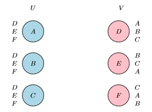

### Lecture 10
### Kidney Exchange and Stable Matching
---
这一讲是关于机制设计部分的最后一章了，延续上一章最后的内容，这一讲主要围绕不考虑钱的机制设计。10.1节主要介绍肾脏交换的案例，这个案例的设计十分受机制设计思想的影响；10.2节探究了稳定匹配问题和著名的deferred acceptance algorithm，这个算法构建了解决绝大多数分配匹配问题的基础算法思想。其中包括医院医疗资源的分配，学生匹配学校问题等等。这个算法拥有良好的数学性质和激励机制。

#### 10.1 Case Study: Kidney Exchange

肾脏交换问题大概的情境如下：由于活体器官捐献的时候，患者和捐献者器官之间不兼容，比如说患者是O型血，但是捐献者是AB型血，那么捐献者的肾脏将无法用于患者。然而活体器官的存量往往是不够的，因此人们引出了这样一个问题：是否可以在这种患者-捐献者对之间进行器官的互换从而使得大家获得自己想要的器官。

我们当然可以使用TTC算法来进行肾脏交换问题的处理，但是我们会发现其存在几个弊端，首先使用假设在TTC算法中出现了很长的环来进行肾脏交换问题的处理。出现的问题是，假设这个环的长度只为2，那么需要同时进行四场手术，之所以同时进行手术是因为如果没有这么做很有可能出现动机问题，一号患者在的得到别人捐献的器官后反悔将自己的器官换出去，那么二号患者就很尴尬。所以我们实际上需要尽可能避免长的环而是短的交换链。另一个问题是在TTC算法中我们对agents的偏好进行建模，但在肾脏交换问题中这个是没必要的，因为患者只需要一个能够兼容自己身体的器官，而不需要考虑什么偏好的排序。

我们考虑一个新的图匹配算法，在这个匹配中我们只考虑在$(P1,D2)$和$(P2,D1)$相互兼容的情况下才进行匹配并在一个无向图中表示为如下的形式：

假设每个患者有一个兼容的供体集合$E_i$，并且可以向机制制定者汇报任何一个兼容供体子集$F_i\subset E_i$，由于所采用的肾脏交换的机制可以被任何病人所拒绝，因此一个可能的虚报是病人拒绝和$E_i\backslash F_i$中的人进行肾脏交换。另外病人也不能虚报与之不兼容的其他供体。

机制设计的最终目标是最大化肾脏移植的数目。

> **成对匹配肾脏交换机制**
>
> 1. 从智能体$i$处收集汇报$F_i$
> 2. 建立图$G=(V,E)$，其中$V$对应所有病人-供体对，对边$(i,j)\in E$当且仅当智能体$i$和$j$上报的病人分别于智能体$j$和$i$上报的供体兼容。
> 3. 返回图$G$上的一个最大基数分配。

这种算法最终导致的情况是可能这个最大匹配是不唯一的。首先可能出现同一个顶点集但是对应的是不同的边集。如图3显示的。

或者是像图四中显示的一样。不同的最大匹配可能匹配的不是同一个顶点集合。

在这些的情况中我们应该如何选择？

一个解决方案就是对顶点进行优先级的排序，这一步在机制设计之前就要完成。假设从$1$到$n$降序排序。引入新的匹配机制：成对肾脏交换中的优先级机制。

> **成对肾脏交换中的优先级机制**
>
> 初始化$M_0$为$G$的最大匹配集合。
>
> for i = 1,2,……,n do
>
> ​	用$Z_i$表示匹配集$M_{i-1}$中包含顶点$i$的所有匹配
>
> ​	if $Z_i\neq \empty$ then
>
> ​		设置$M_i=Z_i$
>
> ​	else if $Z_i=\empty$ then
>
> ​		设置$M_i=M_{i-1}$
>
> 返回任意一个匹配$M_n$

这个算法的思路是在对所有的点做了一个优先级的排序后，我们逐次满足优先级高的点的匹配，依次往下。在$i$轮我们检查一个最大匹配在满足$i$之前的所有的agents被匹配到的情况下是否也能匹配顶点$i$. 如果是的话，则在最终的匹配结果上将$i$加入，如果$i$之前的所有匹配阻碍了$i$可能的所有匹配，那么我们直接跳过$i$继续对下一个点进行判断，对$i$进行归纳，我们知道$M_i$是$G$中所有最大匹配的一个非空子集，由于$M_n$中的每一个匹配包含了相同的顶点集合——$Z_i$非空的顶点$i$的集合，因此在最后一步选择哪一个匹配是无关紧要的。

优先级机制是DSIC的。

目前研究遇到的问题主要来自组织层面，即医院层面，个体是没有动机去虚报或者错报的，而医院出于对自身的考虑会希望自己医院的所有患者能够得到匹配，这可能会导致其虚报从而导致总体匹配情况变差。

以下的两种情况下医院各自都有更好的上报策略而不是实报。

因此在这种情况下是不存在DSIC的最大匹配机制的。

#### 10.2 Stable Matching

稳定匹配问题是不含钱机制设计中的一个非常经典的问题，其中主要包括的应用是学院将毕业学生分配到工作单位，或者把学生分配给学校的问题。

将稳定匹配问题抽象为数学模型，考虑两个大小相同的有限顶点集合$V$和$W$，比如申请人和医院。每个顶点对于另一个集合中的顶点都有一个排序。

所有的申请人核对医院都有一个相同的排序然而对于每一个医院对于所有的申请人都有不同的排序。我们使用$M$定义为$V$和$W$之间的一个完美匹配，即把集合中的每一个顶点分配给另一个集合中的顶点。

blocking pair：$v\in V$和$w\in W$在$M$中没有匹配，并且相对于各自匹配的顶点$v$更喜欢$w$,同样的$w$也更加喜欢$v$. 那么我们就称$v$和$w$之间形成了一个阻塞对。

如果在一个完美匹配中不存在阻塞对，那么我们称这个完美匹配是稳定的。

下面我们来讨论能够输出稳定匹配的算法。

> **延迟接受算法** *Deferred Acceptance Algorithm*
>
> while 存在一个未匹配的申请人$v\in V$ do
>
> ​	$v$尝试和$w$进行匹配，其中$w$是还未拒绝$v$的医院中他最喜欢的那个
>
> ​	if $w$还没有分配出去 then
>
> ​		将$v$和$w$进行临时性匹配
>
> ​	else if $w$已经临时性地和$v'$进行匹配 then
>
> ​		$w$拒绝$v$和$v'$中他相对不喜欢地那个，然后在和另外一个进行临时性匹配
>
> 所有临时性地匹配转换为最终匹配

对于图6中的情况我们进行一次算法的运算，假设第一轮中随机选择了C，C选择先尝试匹配他的偏好第一位的D，由于D当前还没有进行匹配，C和D进行一次临时性匹配，如果下一轮中我们选择了B，那么B也向D提出了匹配请求，D选择拒绝了C然后选择B，同样的下一轮是A，最终D和A进行匹配，最终B和E匹配了，C和F匹配了。

稳定匹配存在一些良好的性质。

稳定匹配的复杂度为$O(N^2)$同时事实上迭代的次数绝对不会超过$n^2$.

对于任意一组申请人和医院的偏好列表，至少存在一个稳定匹配。

下面证明这个匹配是稳定的。

假设申请人$v$和医院$w$是未互相匹配的。有两种情况会发生这种事情，第一种情况是$v$从来没有找过$w$，而我们知道$v$是按照自己的偏好序列进行申请的，因此最终我们知道$v$一定匹配了一个比$w$更好的医院。第二种情况是$v$在某一个阶段向$w$提出了申请但是$w$遇到了更好的选择而放弃了$v$，由于我们知道$w$只能提升他的接受的申请人的列表，因此最终$w$会匹配一个比$v$更好的申请人。

在deferred acceptance algorithm的执行过程中，每一轮的迭代选择的申请人最终会导致得到的稳定匹配的结果不同。

在上述的例子中我们会发现在$U$中迭代或者$V$中迭代最终得到的结果是不一样的。

一个新的性质：从任意一方进行算法迭代最终得到的延迟接受算法的结果是唯一的，与迭代的顺序无关。

在由延迟接受算法计算得到了的稳定匹配中每一个申请人$v\in V$匹配得到了$h(v)$.

下面给出证明：

我们定义$(u,v)\in R$表示$v$拒绝了$u$，那么对于$u$来说，比$v$更好的也将他都给拒绝了，因此我们只需要证明$\forall (u,v)\in R$，没有稳定匹配能够将两者匹配，这样我们就能证明这样一个性质了。

假设$R$从空集不断扩充，假设在$v$的视角中，$u'>u$，在$u'$的视角中$v'>v$，那么如果$(u',v)$匹配了，那么意味着$(u,v),(u'v')\in R$，此时$(u,v)$无法稳定匹配，因为有$(u'v)$作为更好的选择；另外一种情况，$(u',v')$也无法稳定匹配，因此此时$v'$有更好的选择$u''$，$(u'',v')$会抢走$u'$.

当然从医院的角度出发，延迟接受算法输出了一个最差的稳定匹配。

假设申请人和医院的偏好信息都是私人信息，那么通过让所有的节点上报偏好信息然后进行延迟接受算法最终得到的是一个DSIC算法吗？

对于申请人是一个DSIC算法但是对于医院来说不是的。

---

> 肾脏交换问题是一个使得两个或者多个不兼容的病人-供体对的病人从对方的供体中获得一个肾脏的问题。
>
> TTC算法应用于肾脏交换会存在环路过长的问题。
>
> 一个稳定匹配算法是指一组申请人和一组医院的配对，在这个匹配中不存在申请人和医院对通过互相匹配使得对方都获得更好的结果。（也就是说只能有一方的最优）
>
> 延迟接受算法可以得到一个申请人最优的稳定匹配。
>
> 有延迟接受算法导出的直接机制对于申请人来说是DSIC的但是对于医院则不是。

