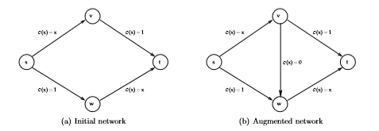

### Lecutre 11

---

### Selfish Routing and the Price of Anarchy

这一章我们开始着手于算法博弈论的第二大部分内容。在很多的情境下，不像我们之前考虑的设计DSIC机制一样，我们会发现无法从头开始设计一个博弈，因为很多时候找不到占优策略。我们在预测这样的一个博弈的结果的时候通常使用的是均衡的概念。每一个agent都考虑的是利己的行为，实际上想想会发现我们最终达到的均衡绝大多数时候都是无法达到社会期望的结果的。但是在很多的建模中，基于一些弱假设，我们能够得到近似最优的均衡。这一讲关注的重点就是“自私路由”的经典问题。

#### 11.1 Selfish Routing: Examples

之前我们讨论过布雷斯悖论的问题：

图(a)中我们知道假设1单位的网络流，在这个图中由于对称性我们可以发现达到均衡时每一条路线都承载一半的交通流，且每一个agent所花费的时间为$3/2$. 此时假设在$v$和$w$之间添加一条瞬间传送的路径，那么所有的agent都会一拥而上走$s\rightarrow v \rightarrow w \rightarrow t$的路径，这个新的均衡下每一个个人花费的时间是$2$，而可能的最短时间是$3/2$，所以在添加了这一条瞬间传送的路径后反而没有带来任何的好处。我们定义这个自私路由的无秩序代价（Price of Anarchy PoA）：均衡情况下所用的时间与最小的平均时间之间的比值：即$2/(3/2)=4/3$.

下面我们再考虑一个更加简单的自私路由网络：Pigou网络

图(a)的网络中不难发现每一个agent的占优策略是选择下面的路径，因为就算所有走下面的路径其cost也最差跟上面一样，而作为一个管理员，他可以将所有的交通流分摊到两条路径上来减少平均时间代价，这时候平均时间代价变为$3/4$. 从而Pigou网络的PoA变为了$1/(3/4)$也就是$4/3$.

图(b)是Pigou网络的一个变种，也就是说在这种情况下下面那条路径的代价函数进行了修改，变为$x^p$, 这种情况下，均衡情况下仍然是所有的agents都从下面的路径走，平均时间为1，然而这种情况下，最优的情况会好很多，我们假设$\epsilon$的流量从上面走，$(1-\epsilon)$的流量从下面走，得到的当$p\rightarrow \infty$, $\epsilon\rightarrow 0$时，$(1-\epsilon)^p$是接近于0的，因此$p\rightarrow \infty$时，这种Pigou网络的非线性变种得到的PoA是无界的。

#### Main Result: Informal Statement

我们不难发现PoA的大小在不同的网络中可大可小，而我们知道当PoA的大小越小时表示均衡结果越来越接近最优结果，因此我们希望去研究在什么情况下自私路由的PoA能够更加解决1. 我们注意前面给出的例子，不难看出非线性的代价函数会让自私路由的PoA结果变得十分糟糕，而往往线性的代价函数有一个更小的PoA. 这里给出一个猜想，如果一个代价函数的非线性不高，那么无论多复杂的路由网络我们都可以得到其PoA应该是接近1的。

假设有向图$G=(V,E)$, 起点$s$终点$t$, $r$单位的网络流从$s$流向$t$. 我们将$G$看作经典的最大/最小费用流问题。每一条边$e$都有一个时间代价函数，这是一个关于交通流的函数，假设这些代价函数都是非负，连续且非递减的。

网络代价函数的非线性程度确实决定了自私路由的PoA.

**定理：**（自私路由的严格PoA界）在所有的代价函数集合$\mathcal{C}$中的所有网络代价函数，在类似Pigou网络中的PoA是最大的。

这个定理的意义就在于，如果我们要寻找一类代价函数族的PoA上界时，我们不必要考虑所有的网络，而是只需要考虑在Pigou网络中进行简单的搜索就可以了。

| 函数类型     | 典型范例              | PoA                                                          |
| ------------ | --------------------- | ------------------------------------------------------------ |
| 线性函数     | $ax+b$                | $4/3$                                                        |
| 二次函数     | $ax^2+bx+c$           | $\frac{3\sqrt{3}}{3\sqrt{3}-2} \approx 1.6$                  |
| 三次函数     | $ax^3+bx^2+cx+d$      | $\frac{4\sqrt[3]{4}}{4\sqrt[3]{3}-3} \approx 1.9$            |
| 四次函数     | $ax^4+bx^3+cx^2+dx+e$ | $\frac{5\sqrt[4]{5}}{5\sqrt[4]{5}-4} \approx 2.2$            |
| 阶数$\leq p$ | $\sum_{i=0}^pa_ix^i$  | $\frac{p+1\sqrt[p]{p+1}}{p+1\sqrt[p]{P+1}-p} \approx \frac{p}{\ln p}$ |

#### Main Result: Formal Statement

> **一个Pigou-Like网络的组成成分**
>
> 1. 两个节点，$o$和$d$.
> 2. 两条从$o$到$d$的边，称为："upper"边和"lower"边
> 3. 一个非负的交通流率$r$
> 4. 在lower边上的一个代价函数$c(\cdot)$
> 5. upper边的代价函数处处相等且等于$c(r)$

对于所有交通流来说，走lower边一定是一个占优策略。因此在均衡条件下的时间代价为：
$$
r\cdot c(r)
$$

另外不难写出最小时间代价：
$$
\inf_{0\leq x\leq r}\{ x\cdot c(x) + (r-x)\cdot c(r)\}
$$
其中$x$是通过下面那条边的交通流量。

PoA为：
$$
\sup_{x\geq 0}\{\frac{r\cdot c(r)}{x\cdot c(x)+(r-x)c(r)}\}
$$
我们令$\mathcal{C}$是任意非负，连续且非递减的代价函数集合。Pigou界可以定义为类Pigou网络中下边代价函数属于$\mathcal{C}$的情况下的最大PoA。
$$
\alpha(\mathcal{C})=\sup_{c\in \mathcal{C}} \sup_{r\geq 0} \sup_{x\geq 0} \{ \frac{r\cdot c(r)}{x\cdot c(x)+(r-x)\cdot c(r)} \}
$$
在类Pigou网络中，前两个$\sup$是对自由参数$c\in \mathcal{C}$和$r\geq 0$的遍历，第三个$\sup$则是对给定的类Pigou网络搜索最好的可能结果。

如果假定集合$\mathcal{C}$中包含所有的常函数，那么在类Pigou网络中，定义$\alpha(\mathcal{C})$就只需要使用$\mathcal{C}$中的函数。对于代价函数属于$\mathcal{C}$的自私路由网络，$\alpha(\mathcal{C})$就是自私路由网络PoA最坏情况的下界。

**定理**：（自私路由的严格PoA界）对于所有代价函数的集合$\mathcal{C}$以及代价函数属于$\mathcal{C}$的自私路由网络，其PoA至多是$\alpha(\mathcal{C})$.

#### 11.4 Technical Preliminaries

定义$G=(V,E)$, 其中有$r$的单位的流量从$s$转移到$t$. 其中$\mathcal{P}$表示图中所有的$s-t$路径的集合（不为空）。分流定义的是交通流在这些路径是怎样分配的。我们定义为一个非负的向量$\{f_P\}_{P\in \mathcal{P}}$, 其中$\sum_{P\in \mathcal{P}}f_P=r$.

例如上图中一半的交通流沿着路径$s\rightarrow v \rightarrow w \rightarrow t$，剩余的其他交通流在另外两条路径对半分。对于每一条边$e\in E$和一种分流$f$，我们记$f_e=\sum_{P\in \mathcal{P}:e\in P}f_p$. 举例：$f_{(s,v)}=f_{(w,t)}=\frac{3}{4}$等。

对于一种分流而言，当且仅当交通流只经过最短的$s-t$路径时，其达到一个均衡。我们认为$f_{\hat{P}}$:
$$
\hat{P}\in \arg\min_{P\in \mathcal{P}}\left\{\underbrace{\sum_{e\in P} c_e(f_e) }_{:=c_P(f)}\right\}
$$
定义一条路径上花费的时间：

$c_P(f)=\sum_{e\in P}c_e(f_e)$

然后按照路径加和计算花费的总时间：

$C(f)=\sum_{P\in \mathcal{P}}f_p\cdot c_p(f)$

第二种计算总时间的方法是按照每一条边加和来计算花费的总时间：

$C(f)=\sum_{e\in E}f_e\cdot c_e(f_e)$

#### 11.5 Proof of Theorem 11.2

固定一个自私路由网络$G=(V,E)$, cost function来自于$\mathcal{C}$, 交通流量为$r$. 我们定义两个最重要的东西，$f$和$f^\ast$分别表示均衡条件下和最优条件下的网络流的数量。下面的证明分为两个部分。

第一部分需要证明的是在每一条边$e$的代价固定为均衡条件下的值$c_e(f_e)$时，均衡分流就是最优的分流。这是因为在均衡分流情况下，所有的路径都会选择最短的路径。

由于$f$是均衡分流，那么如果有$c_{\hat{P}}>0$, 那么对于任意的$P\in\mathcal{P}$，我们都会得到：$c_{\hat{P}}(f) \leq c_{p}(f)$. 此时均衡分流中的所有路径的代价都为$c_{\hat{P}}(f)$, 我们记为$L$, 则对于所有的路径$P\in\mathcal{P}$，有$c_{P}(f)\geq L$. 因此：

$$
\sum_{P\in\mathcal{P}}\underbrace{f_p}_{\text{sums to }r}\cdot \underbrace{c_P(f)}_{=L \text{ if }f_P>0}=r\cdot L
$$

同时我们还有：
$$
\sum_{P\in\mathcal{P}}\underbrace{f_p^*}_{\text{sums to }r}\cdot \underbrace{c_P(f)}_{\geq L}\geq r\cdot L
$$

利用$c_P(f)=\sum_{e\in P}c_e(f_e)$我们可以将上面的两个式子进行改写：
$$
\sum_{e\in E} f_e\cdot c_e(f_e) = r\cdot L
$$
以及：
$$
\sum_{e\in E}f^*_e\cdot c_e(f_e) \geq r \cdot L
$$
两式作差得到：
$$
\sum_{e\in E}(f^*_e - f_e)c_e(f_e)\geq 0
$$
上面的式子直觉上就会告诉你，当我们将所有的边的cost都固定为$\{c_e(f_e)\}_{e\in E}$. 由于均衡分流将所有的交通流都通过最短的路径，那么其他的任何的$f^*$都不可能有更短的时间。

证明的第二部分是：最优分流$f^*$会比均衡分流$f$好很多。大致思路为：在均衡分流和最优分流下，每一条边上的时间代价之差都不会超过Pigou界。虽然这一点只对每一条边上的差值成立，但当我们利用前面第一部分的证明的结论我们可以控制总的差值。

将Pigou界用在我们这个新的情境下：
$$
\alpha(\mathcal{C})\geq \frac{f_e\cdot c_e(f_e)}{f^*_e\cdot c_e(f^*_e)+(f_e-f^*_e)c_e(f_e)}
$$

将上式进行改写：
$$
f^*_e\cdot c_e(f^*_e) \geq \frac{1}{\alpha(\mathcal{C})} f_e\cdot c_e(f_e) + (f^*_e - f_e)c_e(f_e)
$$

对于所有的边我们进行累加求和：
$$
C(f^*)\geq \frac{1}{\alpha(\mathcal{C})}\cdot C(f)+\sum_{e\in E}(f^*_e-f_e)c_e(f_e)\geq \frac{C(f)}{\alpha(\mathcal{C})}
$$

因此PoA至多为$\alpha(\mathcal{C})$, 证毕。

---
> 1. 在自私路由网络中，均衡的分流表示所有人都会选择从起点到终点最短的路径。
> 2. 当自私路由网络的代价函数是“高非线性”的，PoA的值会很大。
> 3. 在只有两个顶点和两条边的网络中，如果一条边的代价函数属于集合$\mathcal{C}$，另一条边的代价函数属于常函数，那么最大的PoA就是集合$\mathcal{C}$中的Pigou界。
> 4. 对于所有代价函数都是属于$mathcal{C}$的自私路由网络来说，PoA的上界就是$\mathcal{C}$的Pigou界。