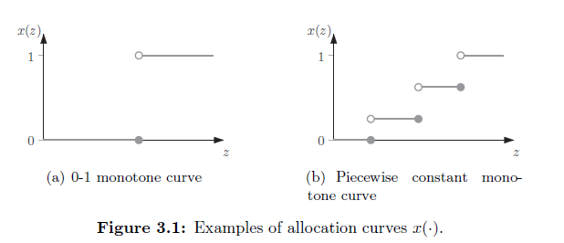

### Lecture 3

----

### Myerson's Lemma

上一个lecture我们提出了一种两步走的拍卖设计的方法，这种机制设计下的拍卖是满足DSIC，社会福利最大化以及具有可计算性。回顾一下：第一步是假设实报，然后基于这个假设考虑一下如何将这个物品分配出去以达到社会福利最大化的效果。例如在赞助搜索拍卖中，这个步骤就表现为我们将第$i$好的广告位置分配给第$i$高出价的竞拍者。第二步是为了使得实报是一种占优策略去设计得到合适的售价。这个lecture中我们将陈述并证明关于myerson‘s lemma的事实，对于机制设计来说，这个引理是进行机制设计第二步的一个非常强大且有普适性的工具。这个引理是适用于赞助搜索拍卖的，其中lecture 4和lecture 5中将会给出一些更加具体的实例。

3.1节介绍了单参数的环境（这种环境是lecture 2中介绍的那种环境的一种更加一般化的情况）；3.2节就分配规则和付款规则重述了2.2节中的封闭拍卖的情境；3.3节定义了分配规则的两种特点：可执行性和单调性，同时陈述并解释了迈尔森引理的内容；3.4节给出了迈尔森引理的证明；迈尔森引理中包含了一种在DSIC机制中的一种付款的方式；3.5节将这种形式应用到了赞助搜索拍卖中。

#### 3.1 Single-Parameter Environment

从一种很好的抽象层次上来说，我们认为对于迈尔森引理来说，它是基于一种单参数的环境下去考虑的。在这个环境下存在$n$个智能体参与其中，每个智能体$i$有一个私密的估值$v_i$，这个$v_i$表示的是他认为的每一个单位物质的价值。最终会存在一个可实现的分配的集合$X$（这里理解为分配空间，即所有可能的分配的结果的集合），在$X$集合中的元素都是一个非负的$n$维的向量$(x_1,x_2,\cdots,x_n)$，$x_i$表示的是分配给智能体$i$的物品的量。

**Example 3.1**：对于单物品的拍卖而言，$X$是一个$0-1$的向量的集合，每一个向量都至多有一个1，即$\sum_{i=1}^{n}x_i \leq 1$.

**Example 3.2**：对于k个物品的拍卖来说，存在k个相同的物品并且有限制是每一个人至多获得一个物品，这个$X$集合中元素满足的条件是$\sum_{i=1}^{n}x_i \leq k$.

**Example 3.3**：对于赞助搜索拍卖而言，集合$X$是一个n维向量的集合，这些向量是一个从拍卖者到位置的映射，每一个位置至多分配给一个bidder，同时每一个bidder最多只有一个位置，如果竞拍者$i$分配到的位置$j$，那么$x_i$的值是等同于位置$j$的点击率$\alpha_j$的。

**Example 3.4**：对于公共项目而言，关于决定是否去构建一个公共项目，例如搭建一座桥，可以将集合$X$建模为：$X=\{ (0,0,\cdots,0),(1,1,\cdots,1) \}$.

Example 3.4表明单参数的环境是足够捕捉到拍卖应用之间的一些不同的。在这个层次上，我们指的是代理人而不是投标人。我们有时用报告代替投标。机制是当代理人拥有私人信息(如估价)时进行决策的一般程序，而拍卖是专门用于交换货物和货币的机制。Table 3.1可以更加清楚的说明这一点：

| auction   | mechanism |
| --------- | --------- |
| bidder    | agent     |
| bid       | report    |
| valuation | valuation |

（这里需要学习的一个知识点是到底什么是单参数的环境？单参数空间从这个抽象的角度来看我们可以认为是对于一个拍卖而言，我们最终需要给出的结果是一个可实行的分配的集合$X$，这个$X$中包含的是对于每个agent我们需要给其分配的物品的个数。而考虑到多参数的环境，我们可以进行类比得到多参数下的的情景。）

#### 3.2 Allocation and Payment Rules

回忆密封拍卖中的两个决策：谁获得这个物品以及他需要付款多少钱。这两个决策我们可以更加抽象的形式化为：分配规则和付款规则，以下有三个步骤：

1. 从所有的agents那边收集报价$\bold{b}=(b_1,\cdots,b_n)$，这个向量$\bold{b}$表示为报价向量或者bid profile。
2. **[Allocation rule]**：选择一个可实现的分配函数$x(b)\in X \subseteq \mathbb{R}^n$，注意这是一个关于报价的函数。
3. **[Payment rule]**：选择一个付款函数$p(b)\in \mathbb{R}^n$，这也是一个关于报价的函数。

诸如以上这种类型的步骤我们把它称为“直接启示机制”，因为在第一步中所有的agents被要求直接表明他们的内心估值。（间接机制的一个例子是迭代递增拍卖（练习2.7：开放递增的单物品拍卖，卖家报一个价格，买家告知是否接受价格，最终当没有人接受一个更高的价格时，前一个价格就是最终的出售价格））。

在采用近线性收益模型的情况下，采用$x(b)$和$p(b)$的分配和付款函数，每一个竞拍者$i$可以获得的收益为：

$$u_i(b) = v_i \cdot x_i(b) - p_i(b)$$

对于付款机制来说需要满足：

$$p_i(b)\in[0,b_i \cdot x_i(b)]$$

关于$p_i(b)\geq 0$的限定是因为在我们涉及的拍卖情景中不允许出现卖家向竞拍者付钱的情况出现。关于$p_i(b)\leq b_i x_i(b)$的限定是因为不允许出现竞拍者的付款价格超过他自己的报价，这样可以保证一个实报的竞拍者的收益永远不会为负。

#### 3.3 Statement of Myerson‘s Lemma

接下来是两个重要的定义。两者都阐明了分配规则的属性。

**Definition 3.5 （Implementable Allocation Rule）**：对于单参数的环境下的一个分配规则$x$来说，如果存在一个付款规则$p$，且对于$(x,p)$这个直接启示机制是DSIC的，则我们可以说这个分配规则是implementable的。

这也就是说，这些implementable的分配规则是可以被扩展到DSIC机制设计中的。等同于说DSIC的机制设计中的分配规则都是implementable的分配规则的集合中的一种。如果我们的目标是设计一种DSIC的机制，我们必须限制我们的机制中的分配规则一定是implementable的，因为这构建起来我们的设计空间。

**Definition 3.6 （Monotone Allocation Rule）**：对于一个分配规则$x$来说，当对于每一个智能体$i$来说以及除去$i$的其他智能体的报价向量$\bold{b}_{-i}$来说，分配规则函数的大小随着他的报价的增加是非递减的，则我们可以认为这个分配规则是一个单调的分配规则。

这也就是说，在这个单调的分配规则下，更高的出价只会让你得到更多的物品而不是更少。

例如在单物品拍卖情境下，显然就是一个单调的分配规则，假设原本是赢家，出价更加依然是赢家，假设是输家，出价更高可以让你变为赢家。

对于赞助搜索拍卖而言也一定是这样的，第$i$好的位置分配给第$i$高报价的竞拍者。

**Theorem 3.7 （Myerson‘s Lemma）**：对于一个单参数的环境下：

（a）一个分配规则$x$是implementable的当且仅当这个分配规则是单调的。

（b）当分配规则$x$是单调的，一定存在一个唯一的付款规则$p$使得$(x,p)$是一个DSIC的机制同时当$b_i=0$的时候，$p_i(b) = 0$.

（c）这个付款规则$p$一定可以给出一个具体的形式来表示它。

迈尔森引理是我们构建机制设计理论的基础。下面给出证明：

#### 3.4 Proof of Myerson‘s Lemma

考虑一个单参数的环境下，假设有一个分配规则$x$，它可能是单调的也可能不是单调的，假设存在一个付款机制$p$使得机制$(x,p)$是一个DSIC的机制，那么这个$p$将会是什么样子的呢？我们的证明的思路是通过严格的DSIC的约束将这个分配机制$x$的可能性限制到只有一个候选项。

回忆一下DSIC的规则，对于每一个智能体$i$来说，每个人有一个估值$v_i$，同时有一个其他所有智能体的报价向量$\bold{b}_{-i}$，一定是在实报出自己的估值的情况下，这个智能体才能够获得最大的收益。现在固定$i$和其他所有智能体的报价向量$\bold{b}_{-i}$，将分配规则和付款规则分别定义为：$x_i(z,\bold{b}_{-i})$和$p_i(z,\bold{b}_{-i})$，其中$z$表示的是$i$这个智能体给出的报价。图3.1给出了两种可能的分配函数：

我们通过一个简单但聪明的交换技巧来调用DSIC约束。假设$(x,p)$是DSIC的，同时考虑变量$y$满足条件$0\leq y < z$。

假设智能体$i$的私人估值为$z$，虚报的价格为$y$，（这种情况下是低报）则根据DSIC的约束以及收益的计算方法我们可以得到下面的式子：

$$z \cdot x(z) - p(z) \geq z\cdot x(y) - p(y)$$.

类似的我们可以假设这个智能体的私人估值为$y$，而他所给出的虚报的价格为$z$，（这种情况下是高报）则我们可以得到另外一个式子：
$$y\cdot x(y) - p(y) \geq y\cdot x(z) - p(z)$$.

将上面的这两个式子进行一下变换我们可以得到一个新的式子：

$$z\cdot[x(y) - x(z)] \leq p(y) - p(z) \leq y\cdot[x(y) - x(z)]$$.

不难发现，上式表明每个可实现的分配规则都是单调的。

考虑$x$为点越阶函数，那么我们可以认为$i$买家所能获得的分配值是是一个有限数量下的跳跃值，考虑上面的式子，假设我们固定$z$，让$y$逐渐接近$z$。

jump in $p$ at $z$ = $z$$\cdot$[jump in $x$ at $z$]

这里给出的是对于payment的约束，即你在payment方面所要提高的值等于你的报价乘上在给你分配物品数量上阶跃的值。结合初始条件$p(0)=0$，我们可以得到下面关于payment方面的解析：

$p_i(b_i,\bold{b}_{-i})=\sum_{j=1}^{\mathcal{l}}z_j[\text{jump in }x_i(\cdot,\bold{b}_{-i}) \text{ at } z_{j}]$

其中$z_1,\cdots,z_{\mathcal{l}}$ 是分配函数$x(\cdot,\bold{b}_{-i})$在$[0,b_i]$。

