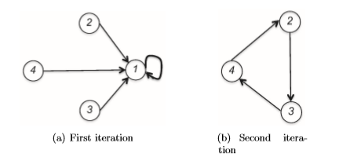

### Lecture 9

----

### Mechanism Design with Payment Constraints

之前在机制设计问题的研究上我们对于payment的限制只停留在最简单的情境，非负且保证实报bidders不会有负收益。在这一讲中我们第一次考虑带支付限制的机制设计问题而不是仅仅incentive和可行的限制。

9.1节中将预算约束考虑进近似线性收益模型；9.2节探究多单位物品的拍卖，在这种拍卖中bidders存在预算，同时提出了非DSIC的但是很优美的解决方案：uniform-price auction；9.3节我们描述了一种clinching auction，这是一种更加复杂的拍卖情境；9.4节提出了不考虑钱的机制设计问题，涉及经典的房屋分配问题同时学习TTC算法的一些性质。

#### 9.1 Budget Constraints

在许多的实际应用中，对于payment往往是有一些约束的。首先就是budget constraints，这个限制了一个智能体所能付出的钱的数量。预算问题在一些一个agent可能购买很多的物品的情境下会变得十分重要。例如在关键词搜索拍卖中，每一个bidder都被要求知道他对于每一次点击的bid以及他每天的预算。

最简单的将budgets加入我们的收益模型的方式是重新定义带budget为$B_i$的智能体$i$对于结果$\omega$和payment为$p_i$的情况：
$$
\begin{split}
v_i(\omega)-p_i & \text{  if }p_i\leq B_i \\
-\infty & \text{  if }p_i>B_i
\end{split}
$$
我们需要新的拍卖形式来将budget约束纳入进来。例如考虑最简单的单物品拍卖情境，其中每一个bidder拥有一个已知的budget为1，同时有一个私人估值。二价拍卖下，获胜者需要支付第二高的价格，其中有可能出现这个价格超过了它的预算。更加广泛的结论是：没有带有非负payments的DSIC的单物品拍卖能够最大化社会福利同时还能够遵守bidders'的预算。

#### 9.2 The Uniform-Price Multi-Unit Auction

多单位物品拍卖问题的情境如下：存在$m$个相同的items，每一个bidder都对每一个他得到的物品有一个估值$v_i$，不同于k-unit物品拍卖的形式，我们假设每一个bidder都希望得到尽可能多的单位的物品。因此$i$号bidder从$k$个items中获得的价值为$k\cdot v_i$. 可以认为这样的多单位物品拍卖问题是单参数的环境。另外的话每一个bidder都有一个公共皆知的预算$B_i$，也就是说卖家是提前知道所有人的这个预算值的。

The Uniform-Price Auction

首先定义$i$号bidder在价格为$p$时的需求量：
$$
D_i(p)=\begin{cases} \min\{\lfloor\frac{B_i}{p}\rfloor,m\} &\text{ if } p < v_i;\\
0 & \text{ if } p>v_i;
\end{cases}
$$

  简单分析，$i$号bidder对于每一个他获得的商品有一个估值$v_i$，如果出售价格$p$超过$v_i$，显然他不会希望获得任意一个商品，即$D_i(p)=0$，如果出售价格低于$v_i$，则他的需求量根据他的预算决定，$\lfloor B_i/p \rfloor$与$m$的最小值为其需求量。随着$p$的增加，bidders的需求量逐渐降低。这个需求量存在一个分界线，决定了两种情况，一种是从一个正整数降低为0，另一种情况是从一个单位一个单位的降低。

我们定义总的需求量为：$A(p)=\sum_{i=1}^{n}D_i(p)$，一般地，定义$A^{-}(p)=\lim_{q\uparrow p}\sum_{i=1}^n D_i(p)$以及$A^+(p)=\lim_{q\downarrow p}\sum_{i=1}^nD_i(p)$，分别对应$A(p)$从下方以及从上方取极限的值。

同一价格拍卖挑选一个价格$p$使得供应量和总需求相等，并分配给每一个竞拍者在价格$p$时的需求量。

> **同一价格拍卖**
>
> 1. 选定价格$p$使得供应量等于总需求量，即$A^{-}(p)\geq m \geq A^+(p)$.
> 2. 将$D_i(p)$个物品分配给竞拍者$i$，其中每一个物品的价格为$p$，当$v_i=p$时，定义竞拍者$i$的需求量$D_i(p)$为使得$m$个商品都被分配出去的量。

同一价格拍卖不是DSIC的！

这个拍卖不是DSIC的，因为其会面临需求缩减的问题。

假设存在两个竞拍者，$B_1=+\infty , v_1=6$，二号玩家$B_2=v_2=5$，同时我们有两个商品，假设都真实竞拍的情况下，我们会发现当$p$设为小于5的情况下，需求量都是超过供应量的，因此最终当价格设为5的情况下拍卖结束，1号玩家得到两个物品，2号玩家无法得到商品，此时1号玩家的收益为2；但是假设1号玩家进行虚假报价为3的情况下，他的收益将会增加，因为当其报价为3时，最终的拍卖会以价格$p=3$结束，此时1号玩家获得一个商品，2号玩家也获得一个商品，但此时1号玩家的收益为3超过了他实报时的收益2.因此我们会发现这样的同一价格拍卖不是一个DSIC的机制。

#### 9.3 The Clinching Auction

在竞拍者存在公开预算约束时，锁定拍卖是一个DSIC的多单位拍卖。拍卖的关键点在于随着价格的升高，卖家逐个将物品出售出去，除了当前价格$p$之外，拍卖还一直关注当前的供应量$s$以及每一个竞拍者剩余的预算$\hat{B}_i$，初始预算为$B_i$. 在价格$p\neq v_i$时，基于剩余预算和供应量给出竞拍者$i$的剩余需求量$\hat{D}_i(p)$:
$$
\hat{D}_i(p)=\begin{cases} \min\{\lfloor\frac{\hat{B}_i}{p}\rfloor,m\} &\text{ if } p < v_i;\\
0 & \text{ if } p>v_i;
\end{cases}
$$
同时定义：$\hat{D}^+_i(p)=\lim_{q\downarrow p}\hat{D}_{i}(q)$.

锁定拍卖迭代地提高当前的价格$p$，同时bidder $i$会在当其他人的总需求量小于当前供应量$s$的时候，锁定一些物品，也就是说在价格$p$的情况下不存在竞争。不同的物品会以不同的价格在不同的轮次中被卖掉。整个拍卖过程会一直持续到所有的物品被卖掉才会结束。

> **锁定拍卖**
>
> 初始化$p=0,s=m$，每个竞拍者的$\hat{B}_i=B_i$
>
> while $s > 0 $时 do：
>
> ​	增加$p$至$v_i$或者$\hat{B}_i/k$中的次高值（$k$为某个正整数）
>
> ​	设$i$为拥有最大剩余需求$\hat{D}^+_i(p)$的竞拍者，以随机策略打破平局
>
> ​	while $\sum_{j\neq i} \hat{D}_i^+(p) < s$ do
>
> ​		if $\sum_{j=1}^{n}\hat{D}^+_i(p)> s$ then
>
> ​			以价格$p$分配给竞拍者$i$一件商品//*也就是说这个商品被锁定了*
>
> ​			将$\hat{B}_i$减少$p$同时供应量$s$减少1
>
> ​			在价格$p$下重新计算最大剩余需求量的竞拍者$i$，以随机的策略打破平局
>
> ​		else if $\sum_{j=1}^n \hat{D}_j^+(p)\leq s$ then
>
> ​			以价格$p$分配$\hat{D}^+_i(p)$个物品给竞拍者$j$
>
> ​			把任意剩余物品以价格$p$分配给满足$v_l=p$的竞拍者$l$
>
> ​			将$s$置为$0$

 注意到关于出售价格$p$只有在竞拍者的剩余需求减少的时候会产生变化。

内层循环存在两种情况，第一种情况总的剩余需求量超过剩余供应量，但是除了竞拍者$i$外的其他竞拍者的总剩余需求量小于供应量。在这种情况下我们称竞拍者$i$以价格$p$锁定一个物品，同时对应做一些更新。第二种情况只有在总需求量在价格为$p$时减少两个或者更多的时候才会发生。这种情况下当$l$的需求降为0时，剩余的$s$个商品不会产生竞争，因此直接以价格$p=v_l$分配给竞拍者就ok了。

继续使用之前的例子，在锁定拍卖中，由于2号bidder的需求量在当价格$p$达到5/2时需求量减少为1，此时1号bidder将会以5/2的价格得到第一个商品，接下来价格上升到5后，1号bidder再次获得第二个物品，最终1号bidder的收益为$12-5/2-5$等于$9/2$. 且虚报在这个机制下是无法增加收益的。

我们不难发现锁定拍卖一定是implementable的，它总会结束且将这$m$个物品全部分配出去，收取的支付最多是竞拍者的预算值。

锁定拍卖是DSIC的！下面给出证明：

首先假定固定一个bidder $i$以及其他bidders的出价$\bold{b}_{-i}$，由于大家的预算信息是一个公共信息，所以对于$\hat{D}^+_i(p)$中的$\lfloor \hat{B}_i/p\rfloor$我们发现$i$是无法通过改变他的报价来改变的。他所能影响的是他什么时候退出这一场拍卖即$\hat{D}^+_i(p)=0$的时候。当$p<v_i$时，竞拍者$i$能够锁定的商品都是可以为他带来正收益的，同样的$p>v_i$时，每个锁定的物品只能带来负收益。因此这里也说明了实报一定是收益非负的。

考虑$b_i < v_i$的情况，那么在价格$p$从$0$增加到$b_i$的过程中，$b_i$和$v_i$是一样的拍卖流程，bidder可以锁定的物品也是一样的，即这一部分收益相同，但是在$[b_i,v_i]$区间上，报价为$b_i$时可能会错失一些可以锁定的物品。这样对他的收益是有损失的。

再考虑$b_i>v_i$的情况，与前一种情况前面是类似的，但是在$[v_i,b_i]$区间上，我们会发现，bidder会锁定到一些额外的物品，但是这些物品的价格$p>v_i$的，因此这些物品只能给bidder带来一些非正的收益，同样的这样的结果下对他的收益是有损失的。

综合上面的情况我们会发现锁定拍卖一定是DSIC的机制。

假设预算信息是私人信息，则锁定拍卖不再是DSIC机制。

事实上，锁定拍卖非常接近最优拍卖了，仅仅在一定程度上被预算限制了。不考虑拍卖的时候，机制实现了VCG机制的定价。有一些方式可以说明锁定拍卖在一定程度上是接近最优的。第一种方式是从收益最大化的角度，假定竞拍者的估值在一个分布上，然后在满足预算的约束下求解最大化期望社会福利的DSIC机制；第二种方式是修改社会福利目标函数，将预算约束加进去，即$\sum_{i}v_ix_i$替换为$\sum_{i}\min\{B_i,v_ix_i\}$，在这个目标函数下也被证明是接近最优的；第三种方式研究帕累托最优而不是某一个具体的目标函数，有人已经证明了锁定拍卖是唯一的总能获得帕累托最优分配的确定性DSIC拍卖。但是一些可取的机制，不如第一种方式下的得到的贝叶斯最优机制未必是帕累托最优的。

#### 9.4 Mechanism Design without Money

 在很多的重要的应用中，激励是一个很重要的事情，而钱的参与却是不重要的甚至是违规的。这种场景下大家的预算为0。例如在选举，器官捐献，选择学校等问题上，不含有钱的机制显得十分重要。有很多时候不含钱的机制设计带来的约束比带预算约束的机制设计更加紧，更加困难。

一个代表性的例子是房屋的分配问题。有$n$个智能体，初始情况下每一个agent都有一个房屋，每个agent对于这$n$个房屋的估值是对这$n$个房屋的偏好的全排序。那么问题是如何通过重新分配房屋来使得每个agent的情况都变得更好呢？

这里使用到是TTC算法（Top Trading Cycle Algorithm）

> **Top Trading Cycle Algorithm**
>
> 初始化$N$为所有智能体的集合
>
> while $N\neq \empty$ do 
>
> ​	构建一个有向图$G$，其中顶点集为$N$，边集为：{$(i,l):$ $i$最喜欢的房子被$N$中的$l$拥有}
>
> ​	计算图$G$中的所有有向环$C_1,\cdots,C_h$
>
> ​	for 每个环$C_1,\cdots C_h$中的每一条边$(i,l)$ do
>
> ​		重新分配$l$的房子给agent $i$
>
> ​	从集合$N$中移除$C_1,\cdots,C_h$中的agents

假设我们使用$N_k$表示TTC算法在第$k$次迭代中被移除的agnts的集合。除了被$N_1\cup \cdots \cup N_{k-1}$拥有的房屋外，每个在$N_k$中的agents选择了在剩余房屋中他最喜欢的那个，并且这个房屋的原始拥有者也在$N_k$中。

举个例子来说明这个算法：

图(a)中展示算法的初始状态，四个agents对于房屋的偏好最大的都是1号房屋，同时智能体2，3，4第二喜欢的房屋分别被3，4，2拥有。剩余的喜好对于这个实例没有影响。我们发现第一轮只有一个agent一号的自环，此时我们将1号房屋仍然分配给1号agent，移除之后我们得到图(b)中的结果，我们发现一个环，因此我们进行如下分配：将2号房屋分配给4号agent，3号房屋分配给2号agent，4号房屋分配给3号agent. 算法终止。

整个流程是机制首先向所有的agents收集他们的偏好，调用算法，重新分配。在这个机制下，我们可以证明每个agent都没有动机虚报他的偏好信息。

TTC算法是DSIC的！下面给出证明：

固定智能体$i$和其他agents上报的信息。假设$i$实报信息同时$i\in N_j$，那么证明的要点就是任何的虚报都能让$i$获得$N_1\cup\cdots \cup N_{j-1}$中的房屋。在循环$k=1,2,\cdots, j-1$中，不存在agent $l\in N_k$指向$i$的房子，否则$i$和$l$之间会属于同一个有向环，此时$i$会在$N_k$中而不是$N_j$中。同时也不存在在$N_k$中agents在第$k$次迭代前指向$i$的房子，如果存在那么在$k$轮迭代中他依旧会指向$i$的房子。因此不管agent $i$报告什么，他都不能加入到含有$N_1\cup \cdots \cup N_{j-1}$的环中，因此他就没有任何理由去虚报自己的偏好信息。

DSIC对于TTC并不是很重要，因为不做任何重新分配的机制也是DSIC的，但是TTC算法却是一种最优的算法。

阻塞联盟（blocking coalition）：给定一个子集，如果他们可以在该子集中重新分配原始的房屋使得某些成员的情况变得更好且没人变差，那么就称这个子集在这个分配中形成了一个阻塞联盟。

核心配置（core allocation）：不存在阻塞联盟的分配。

TTC算法和核心配置：对于任意的房屋分配问题，由TTC算法得到的分配是唯一的核心配置。

证明：

首先说明唯一性。在TTC算法中$N_1$中的agents获得了他们的首选项，因此对于任意一个与TTC算法在$N_1$上不同的分配而言，$N_1$形成了一个阻塞联盟，类似的$N_2$也是如此，不断归纳我们会发现任何与TTC算法不一致的分配方式都不会是一个核心配置。

下面证明TTC算法分配是一个核心配置考虑一个子集$S$和一个重分配，使得$S$分为一些不相交的环，如果在某一个这样的环中存在两个来自于不同的$N_k$集合的agents，那么此环中形成的重分配中肯定存在至少一个来自$N_j$的agent $i$获得了来自于$N_l$（$l>j$）的房屋从而导致$i$获得了一个不如TTC算法得到的房屋。由于集合$S$是任意的，所以TTC分配是不存在阻塞联盟的，也就是TTC是一个核心配置。

---

> 带预算约束的多单位同质物品拍卖中，同一个价格拍卖以达到供需平衡的价格把所有物品以相同价格拍卖出去。
>
> 锁定拍卖是一个以递增的价格将物品逐个拍卖出去的拍卖形式，它是DSIC的。
>
> TTC算法是一个重新分配智能体所拥有物品的方法，并且这个算法依据agents给出的偏好信息使得其获得的物品情况变得更好。
>
> TTC算法导出一个DSIC的机制并且其计算了唯一的核心配置。

