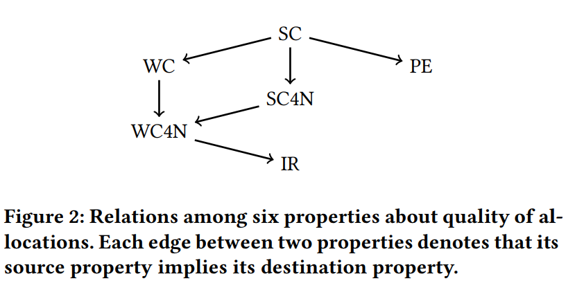

### Mechanism Design for Housing Market over Social Network

---

#### Model

Consider a networked housing market problem

a set of agents $N=\{1,\cdots,i,\cdots,n\}$.

a set of indivisible objects: $H=\{h_1,h_2,\cdots,h_n\}$.

初始状态下每个agent是拥有一个自己的house $h_i$.

在这个情境下一个机制的allocation可以认为是：$\bold{x}=\{x_i\}_{i\in N}$. 对于所有的房屋进行重新分配。

对于每一个agent，其type表示为$t_i=(\succ_i,r_i)$. $\succ_i$表示的是agent $i$对于所有的houses的一个偏好的order，我们记$h\succ_i h^\prime$表示对于agent $i$来说，对比$h^\prime$他严格更加偏好于房子$h$. $h\succeq_ih^\prime$表示要么$h=h'$要么$h\succ h'$. 

denote $\bold{t'}=\{t_1',t_2',\cdots,t_n'\}$ 表示所有的agents的report types.

我们将我们的机制定义为一个函数$f$，这个函数将这样的一个profile $\bold{t}'$映射到一个新的分配结果上。$f_i(\bold{t}')$表示为对于agent $i$ 来说重新分配给他的房屋。

在这类匹配领域中需要引入的一些性质包括：

***Strategy-proofness*** (SP) 表示为对于每一个agent来说，$t_i'=t_i=(\succ_i,r_i)$是占优策略。

> For any $i\in N$, for any $\bold{t}_{-i}$ and $\bold{t}_{-i}'\in R(\bold{t}_{-i})$ and $t_i,t_i'\in R(t_i)$, it holds that $f_i(t_i\bold{t}_{-i}')\succeq_i f_i(t_i',\bold{t}_{-i}')$.

***Strict Core*** (SC) 表示在一个SC的分配下，没有任何agents构成的group有集体偏离当前机制的结果的动机。

> For a networked housing market, allocation $x\in X$ is said to be in the SC under $\bold{t}$, if $\nexists S\subseteq N$ such that, under some allocation $y\in X$ satisfying $\bigcup _{i\in S}y_i=\bigcup_{i\in S}h_i$, (a) $y_i\succeq_i x_i$ holds for any $i\in S$; (b) $y_j\succ_jx_j$ holds for some $j\in S$. 

在strict core之上还定义了一个weak core，表示的是将条件(a),(b)换成(c) $y_i\succ_i x_i$ for any $i\in S$. 也就是说找不到这样一个子集使得每个人都严格更优。

***Individual Rationality*** (IR) 表示在实报的情况下，每一个agent重新分配得到的房屋一定不会差于初始情况下自己的房屋。

> For a networked housing market, feasible allocation $x\in X$ is said to be IR for given $\bold{t}$, if $x_i\succeq_i h_i$ for any $i \in N$.

***Pareto Efficiency*** (PE) 表示一个allocation是PE当且仅当我们无法找到另外一个allocation使得对于所有的agents重新分配的结果是弱优于之前的分配，同时存在一个agent的结果是严格由于之前的分配的。

> For a networked housing market, feasible allocation $x$ Pareto dominates another one $y$ under $\bold{t}$ if $x_i\succeq_i y_i$ for any $i \in N$ and $x_j \succ_j y_j$ for some $j\in N$. 

我们可以发现strict core是一个在IR和PE下更加严格的要求，事实上，在选择令$S=N$的情况下strict core的定义就完全等同于PE，而如果令$S=\{i\}$ $\forall i\in N$. strict core和weak core的定义就等同于IR. 表达为公式的形式可以写为：
$$
\forall \theta, SC(\theta)\subseteq \{PE(\theta)\cap IR(\theta)\}\text{ and } SC(\theta)\subseteq WC(\theta)\subseteq IR(\theta)
$$

##### Top Trading Cycles (TTC Algorithm)

传统的TTC算法：如果在这个市场中不存在agents剩余的时候，算法就会停止。否则的话我们构建一个有向图，他们的节点对应于所有的剩下的agents，每个agent $i$指向另一个agent，那个agent手中的房屋是$i$在剩余的agents中他最偏好的那个。显然必定会存在一个cycle，每一次在一个环中我们根据边的方向将房屋在环内进行重新的分配，然后将这个cycle中的所有的agents都剔除。重新上述的步骤直至算法终止。

在传统的房屋分配市场问题中，strict core是唯一的，且TTC导出的最终结果一定是这个strict core.

在传统的房屋分配市场问题中，TTC算法导出的唯一的一个满足SP，IR，PE的机制。

#### General Results

首先考虑SP，对于networked housing market来说，IC性不仅仅要求每个人真实的反映自己的偏好，还要求所有的agents都不能够通过减少向他的周围人的传播来获得更高的收益。

>  For a networked housing market $(N,\Pi,r)$, with general $r$, TTC satisfies SP when $n\leq 2$.

Proof: 考虑参与的agents的人数小于等于2的情况下，第一种情况如果两个agents之间不是父子节点的关系，这样的networked housing market问题与传统问题一致，TTC显然是满足SP的；第二种情况两个节点$i,j$之间$i$ diffuse information to $j$那么我们考虑如果$i$ not diffuse, 最终的结果一定是$i$得到$h_i$，然后如果他diffuse使得$j$也参与进来的话，那么$i$要么会得到$h_i$要么会得到$h_j$，反正结果一定是优于他not diffuse的情况的。也就是说在agents的数量少于等于2个的情况下，TTC导出的结果一定是SP的。

> For a networked housing market $(N,\Pi,r)$, with general $r$, there exist no mechanism that satisfies SP, IR and PE when $n\geq 3$.

Proof: 给出在$n\geq 3$的情况下，TTC一定是违背SP的。给出一个实例，假设有三个agents $i,j,k$, diffusion的情况如下：$r_s=\{i\},r_i=\{j\},r_j=\{k\}$. 同时给出他们的偏好情况：
$$
\begin{split}
\succ_i: & h_k\succ h_j\succ h_i\\
\succ_j: & h_k\succ h_i \succ h_j\\
\succ_k: & h_i\succ h_k \succ h_j
\end{split}
$$
不难计算得到TTC返回的结果为：$x_i=h_k,x_k=h_i,x_j=h_j$. 

此时我们考虑agent $j$ not diffuse to $k$, then TTC返回的结果为：$x_i=h_j,x_j=h_i$. 对于$j$来说他的收益实际上通过少传播的方式得到了增加，这就违背了SP的原则。 TTC是唯一的满足SP，IR和PE的机制，这也就说明当$n\geq 3$的情况下是不存在一个机制在networked housing market下满足SP, IR和PE的机制。

由于前面我们之前TTC导出的机制是唯一的一个满足SP和SC的机制。这样的理论说明了SP和SC是不相容的。因此现在考虑的就是将已有的strict core的概念进行弱化，同时将网络结构信息考虑进去。首先考虑的是所有的变种中最简单的同时最弱的一种，我们只关心两人联盟式的合作（以父子节点出现的那种）。

***Strict Core for Neighbors*** (SC4N) 在一个networked housing market下，我们认为一个结果是SC4N的如果在$\theta$的情况下，strict core对于所有的单个agent构成的联盟成立，同时对于任意的$i,j$满足存在$s\to\cdots\to i\to j$的结构的父子节点组合的联盟都是成立的。

> For a networked housing market, an outcome is said to be in the strict core for neighbors (SC4N) under profile $\theta$ if the strict core condition holds for any singleton agent $i\in N$ and for any pair $i,j$ of agents such that there is a path $s\to \cdots \to i\to j$ under $\theta$. Let $SC4N(\theta)$ be the set of such allocations for given $\theta$. A mechanism is said to satisfy SC4N if $f(\theta)\in SC4N(\theta)$ for any $\theta$.

类似的我们可以定义weak core for neighbors (WC4N). 我们可以找到一些概念之间的关系。

我们可以看到，从strict core这里我们可以衍生出很多的概念，首先是从strict core到weak core的扩展，strict core要求是不存在一个agents集合$S$使得有一个分配$y$对于所有在$S$中的agent都有分配结果$y$弱优于$x$，同时存在至少一个强优于$x$. 而weak core的要求是全部都优于$x$. 前面介绍过$SC(\theta)\subseteq WC(\theta)$. 这个地方需要深刻理解一下，strict core的要求显然是更高的，考虑一个在SC的分配，这个分配一定是在WC中的，因为这个分配不存在联盟使得$y$弱占优于$x$的，自然不会存在联盟使得$y$强占优于$x$. 从strict core出发，进一步将集合$S$进行限制，限制在要么是单个node，要么是两个构成父子关系的节点集合得到SC4N，对于WC是类似地得到WC4N，而从WC4N进一步放松限制$S$到单点集，从而得到的结果就是IR，从另一个角度，如果令集合$S=N$得到的就是PE.

**Example**: 考虑类似前面的实例，三个agents $i,j,k$, diffusion的情况如下：$r_s=\{i\},r_i=\{j\},r_j=\{k\}$. 同时给出他们的偏好情况：
$$
\begin{split}
\succ_i: \quad& h_k\succ h_j\succ h_i\\
\succ_j: \quad& h_i\succ h_k \succ h_j\\
\succ_k: \quad& h_i\succ h_j \succ h_k
\end{split}
$$
对于分配：$x_i=h_j,x_j=h_k,x_k=h_i$来说，它是PE且IR的。显然是IR的，因为每个人都拿到了自己初始状态拥有的房屋好，考虑PE，我们无法找到一个新的分配使得对于每一个agent来说都能够拿到更好的结果（可以逐一验证）。但是我们又会发现这个分配是不满足SC4N的，因为$\{i,j\}$是会形成一个coalition的，如果$x_i=h_j,x_j=h_i$对于$\{i,j\}$是更优的。但是考虑另一个分配：$y_i=h_j,y_j=h_i,y_k=h_k$是SC4N的但是却不是PE的，因为另外一个分配：$z_i=h_k,z_j=h_i,z_k=h_j$是Pareto占优于$y$的。（这个问题还是挺复杂的……）

给出另外一个实例：

**Example**: 考虑现在有four agents $N=\{i,j,k,l\}$, 社交网络表示为：

同时他们的偏好如下：
$$
\begin{split}
\succ_i: \quad& h_l\succ h_k\succ h_i\succ h_j\\
\succ_j: \quad& h_i\succ h_k\succ h_l\succ h_j\\
\succ_k: \quad& h_l\succ h_j\succ h_k\succ h_i\\
\succ_l: \quad& h_i\succ h_j\succ h_l\succ h_k
\end{split}
$$
Allocation $\bold{x}$: $x_i=h_k,x_j=h_i,x_k=h_l,x_l=h_j$. 这个分配是PE同时IR的，但是不是WC4N的，考虑coalition $\{i,l\}$, strongly block $x$. 

Allocation $\bold{y}$: $y_i=h_k,y_j=h_l,y_k=h_j,y_l=h_i$. 这个是WC4N的但是不是PE的，类似前面的例子。

上面给出的两个例子表明了：由于每个人的偏好都是严格偏好，所以说一定存在唯一的一个分配是SC的，这也就意味着：$SC4N\cap\{PE\cap IR\}\neq \empty$; $WC4N\cap\{PE \cap IR\}\neq \empty$.

> For a networked housing market $(N,\Pi,r)$, with general $r$, there dose not exist a mechanism that satisfies SP and WC4N when $n\geq 3$.

这个结论告诉我们在networked housing market下，当agents的数量大于等于3时，我们找不到一个机制同时满足SP和WC4N.

Proof: 考虑下面给出的例子：

$$
\begin{split}
\succ_i: \quad &h_k\succ h_i \succ h_j\\
\succ_j: \quad &h_k\succ h_j \succ h_i\\
\succ_k: \quad &h_j\succ h_i \succ h_k
\end{split}
$$
There are 3 allocations $x,y,z$ satisfying IR: 
$$
\begin{split}
x &= (h_i,h_k,h_j)\\
y &= (h_k,h_j,h_i)\\
z &= (h_i,h_j,h_k)
\end{split}
$$
